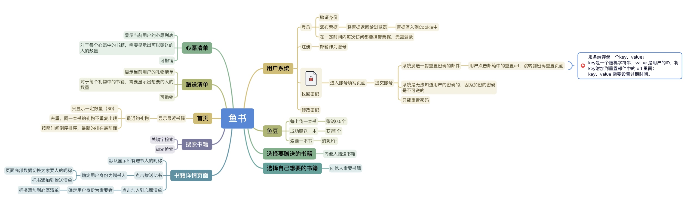

# 鱼书网站介绍

### 网站的目的



### 网站样式
http://yushu.talelin.com/
### 项目结构
```
apple@MacBook-Pro13 fisher % tree -L 2 -F
./                              # 项目根路径
├── Pipfile
├── Pipfile.lock
├── README.md
├── app/                        # flask core app 目录
│   ├── __init__.py             # flask core app 初始化
│   ├── common_config.py        # 普通配置项
│   ├── secure_config.py        # 敏感配置项
│   ├── forms/                  # 请求参数验证模块
│   ├── libs/                   # 一些通用模块,工具库
│   ├── models/                 # MVC 的 M 层
│   ├── spider/                 # 数据抓取模块
│   ├── static/                 # 静态文件目录
│   ├── templates/              # 模版文件目录
│   ├── view_models/            # 视图层,接口下行数据协议 MVC 的 V 层
│   └── web/                    # 一个名字叫 web 的蓝图层
├── media/                       
├── requirements.txt
├── run.py                      # 程序运行的开始文件(该文件一定要在项目的根路径下)
└── test/                       # 测试文件
```

### 本地启动运行
`python3 run.py`

### 导入图书数据到 mysql
因为, 课程老师的图书数据是来自如 http://t.talelin.com/v2/book/isbn/{isbn}, http://t.talelin.com/v2/book/search?q={keyword}&count=5&start=0 api; 我把部分数据同步到 mysql 数据库了, 这样就不依赖外置的 api, 方便本地学习和日后调试. 
```
INSERT INTO fisher.book (title,author,binding,publisher,price,pages,pubdate,isbn,summary,image,create_time,enable_status) VALUES
	 ('Python for Unix and Linux System Administration','["Noah Gift", "Jeremy Jones"]','Paperback','O''Reilly Media','USD 49.99','458','2008-08-22','9780596515829','Python is an ideal language for solving problems, especially in Linux and Unix networks. With this pragmatic book, administrators can review various tasks that often occur in the management of these systems, and learn how Python can provide a more efficient and less painful way to handle them.\\nEach chapter in Python for Unix and Linux System Administration presents a particular administrative issue, such as concurrency or data backup, and presents Python solutions through hands-on examples. Once you finish this book, you''ll be able to develop your own set of command-line utilities with Python to tackle a wide range of problems. Discover how this language can help you:\\n* Read text files and extract information\\n* Run tasks concurrently using the threading and forking options\\n* Get information from one process to another using network facilities\\n* Create clickable GUIs to handle large and complex utilities\\n* Monitor large clusters of machines by interacting with SNMP programmatically\\n* Master the IPython Interactive Python shell to replace or augment Bash, Korn, or Z-Shell\\n* Integrate Cloud Computing into your infrastructure, and learn to write a Google App Engine Application\\n* Solve unique data backup challenges with customized scripts\\n* Interact with MySQL, SQLite, Oracle, Postgres, Django ORM, and SQLAlchemy\\nWith this book, you''ll learn how to package and deploy your Python applications and libraries, and write code that runs equally well on multiple Unix platforms. You''ll also learn about several Python-related technologies that will make your life much easier.','http://127.0.0.1:5000/static/images/book/s3355252.jpg',1690027930,1),
	 ('Java编程思想 （第4版）','["[美]BruceEckel"]','平装','机械工业出版社','108.00元','880','2007-6','9787111213826','本书赢得了全球程序员的广泛赞誉，即使是最晦涩的概念，在Bruce Eckel的文字亲和力和小而直接的编程示例面前也会化解于无形。从Java的基础语法到最高级特性（深入的面向对象概念、多线程、自动项目构建、单元测试和调试等），本书都能逐步指导你轻松掌握。\\n从本书获得的各项大奖以及来自世界各地的读者评论中，不难看出这是一本经典之作。本书的作者拥有多年教学经验，对C、C++以及Java语言都有独到、深入的见解，以通俗易懂及小而直接的示例解释了一个个晦涩抽象的概念。本书共22章，包括操作符、控制执行流程、访问权限控制、复用类、多态、接口、通过异常处理错误、字符串、泛型、数组、容器深入研究、Java I/O系统、枚举类型、并发以及图形化用户界面等内容。这些丰富的内容，包含了Java语言基础语法以及高级特性，适合各个层次的Java程序员阅读，同时也是高等院校讲授面向对象程序设计语言以及Java语言的绝佳教材和参考书。\\n第4版特点：\\n适合初学者与专业人员的经典的面向对象叙述方式，为更新的Java SE5/6增加了新的示例和章节。\\n 测验框架显示程序输出。','http://127.0.0.1:5000/static/images/book/s27243455.jpg',1690027932,1),
	 ('Python 编程金典','["P.J.Deitel", "J.P.Liperi", "B.A.Wiedermann", "H.M.Deitel"]','平装(无盘)','清华大学出版社','88.00元','596','2003-6','9787302066422','本书由全球著名的程序语言培训专家精心编著，解释了如何将Python用作常规用途，编写多层、客户机/服务器结构、数据库密集型、基于Internet和Web的应用程序。书中采用作者独创的“活代码”教学方式，层层揭示了Python这一程序设计语言的强大功能，并通过穿插在全书各处的屏幕输出和编程技巧与提示，帮助读者搭建良好的知识结构、养成良好的编程习惯、避免常见的编程错误以及写出高效、可靠的应用程序。','http://127.0.0.1:5000/static/images/book/s1326052.jpg',1690028458,1),
	 ('利用Python进行数据分析','["WesMcKinney"]','平装','机械工业出版社','89.00','464','2013-11-18','9787111436737','【名人推荐】\\n“科学计算和数据分析社区已经等待这本书很多年了：大量具体的实践建议，以及大量综合应用方法。本书在未来几年里肯定会成为Python领域中技术计算的权威指南。”\\n——Fernando Pérez　加州大学伯克利分校 研究科学家， IPython的创始人之一\\n【内容简介】\\n还在苦苦寻觅用Python控制、处理、整理、分析结构化数据的完整课程？本书含有大量的实践案例，你将学会如何利用各种Python库（包括NumPy、pandas、matplotlib以及IPython等）高效地解决各式各样的数据分析问题。\\n由于作者Wes McKinney是pandas库的主要作者，所以本书也可以作为利用Python实现数据密集型应用的科学计算实践指南。本书适合刚刚接触Python的分析人员以及刚刚接触科学计算的Python程序员。\\n•将IPython这个交互式Shell作为你的首要开发环境。\\n•学习NumPy（Numerical Python）的基础和高级知识。\\n•从pandas库的数据分析工具开始。\\n•利用高性能工具对数据进行加载、清理、转换、合并以及重塑。\\n•利用matplotlib创建散点图以及静态或交互式的可视化结果。\\n•利用pandas的groupby功能对数据集进行切片、切块和汇总操作。\\n•处理各种各样的时间序列数据。\\n•通过详细的案例学习如何解决Web分析、社会科学、金融学以及经•济学等领域的问题。','http://127.0.0.1:5000/static/images/book/s27275372.jpg',1690112634,1),
	 ('JAVA 2核心技术 卷Ⅰ','["[美] 霍斯特曼", "[美] 科奈尔"]','平装','机械工业出版社','88.00元','691','2006-5','9787111185239','本书是Java技术经典参考书，多年畅销不衰，第7版在保留以前版本风格的基础上，涵盖Java2开发平台标准版J2SE5.0的基础知识，主要内容包括面各对象程序设计、反射与代理、接口与内部类、事件监听器模型、使用Swing UI工具箱进行图形用户界面设计，异常处理、流输入/输出和对象序列化、泛型程序设计等。\\n本书内容翔实、深入浅出，附有大量程序实例，极具实用价值，是Java初学者和Java程序员的必备参考书。','http://127.0.0.1:5000/static/images/book/s1815135.jpg',1690113012,1),
	 ('Java夜未眠','["蔡学镛"]','平装','电子工业出版社','20.00元','277','2003-4','9787505386600','本书是一本散文集。作为一名资深程序设计师，作者走笔清新面独特，简练俏皮的文字下，是作者对工作，对人生的理性思考。书中收录的文章内容贴近程序员的生活，能令读者产生强烈共鸣。此外，书中的部分文章也以轻松的风格剖析了学习Java技术时的常见问题，并以专家眼光和经验推荐介绍了一批优秀的技术书籍，旨在帮助读者兴趣盎然地学习Java。','http://127.0.0.1:5000/static/images/book/s1403563.jpg',1690113013,1),
	 ('Java与模式','["阎宏 编著"]','平装16开','电子工业出版社','88.00元','1024','2002-10','9787505380004','《Java与模式》是一本讲解设计原则以及最为常见的设计模式的实用教材，目的是为了工作繁忙的Java系统设计师提供一个快速而准确的设计原则和设计模式的辅导。全书分为55章，第一个章节讲解一个编编程模式，说明此模式的用意、结构，以及这一模式适合于什么样的情况等。每一个章节都附有多个例子和练习题，研习这些例子、完成这些练习题可以帮助读者更好地理解所讲的内容。大多数的章节都是相对独立的，读者可以从任何一章开始读起。为了满足不同程序的读者的需要，书中提供了一些标为“专题”的章节，不阅读这些章节，对阅读书中的标准章节没有影响。','http://127.0.0.1:5000/static/images/book/s1201195.jpg',1690113013,1),
	 ('JavaScript高级程序设计（第3版）','["[美]尼古拉斯·泽卡斯"]','平装','人民邮电出版社','99.00元','748','2012-3-29','9787115275790','本书是JavaScript 超级畅销书的最新版。ECMAScript 5 和HTML5 在标准之争中双双胜出，使大量专有实现和客户端扩展正式进入规范，同时也为JavaScript 增添了很多适应未来发展的新特性。本书这一版除增加5 章全新内容外，其他章节也有较大幅度的增补和修订，新内容篇幅约占三分之一。全书从JavaScript 语言实现的各个组成部分——语言核心、DOM、BOM、事件模型讲起，深入浅出地探讨了面向对象编程、Ajax 与Comet 服务器端通信，HTML5 表单、媒体、Canvas（包括WebGL）及Web Workers、地理定位、跨文档传递消息、客户端存储（包括IndexedDB）等新API，还介绍了离线应用和与维护、性能、部署相关的最佳开发实践。本书附录展望了未来的API 和ECMAScript Harmony 规范。\\n本书适合有一定编程经验的Web 应用开发人员阅读，也可作为高校及社会实用技术培训相关专业课程的教材。','http://127.0.0.1:5000/static/images/book/s8958650.jpg',1690113013,1),
	 ('JavaScript语言精粹','["DouglasCrockford"]','平装','电子工业出版社','35.00元','155','2009-4','9787121084379','本书通过对JavaScript语言的分析，甄别出好的和坏的特性，从而提取出相对这门语言的整体而言具有更好的可靠性、可读性和可维护性的JavaScript的子集，以便你能用它创建真正可扩展的和高效的代码。\\n雅虎资深JavaScript架构师Douglas Crockford倾力之作。\\n向读者介绍如何运用JavaScript创建真正可扩展的和高效的代码。','http://127.0.0.1:5000/static/images/book/s3651235.jpg',1690113013,1),
	 ('Java并发编程实战','["Brian Goetz", "Tim Peierls", "Joshua Bloch", "Joseph Bowbeer", "David Holmes", "Doug Lea"]','平装','机械工业出版社华章公司','69.00元','293','2012-2','9787111370048','本书深入浅出地介绍了Java线程和并发，是一本完美的Java并发参考手册。书中从并发性和线程安全性的基本概念出发，介绍了如何使用类库提供的基本并发构建块，用于避免并发危险、构造线程安全的类及验证线程安全的规则，如何将小的线程安全类组合成更大的线程安全类，如何利用线程来提高并发应用程序的吞吐量，如何识别可并行执行的任务，如何提高单线程子系统的响应性，如何确保并发程序执行预期任务，如何提高并发代码的性能和可伸缩性等内容，最后介绍了一些高级主题，如显式锁、原子变量、非阻塞算法以及如何开发自定义的同步工具类。\\n本书适合Java程序开发人员阅读。','http://127.0.0.1:5000/static/images/book/s7663093.jpg',1690113014,1);
INSERT INTO fisher.book (title,author,binding,publisher,price,pages,pubdate,isbn,summary,image,create_time,enable_status) VALUES
	 ('JavaScript DOM编程艺术 （第2版）','["[英] Jeremy Keith", "[加] Jeffrey Sambells"]','平装','人民邮电出版社','49.00元','300','2011-4','9787115249999','JavaScript是Web开发中最重要的一门语言，它强大而优美。无论是桌面开发，还是移动应用。JavaScript都是必须掌握的技术。W3C的DOM标准是开发Web应用的基石。已经得到所有现代浏览器的支持，这使得跨平台Web开发成了一件轻松惬意的事。\\n本书是超级畅销书的升级版，由倡导Web标准的领军人物执笔，揭示了前端开发的真谛，是学习JavaScript和DOM开发的必读之作。\\n本 书在简洁明快地讲述JavaScript和DOM的基本知识之后，通过几个实例演示了专业水准的网页开发技术，透彻阐述了平稳退化等一批至关重要的 JavaScript编程原则和最佳实践，并全面探讨了HTML5以及jQuery等JavaScript库。读者将看到JavaScript、 HTML5和CSS如何协作来创建易用的、与标准兼容的Web设计，掌握使用JavaScript和DOM通过客户端动态效果和用户控制的动画来加强 Web页面的必备技术；同时，还将对如何利用库提高开发效率有全面深入的理解。','http://127.0.0.1:5000/static/images/book/s4677623.jpg',1690113014,1),
	 ('Java语言程序设计','["（美）  Y. Daniel Liang"]','平装','机械工业出版社','75.00元','604','2011-6','9787111340812','本书是Java语言的经典教材，多年来畅销不衰。本书全面整合了Java 6的特性，采用“基础优先，问题驱动”的教学方式，循序渐进地介绍了程序设计基础、解决问题的方法、面向对象程序设计、图形用户界面设计、异常处理、I/O和递归等内容。此外，本书还全面且深入地覆盖了一些高级主题，包括算法和数据结构、多线程、网络、国际化、高级GUI等内容。\\n本书中文版由《Java语言程序设计：基础篇》和《Java语言程序设计：进阶篇》组成。基础篇对应原书的第1～20章，进阶篇对应原书的第21～37章。\\n本书特点：\\n	基础篇介绍基础内容，进阶篇介绍高级内容，便于教师按需选择理想的教材。\\n	全面整合了Java 6的特性，对全书的内容进行了修订和更新，以反映Java程序设计方面的最新技术发展。\\n	对面向对象程序设计进行了深入论述，包含GUI程序设计的基础和扩展实例。\\n	提供的大量实例中都包括了对问题求解的详细步骤，很多实例都是随着Java技术的引入不断地进行增强，这种循序渐进的讲解方式更易于学生学习。\\n	较上一版增加了大量难易程度不同的习题，同时在作者的网站http://www.cs.armstrong.edu/liang/intro8e/index.html 中还提供了很多自测题。\\n	为满足对Web设计有浓厚兴趣的同学，本版在配套网站上增加了第39～48章的内容，以提供更多的相关信息。','http://127.0.0.1:5000/static/images/book/s6520557.jpg',1690113014,1),
	 ('JavaScript设计模式与开发实践','["曾探"]','平装','人民邮电出版社','59.00元','294','2015-5','9787115388889','本书在尊重《设计模式》原意的同时，针对JavaScript语言特性全面介绍了更适合JavaScript程序员的了16个常用的设计模式，讲解了JavaScript面向对象和函数式编程方面的基础知识，介绍了面向对象的设计原则及其在设计模式中的体现，还分享了面向对象编程技巧和日常开发中的代码重构。本书将教会你如何把经典的设计模式应用到JavaScript语言中，编写出优美高效、结构化和可维护的代码。','http://127.0.0.1:5000/static/images/book/s28065006.jpg',1690113015,1),
	 ('JavaScript & jQuery交互式Web前端开发','["[美]达克特(Duckett,J.)"]','平装','清华大学出版社','79.80元','314','2015-6-9','9787302397632','欢迎选择一种更高效的学习JavaScript和jQuery的方式。\\n你是一名JavaScript新手?或是您曾经向自己的Web页面上添加过一些脚本，但想以一种更好的方式来实现它们？本书非常适合您。本书不仅向您展示如何阅读和编写JavaScript代码，同时还会以一种简单且视觉化的方式，教您有关计算机编程的基础知识。阅读本书之前，您只需要对HTML和CSS有一些了解即可。\\n通过将编程理论与用来演示JavaScript和jQuery如何被应用于流行站点之上的示例相结合，本书将教会您如何让网站更具交互性、吸引性、可用性。很快，您就能够像一名程序员那样去思考和编写代码了。','http://127.0.0.1:5000/static/images/book/s28118537.jpg',1690113041,1),
	 ('Java性能优化权威指南','["Charlie Hunt", "Binu John"]','平装','人民邮电出版社','109.00 元','540','2014-3','9787115342973','Java性能优化圣经！Java之父重磅推荐！\\n本书由曾任职于Oracle/Sun的性能优化专家编写，系统而详细地讲解了性能优化的各个方面，帮助你学习Java虚拟机的基本原理、掌握一些监控Java程序性能的工具，从而快速找到程序中的性能瓶颈，并有效改善程序的运行性能。\\nJava性能优化的任何问题，都可以从本书中找到答案！','http://127.0.0.1:5000/static/images/book/s27219217.jpg',1690113041,1),
	 ('Java解惑','["布洛赫", "加夫特"]','简裝本','人民邮电出版社','39.00元','285','2006-1','9787115142412','本书特写了95个有关Java或其类库的陷阱和缺陷的谜题，其中大多数谜题都采用了短程序的方式，这些程序的行为与其看似的大相径庭。在每个谜题之后都给出了详细的解惑方案，这些解惑方案超越了对程序行为的简单解释，向读者展示了如何一劳永逸地避免底层的陷阱与缺陷。\\n本书趣味十足、寓教于乐，适合于具备Java知识的学习者和有编程经验的Java程序员。','http://127.0.0.1:5000/static/images/book/s1491187.jpg',1690113041,1),
	 ('Java 8函数式编程','["[英] Richard Warburton"]','平装','人民邮电出版社','39.00元','148','2015-3','9787115384881','通过每一章的练习快速掌握Java 8中的Lambda表达式\\n分析流、高级集合和其他Java 8类库的改进\\n利用多核CPU提高数据并发的性能\\n将现有代码库和库代码Lambda化\\n学习Lambda表达式单元测试和调试的实践解决方案\\n用Lambda表达式实现面向对象编程的SOLID原则\\n编写能有效执行消息传送和非阻塞I/O的并发应用','http://127.0.0.1:5000/static/images/book/s28028344.jpg',1690113041,1),
	 ('JAVA核心技术卷2','["Cay S. Horstmann", "Gary Cornell"]','平装','机械工业出版社','118.00元','852','2008-12','9787111256113','《JAVA核心技术卷2:高级特征》是Java技术权威指南，全面覆盖Java技术的高级主题，包括流与文件、XML、网络、数据库编程、高级Swing、高级 AWT、JavaBean构件、安全、分布式对象、脚本、编译与注解处理等，同时涉及本地化、国际化以及Java SE 6的内容。《JAVA核心技术卷Ⅱ:高级特征》对Java技术的阐述精确到位，叙述方式深入浅出，并包含大量示例，从而帮助读者充分理解Java语言以及Java类库的相关特性。\\n《JAVA核心技术卷2:高级特征》适合软件开发人员、高等院校教师和学生参考。\\n点击链接进入Java程序设计：\\n《深入理解Java虚拟机:JVM高级特性与最佳实践》\\n《JAVA核心技术(卷1):基础知识(原书第8版)》\\n《JAVA核心技术卷2:高级特征》\\n《Java语言程序设计(基础篇)(原书第8版)》\\n《Java编程思想(第4版)》\\n《Effective Java中文版(第2版)》\\n《Java编程思想(英文版•第4版)》\\n《Java 实时编程》\\n《Java加密与解密的艺术》\\n《Eclipse插件开发(原书第3版)(畅销插件开发指南新版)》\\n《Java语言程序设计:进阶篇(原书第8版)》\\n《Maven实战》','http://127.0.0.1:5000/static/images/book/s5970236.jpg',1690113042,1),
	 ('基于MVC的JavaScript Web富应用开发','["麦卡劳(Alex MacCaw)"]','平装','电子工业出版社','59.00元','282','2012-5','9787121109560','《JavaScript Web 富应用开发》Developing JavaScript Web Applications是 Alex MacCaw 的新作（由O''Reilly出版发行），本书系统而深入的讲解了如何使用最前沿的Web技术构建下一代互联网富应用程序。作者 Alex MacCaw 是一名Ruby/JavaScript 程序员，在开源社区中很有名望，是Spine框架的作者，同时活跃在纽约、旧金山和柏林的各大 Ruby/Rails 论坛。除了作为一名工程师，他还喜欢带着他的尼康D90和冲浪板环游世界。\\n有赖于强大的JavaScript引擎以及CSS3和HTML5新技术，如今的JavaScript Web 富应用的用户体验已经可以和桌面系统相媲美。关键是如何平滑的将服务器端的复杂度移植到客户端，这并不容易做到。这本书将专注于讲述如何构建“优雅又不失高水准”（state of the art）的JavaScript应用，包括软件架构、模板引擎、框架和库、同服务器的消息通信等内容。\\n通过由浅入深的讲解，你将学会如何构建具有丰富交互以及优雅体验的JavaScript应用，书中同样提供了大量的示例代码，可以帮助你更深入的理解很多重要的概念。\\n揭开MVC的神秘面纱，教你如何设计合理的架构以及处理应用内部模块之间的依赖\\n介绍模板引擎和数据绑定\\n讲解远程数据加载、第二代Ajax以及跨域请求\\n利用WebSockets和Node构建实时应用\\n拖拽上传文件以及上传进度提示\\n讲解主流的库和框架，包括jQuery、JavaScriptMVC以及Backbone\\n编写测试用例，并使用控制台工具来调试你的应用\\n部署应用的最佳实践，比如缓存机制和代码压缩等','http://127.0.0.1:5000/static/images/book/s27269298.jpg',1690113042,1),
	 ('JavaScript面向对象精要','["[美]尼古拉斯·泽卡斯"]','平装','人民邮电出版社','39.00','100','2015-4','9787115383846','本书关注面向对象的原理和ES5对象新特性，目的是帮助那些已经熟知面向对象编程的读者掌握这些概念是如何在JavaScript中工作的。\\n本书内容简洁而精妙。全书共6章，分别深入探讨了原始类型和引用类型、函数、对象、构造函数和原型对象、继承和对象模式等主题和特性。在本书中，你将学到JavaScript独特的面向对象的编程方式；抛弃类的概念和基于类的继承，学习基于原型的继承和构造函数。你将学会如何创建对象、定义自己的类型、使用继承以及其他各种操作来充分使用对象。总而言之，你将学到JavaScript语言并进行专业编程所需熟知的一切。\\n本书适合熟悉面向对象编程的概念并希望将其应用于JavaScript的开发者阅读，也适合JavaScript新手学习参考。','http://127.0.0.1:5000/static/images/book/s28291461.jpg',1690113042,1);
INSERT INTO fisher.book (title,author,binding,publisher,price,pages,pubdate,isbn,summary,image,create_time,enable_status) VALUES
	 ('JavaScript模式','["Stoyan Stefanov"]',NULL,'中国电力出版社','38.00元','208','2012-7','9787512329232','《JavaScript模式》包含了实现每个讨论的模式的实践建议，并附有数个可以立即上手的范例。同时还可以学到一些反模式，一些常见的编程方式，这些编程方式引发的问题比解决的还多。它不是一本入门级的书，而是适用于希望将自身的Javascript技巧提高到一个新层次的专业的开发人员和程序员。全书共八章节，内容包括简介、基本技巧、字面量和构造函数、函数、对象创建模式、代码复用模式等。','http://127.0.0.1:5000/static/images/book/s11337059.jpg',1690113042,1),
	 ('JavaScript编程全解','["［日］井上诚一郎", "［日］土江拓郎", "［日］滨边将太"]','平装','人民邮电出版社','79.00','420','2013-12','9787115333414','本书全方位地介绍了JavaScript开发中的各个主题，无论是前端还是后端的JavaScript开发者都可以在本书中找到自己需要的内容。本书对HTML5、Web API、Node.js及WebSocket等最新的热门技术也作了深入浅出的介绍，并提供了大量实际应用范例。\\n本书语法说明系统深入、示例代码规范详细，对容易产生问题之处均做了重点说明，不仅适合初学者入门，而且有经验的JavaScript开发人员、项目负责人也能从中受益。','http://127.0.0.1:5000/static/images/book/s27133074.jpg',1690113042,1),
	 ('Java入门1•2•3','["臧萌"]','平装','清华大学出版社','69.00元','615','2010-5-1','9787302217831','本书是一本与众不同的Java入门好书。作者以独特的视角，向Java初学者讲述了如何才能真正理解和掌握Java语言。本书充分考虑了初学Java语言的种种困难，讲解时细致入微，抽丝剥茧，层层推进，并采用对比、比喻和类比的方式讲解，还给出了大量的流程图帮助读者理解各种概念和程序的运行过程。另外，作者专门录制了近16小时的多媒体语音教学视频帮助读者直观地学习。这些视频和书中的源代码一起收录于本书的DVD光盘中。    本书分3篇。第1篇为Java语言基本语法，包括Java语言概述、配置开发环境、Java中的基本数据类型、Java运算符、Java流程控制语句和数组。第2篇为Java语言高级语法，包括类、对象、方法、继承、多态、修饰符、接口、抽象类、内部类、Java异常处理和多线程编程。第3篇为Java语言编程进阶，包括Java编程常用知识、Java文件编程、Java文件I/O编程、Java TCP编程、Java UDP编程、Java Swing编程、JDBC编程，最后还给出了一个聊天程序实例和一个数据表操作窗口实例，将Swing、UDP、Java集合类、线程同步、接口和JDBC编程有机地结合起来，展示了开发一个简单程序的典型步骤。    本书适合广大想学习一门编程语言的读者、没有任何基础的Java入门读者、Java自学人员、从其他语言转向Java语言的读者、大中专院校的学生和社会培训学生。','http://127.0.0.1:5000/static/images/book/s4364318.jpg',1690113042,1),
	 ('Java并发编程的艺术','["方腾飞", "魏鹏", "程晓明"]','平装','机械工业出版社','59.00元','240','2015-7-1','9787111508243','并发编程领域的扛鼎之作，作者是阿里和1号店的资深Java技术专家，对并发编程有非常深入的研究，《Java并发编程的艺术》是他们多年一线开发经验的结晶。本书的部分内容在出版早期发表在Java并发编程网和InfoQ等技术社区，得到了非常高的评价。它选取了Java并发编程中最核心的技术进行讲解，从JDK源码、JVM、CPU等多角度全面剖析和讲解了Java并发编程的框架、工具、原理和方法，对Java并发编程进行了最为深入和透彻的阐述。\\n《Java并发编程的艺术》内容涵盖Java并发编程机制的底层实现原理、Java内存模型、Java并发编程基础、Java中的锁、并发容器和框架、原子类、并发工具类、线程池、Executor框架等主题，每个主题都做了深入的讲解，同时通过实例介绍了如何应用这些技术。','http://127.0.0.1:5000/static/images/book/s28275418.jpg',1690113561,1),
	 ('Java开发实战经典','["李兴华 编著"]','平装','清华大学出版社','79.80元','831','2009-8','9787302202615','《Java开发实战经典(名师讲坛)》是一本综合讲解Java核心技术的书籍，在书中使用大量的代码及案例进行知识点的分析与运用，并且给出一些比较成熟的开发步骤，帮助读者更好地进行Java的开发。从作者多年的Java培训经验来看，大部分学生对各种高端开发都没有任何问题，唯一的问题在于Java基础并不牢固，而且在国内也始终没有一本真正可以引领读者入门的好书籍，大部分的书籍都是围绕概念本身进行讲解的，没有讲解清楚为什么要具备这些知识以及该如何去理解这些知识。《Java开发实战经典(名师讲坛)》真正地做到了让每一位读者都能清楚地知道每个知识点的来龙去脉，不仅可以很容易地看懂一个程序，而且能真正地灵活运用程序，编写代码。\\n在学习编程语言时，环境、代码调试等，都是很多读者最头疼的地方，而且很多代码都会存在一些细节上的问题，所以，《Java开发实战经典(名师讲坛)》为了让读者可以更好地理解每一个知识点，将书中所有内容都录制成了视频，让每一位读者真正做到“轻松学Java、从零开始学Java”，以优质的视频教学为每一位读者提供最大的支持。\\n“注意”、“提示”、“问答”是《Java开发实战经典(名师讲坛)》的一大特色，通过这样的方式，可以让读者进行更加全面的思考，这些特色中还包含了不少在Java面试中有可能遇到的问题，这让每位读者在打好基础、巩固技术之余，也能为面试提供强有力的支持。','http://127.0.0.1:5000/static/images/book/s6050358.jpg',1690113561,1),
	 ('Java JDK6学习笔记','["林信良"]',NULL,'清华大学出版社','59.90元','572','2007-4','9787302149958','《Java JDK6学习笔记》是作者良葛格本人近几年来学习Java的心得笔记，结构按照作者的学习脉络依次展开，从什么是Java、如何配置Java开发环境、基本的Java语法到程序流程控制、管理类文件、异常处理、枚举类型、泛型、J2SE中标准的API等均进行了详细介绍。本书还安排了一个“文字编辑器”的专题制作。此外，Java SE6的新功能，对Java lang等套件的功能加强，以及JDBC4.0、Apache Derby纯Java数据库等新增功能，本书也都予以介绍。\\n《Java JDK6学习笔记》中介绍了Java JDK6中新增的功能。Java JDK6加强了java.lang、java.util、java.io、java.awt等套件的功能，并增加了JDBC 4.0新功能。另外，在JDK 6中还包括了Apache Derby纯Java数据为。\\n本书附CD光盘一张，光盘内容包括：\\n书中所有范例的源代码。\\nJDK下载、安装、Path设置等多媒体视频。\\n本书门槛很低，只要您了解Windows基本操作，无须有其他程序语言的基础，甚至没有接触过Java，都可以通过本书扎扎实实地学习Java。而对于一些曾经学习过Java，但概念和基础仍不扎实的读者，本书也准备了一些面向对象的观点与进阶的议题可供参考。','http://127.0.0.1:5000/static/images/book/s5765807.jpg',1690113561,1),
	 ('Java程序员修炼之道','["[英] Benjamin J. Evans", "[荷兰] Martijn Verburg"]','平装','人民邮电出版社','89.00元','395','2013-7','9787115321954','本书分为四部分，第一部分全面介绍Java 7 的新特性，第二部分探讨Java 关键编程知识和技术，第三部分讨论JVM 上的新语言和多语言编程，第四部分将平台和多语言编程知识付诸实践。从介绍Java 7 的新特性入手，本书涵盖了Java 开发中最重要的技术，比如依赖注入、测试驱动的开发和持续集成，探索了JVM 上的非Java 语言，并详细讲解了多语言项目， 特别是涉及Groovy、Scala 和Clojure 语言的项目。此外，书中含有大量代码示例，帮助读者从实践中理解Java 语言和平台。\\n本书适合Java 开发人员以及对Java7 和JVM 新语言感兴趣的各领域人士阅读。','http://127.0.0.1:5000/static/images/book/s26812781.jpg',1690113562,1),
	 ('Java并发编程','["(美)Doug Lea"]',NULL,'中国电力出版社','35','282','2004-2-1','9787508318288','本书全面介绍了如何使用Java 2平台进行并发编程，较上一版新增和扩展的内容包括：\\n·存储模型 ·取消 ·可移植的并行编程 ·实现并发控制的工具类\\nJava平台提供了一套广泛而功能强大的api，工具和技术。内建支持线程是它的一个强大的功能。这一功能为使用Java编程语言的程序员提供了解并发编程这一诱人但同时也非常具有挑战性的选择。\\n本书通过帮助读者理解有关并发编程的模式及其利弊，向读者展示了如何更精确地使用Java平台的线程模型。\\n这里，读者将通过使用java.lang.thread类、synchronized和volatile关键字，以及wait、notify和notifyall方法，学习如何初始化、控制和协调并发操作。此外，本书还提供了有关并发编程的全方位的详细内容，例如限制和同步、死锁和冲突、依赖于状态的操作控制、异步消息传递和控制流、协作交互，以及如何创建基于web的服务和计算型服务。 本书的读者对象是那些希望掌握并发编程的中高级程序员。从设计模式的角度，本书提供了标准的设计技巧，以创建和实现用来解决一般性并发编程问题的组件。贯串全书的大量示例代码详细地阐述了在讨论中所涉及到的并发编程理念的细微之处。','http://127.0.0.1:5000/static/images/book/s29559745.jpg',1690113562,1),
	 ('Java2入门经典','["霍顿"]',NULL,'机械工业出版社','118.00元','1064','2006-1','9787111180890','《Java2入门经典》(JDK5)综合介绍了使用J2SE(Java 2 Standard Edition)5．0或更高版本开发动态程序的过程，阐述了Java语言的各个方面，包括Java语言结构和工作原理的基本知识，用大量的实例讲述如何开发功能齐全的Java应用程序，以期帮助读者掌握Java语言的最新特性和Java类库中主要的功能包，积累Java应用环境的使用经验，并在核心技术领域打下坚实的基础。《Java2入门经典》(JDK5)系统全面、浅显易懂，非常适合没有任何编程经验的初学者阅读，也可作为软件开发人员和高校师生的必备参考书。','http://127.0.0.1:5000/static/images/book/s1502324.jpg',1690113562,1),
	 ('Java虚拟机精讲','["高翔龙"]','平装','电子工业出版社','69.00元','280','2015-5','9787121257056','《Java虚拟机精讲》内容简介：HotSpot VM是目前市面上高性能JVM的代表作之一，它采用解释器+JIT 编译器的混合执行引擎，使得Java 程序的执行性能从此有了质的飞跃。本书以极其精练的语句诠释了 HotSpot VM的方方面面，比如：字节码的编译原理、字节码的内部组成结构、通过源码的方式剖析 HotSpot VM 的启动过程和初始化过程、Java 虚拟机的运行时内存、垃圾收集算法、垃圾收集器（重点讲解了Serial 收集器、ParNew收集器、Parallel收集器、CMS（Concurrent-Mark-Sweep）收集器和 G1（Garbage-First）收集器）、类加载机制，以及HotSpot VM 基于栈的架构模型和执行引擎（解释器的工作流程、JIT 编译器的工作流程、分层编译策略、热点探测功能）等技术。\\n如果你对JVM 感兴趣，并且从未接触过 JVM，那么本书将会是你探索 JVM 世界的必备入门工具。\\n本书适用于任何对Java 虚拟机感兴趣的Java 开发人员、系统架构师、Java 虚拟机爱好者。尤其是对于那些从未接触过Java 虚拟机的Java 开发人员，本书笔者竭尽所能用最精练和直接的语句诠释了有关Java 虚拟机的方方面面，只要你熟练掌握了Java 编程基础，那么阅读本书你将不会感觉到任何的吃力和枯燥乏味。','http://127.0.0.1:5000/static/images/book/s28035477.jpg',1690113562,1);
INSERT INTO fisher.book (title,author,binding,publisher,price,pages,pubdate,isbn,summary,image,create_time,enable_status) VALUES
	 ('Java Nio','["Ron Hitchens"]','Paperback','O''Reilly Media','USD 39.99','312','2002-8-15','9780596002886','Many serious Java programmers, especially enterprise Java programmers, consider the new I/O API--called NIO for New Input/Output--the most important feature in the 1.4 version of the Java 2 Standard Edition. The NIO package includes many things that have been missing from previous editions of Java that are critical to writing high-performance, large-scale applications: improvements in the areas of buffer management, scalable network and file I/O, character-set support, and regular expression matching.  Most of all, it boosts performance and speed dramatically. Java NIO explores the new I/O capabilities of version 1.4 in detail and shows you how to put these features to work to greatly improve the efficiency of the Java code you write.  This compact volume examines the typical challenges that Java programmers face with I/O and shows you how to take advantage of the capabilities of the new I/O features.  You?ll learn how to put these tools to work using examples of common, real-world I/O problems and see how the new features have a direct impact on responsiveness, scalability, and reliability. The book includes:  * A rundown of the new features in NIO * Basic and advanced I/O Concepts * Binary I/O and the new buffer classes * Memory mapped files and file locking * Character I/O: encoding, decoding and transforming character data * Regular Expressions and the new java.util.regex package * Muliplexing with java.nio  Because the NIO APIs supplement the I/O features of version 1.3, rather than replace them, you''ll also learn when to use new APIs and when the older 1.3 I/O APIs are better suited to your particular application.  Java NIO is for any Java programmer who is interested in learning how to boost I/O performance, but if you''re developing applications where performance is critical, such as game computing or large-scale enterprise applications, you''ll want to give this book a permanent spot on your bookshelf.  With the NIO APIs, Java no longer takes a backseat to any language when it comes to performance.  Java NIO will help you realize the benefits of these exciting new features.','http://127.0.0.1:5000/static/images/book/s27298846.jpg',1690113562,1),
	 ('Java TCP/IP Socket编程','["Kenneth L. Calvert", "Michael J. Donahoo"]',NULL,'机械工业出版社','29.00元','172','2009-1','9787111257561','《Java TCP/IP Socket编程(原书第2版)》基于TCP/IP Socket相关原理，对如何在Java中进行Socket编程作了深入浅出的介绍。《Java TCP/IP Socket编程(原书第2版)》内容简明扼要，条理清晰，并在讲解相应的概念或编程技巧时列举了大量的示例程序，每章附有练习。','http://127.0.0.1:5000/static/images/book/s5985364.jpg',1690113563,1),
	 ('Java Generics and Collections','["Naftalin", "Philip Wadler"]','Paperback','O''Reilly Media','USD 34.99','286','2006-10-24','9780596527754','This comprehensive guide shows you how to master the most important changes to Java since it was first released. Generics and the greatly expanded collection libraries have tremendously increased the power of Java 5 and Java 6. But they have also confused many developers who haven''t known how to take advantage of these new features. "Java Generics and Collections" covers everything from the most basic uses of generics to the strangest corner cases. It teaches you everything you need to know about the collections libraries, so you''ll always know which collection is appropriate for any given task, and how to use it. Topics covered include: Fundamentals of generics: type parameters and generic methods; Other new features: boxing and unboxing, foreach loops, varargs; Subtyping and wildcards; Evolution not revolution: generic libraries with legacy clients and generic clients with legacy libraries; Generics and reflection; Design patterns for generics; Sets, Queues, Lists, Maps, and their implementations; Concurrent programming and thread safety with collections; ane Performance implications of different collections. Generics and the new collection libraries they inspired take Java to a new level. If you want to take your software development practice to a new level, this book is essential reading.','http://127.0.0.1:5000/static/images/book/s27083980.jpg',1690113563,1),
	 ('Java特种兵（上册）','["谢宇"]','平装','电子工业出版社','79.00元','492','2014-9-1','9787121239359','《Java特种兵（上册）（含CD光盘1张）》分上、下册，上册强调个人修为的提升，也是本书主旨所在，希望能帮助各位读者朋友提升“功力”；下册将基于上册的内容融入设计、实现的细节。\\n《Java特种兵（上册）（含CD光盘1张）》上册共10章，主要内容包括：从简单的角度来验证功底，通过一些简单的例子来说明我们应当如何去掌握Java的基础；关于计算机的工作原理和Java虚拟机的基础知识；Java通信；Java并发；数据库知识；源码基础，说明Java常见的框架基础知识，比如反射、AOP、ORM、Annotation和配置文件的原理；JDBC、Spring的源码讲解，通过几种不同类型的框架源码，希望读者能体会源码之中的思维方式、设计、架构，以及了解到不同源码的区别所在；最后是知识总结。\\n《Java特种兵（上册）（含CD光盘1张）》既适合有一定Java基础，并希望能在Java技术上有所成长的人阅读，也适合能静心看书的初学者，以及以自我提升为主要目的的读者阅读，还适合工作一段时间，对知识和发展的方向很迷茫，甚至对某些观念也比较迷茫，但是又渴望去解决这些问题，渴望自己成长，渴望自己能找到道路的人阅读。','http://127.0.0.1:5000/static/images/book/s27404397.jpg',1690113607,1),
	 ('JavaScript面向对象编程指南（第2版）','["[加拿大] Stoyan Stefanov 斯托扬 著"]','平装','人民邮电出版社','69元','372','2014-12','9787115372703','1.本书是唯一一本介绍JavaScript面向对象编程的图书。\\n2.本书作者是知名的Web开发人员和作者。受到国内众多前端开发人员，如淘宝UED团队的推崇和推荐。 Stoyan Stefanov：Facebook公司工程师、作家、演说家。他经常会在其博客（www.phpied.com）与一些相关会议中就Web开发话题发表独到见解。他还运营着其他一些网站，其中包括JSPatterns.com—一个用于探讨JavaScript模式的网站。\\n3.本书内容较为简单，初学者容易上手。\\n内容提要\\nJavaScript语言是一种具有高度表达能力的、基于原型特性的、非常灵活的面向对象程序设计语言。本书着重于介绍JavaScript在面向对象方面的特性，以为您展示如何去构建强健的、可维护的、功能强大的应用程序及程序库。\\n本书是《JavaScript面向对象编程指南》的第二版，全书包括8章和4个附录。依次介绍了JavaScript的发展历史、基础性话题（变量、数据类型、数组、循环以及条件表达式）、函数、对象、原型、继承的实现、BOM和DOM等。附录部分包括了学习JavaScript编程常用的参考资源。尤其值得一提的是，本书作者是JavaScript设计模式方面的专家，他在本书第8章中介绍了几种常用的JavaScript编程模式，这也成为他的另一本重要著作《JavaScript模式》（JavaScript Patterns）奠定了基础。\\n本书全面地覆盖了JavaScript语言的OO特性，同时兼顾基础知识，对初学者来说，是难得的JavaScript佳作。读者不需要具备任何的JavaScript基础知识及项目经验，通过学习这本书，将会在面试有关JavaScript程序设计的职位时游刃有余。','http://127.0.0.1:5000/static/images/book/s27984590.jpg',1690113607,1),
	 ('Java性能权威指南','["奥克斯 (Scott Oaks)"]','平装','人民邮电出版社','CNY 79.00','312','2016-3-1','9787115413765','市面上介绍Java的书有很多，但专注于Java性能的并不多，能游刃有余地展示Java性能优化难点的更是凤毛麟角，本书即是其中之一。通过使用JVM和Java平台，以及Java语言和应用程序接口，本书详尽讲解了Java性能调优的相关知识，帮助读者深入理解Java平台性能的各个方面，最终使程序如虎添翼。\\n通过阅读本书，你可以：\\n运用四个基本原则最大程度地提升性能测试的效果\\n使用JDK中自带的工具收集Java应用的性能数据\\n理解JIT编译器的优缺点\\n调优JVM垃圾收集器以减少对程序的影响\\n学习管理堆内存和JVM原生内存的方法\\n了解如何最大程度地优化Java线程及同步的性能\\n解决Java EE和Java SE应用程序接口的性能问题\\n改善Java驱动的数据库应用程序的性能','http://127.0.0.1:5000/static/images/book/s28487617.jpg',1690113608,1),
	 ('JavaEE开发的颠覆者','["汪云飞"]','平装','电子工业出版社','89.00元','524','2016-3-1','9787121282089','在当今Java EE 开发中，Spring 框架是当之无愧的王者。而Spring Boot 是Spring 主推的基于“习惯优于配置”的原则，让你能够快速搭建应用的框架，从而使得Java EE 开发变得异常简单。\\n《JavaEE开发的颠覆者: Spring Boot实战》从Spring 基础、Spring MVC 基础讲起，从而无难度地引入Spring Boot 的学习。涵盖使用Spring Boot 进行Java EE 开发的绝大数应用场景，包含：Web 开发、数据访问、安全控制、批处理、异步消息、系统集成、开发与部署、应用监控、分布式系统开发等。\\n当你学完《JavaEE开发的颠覆者: Spring Boot实战》后，你将能使用Spring Boot 解决Java EE 开发中所遇到的绝大多数问题。','http://127.0.0.1:5000/static/images/book/s28588050.jpg',1690113608,1),
	 ('Java大学简明教程','["戴特尔"]',NULL,'电子工业出版社','72.00元','835','2005-2','9787121006401','对于初学者,尤其是没有编程经验者来说,这是一本可以快速上手,真正面向应用的好教材。\\n本书展示了Java在面向对象、事件驱动等程序设计方面的强大功能。本书出色的教学方式均源于Deitel&Associates公司——该公司拥有众多撰写最畅销编程语言书籍的作者和在100多个国家为超过1000000的人讲授程序设计课程的知名教师。\\n本书是Deitel向广大读者奉献的又一力作。全书结合Java程序设计的基本原理，采用手把手的教程式方法，逐步引导读者开发出面向实际的应用程序。从最基本的程序设计的学习开始，读者在每一教程中学到的有关Java程序设计的所有新知识和新内容，都是建立在前一教程学习的基础之上的。从而读者能够很容易地将所学到的知识运用到自己应用程序的开发当中。\\n本书向读者介绍Java的GUI设计、组件、方法、事件处理技术、类型、控制语句、数组、面向对象的程序设计、异常处理技术、字符串与字符、按顺序访问的文件，以及更多同Java程序设计相关知识的全面介绍。书中还包含了一些更为高级主题的讨论，如数据库程序设计、多媒体技术、图形绘制及Web应用程序的开发等。','http://127.0.0.1:5000/static/images/book/s5667605.jpg',1690113608,1),
	 ('Java Web高级编程','["[美]威廉斯"]','平装','清华大学出版社','CNY 99.80','797','2015-6-1','9787302400950','Java成为世界上编程语言之一是有其优势的。熟悉JavaSE的程序员可以轻松地进入到Java EE开发中，构建出安全、可靠和具有扩展性的企业级应用程序。编写《Java Web高级编程——涵盖WebSockets、Spring Framework、JPA Hibernate和\\nSpring Security》一书的目的正是如此。\\n《Java Web高级编程：涵盖WebSockets、Spring Framework、JPA 》面向的读者是已经了解Java SE、SQL和基本的HTML，准备将他们的Java编码技能提升到更高水平的程序员。软件开发者可以按顺序阅读本书或者在遇到特定的编程问题时将某个章节用作参考。\\n主要内容\\n◆ 为企业级Web应用的Java编码提供了自我指导、自我学习的方法\\n◆ 帮助Web应用架构师在开发团队的项目中或者开发过程中应用新的概念\\n◆ 对Java EE平台7和其中的许多技术提供了详细的介绍\\n◆ 讲解了Servlet、JSP、WebSockets、Spring Framework、AMQP、JPA和O/RM、Spring Data、全文搜索、Apache Lucene和Hibernate Search、Spring Security和OAuth\\n◆ 重点介绍Java SE 8中新增加的常用功能，如lambda表达式和新的JSR 310 Java 8 Date and Time API等','http://127.0.0.1:5000/static/images/book/s28314031.jpg',1690113608,1),
	 ('Java程序性能优化','["葛一鸣"]','平装','清华大学出版社','59.00元','416','2012-9-1','9787302296256','Java是目前应用最为广泛的软件开发平台，学习针对Java程序的优化方法有重要的现实意义。《Java程序性能优化：让你的Java程序更快、更稳定》以Java性能调优为主线，系统地阐述了与Java性能优化相关的知识与技巧。\\n《Java程序性能优化：让你的Java程序更快、更稳定》共6章，先后从软件设计、软件编码、JVM调优以及程序故障排斥等方面介绍针对Java程序的优化方法。第1章介绍性能的基本概念、定律、系统调优的过程和注意事项。第2章从设计层面介绍与性能相关的设计模式、组件。第3章从代码层面介绍如何编写高性能的Java程序。第4章介绍了并行开发和如何通过多线程提高系统性能。第5章立足于JVM虚拟机层面，介绍如何通过设置合理的JVM参数提升Java程序的性能。第6章为工具篇，介绍了获取和监控程序或系统性能指标的各种工具，包括相关的故障排查工具。\\n本书适合所有Java程序员、软件设计师、架构师以及软件开发爱好者，对于有一定经验的Java工程师，本书更能帮助他突破技术瓶颈，深入Java内核开发！','http://127.0.0.1:5000/static/images/book/s25101909.jpg',1690113609,1);
INSERT INTO fisher.book (title,author,binding,publisher,price,pages,pubdate,isbn,summary,image,create_time,enable_status) VALUES
	 ('JAVASCRIPT语言精髓与编程实践','["周爱民"]','平装','电子工业出版社','68.00元','510','2008-3','9787121056871','《JAVASCRIPT语言精髓与编程实践》讲述了JavaScript的语言实现与扩展，主要包括以下三个方面的内容：（1）动态、函数式语言，以及其它语言特性在JavaScript的表现与应用；（2）如何用动态函数式语言的特性来扩展JavaScript的语言特性与框架；（3）如何将JavaScript引擎整合到其它高级语言的开发过程中。','http://127.0.0.1:5000/static/images/book/s2970031.jpg',1690113609,1),
	 ('Java语言程序设计基础篇','["梁"]','平装','机械工业出版社','58.00元','500','2006-8','9787111190592','《Java语言程序设计基础篇》(原书第5版本书是Java语言的经典教材，畅销多年不衰。本书以J2SE 5.0版本为基础，采用“先讲基础”的教学方式，循序渐进地介绍了程序设计基础、面向对象的程序设计、图形用户界面设计、异常处理和输入/输出等。另外，本书还全面且深入地覆盖了一些高级主题，包括GUI应用程序、applet、数据结构、多线程、JavaBeans、高级GUI、数据库、JSP、分布式计算等。','http://127.0.0.1:5000/static/images/book/s10354987.jpg',1690113609,1),
	 ('JavaScript DOM高级程序设计','["Jeffrey Sambells", "Aaron Gustafson"]',NULL,'人民邮电出版社','59.00元','457','2008-7','9787115181091','本书注重理论与实践的结合，全面讲述高级的DOM 脚本编程。全书分为3 个部分：第一部分“深入理解DOM 脚本编程”，涉及W3C DOM 规范的各方面，包括非标准的浏览器支持和不支持的内容；第二部分“浏览器外部通信”，以Ajax 和客户端—服务器端通信为主题；第三部分“部分高级脚本编程资源”，集中介绍了一批第三方脚本编程资源，包括库和API。同时，每部分的最后一章都为案例研究，将学到的内容应用于实践。通过学习全书内容，读者将能构建起属于自己的DOM 实用方法库。\\n本书适合有Web 开发和设计经验的读者阅读和参考。','http://127.0.0.1:5000/static/images/book/s3103215.jpg',1690113609,1),
	 ('Docker源码分析','["孙宏亮"]','平装','机械工业出版社','59.00','264','2015-8-1','9787111510727','本书是一本引导读者深入了解Docker实现原理的技术普及读物，主要目标是通过对Docker架构和源代码的详细讲解和解剖，帮助读者对Docker的底层实现有一个全面的理解。\\n作者通过大量的流程图和代码片段对Docker的架构、Docker的重要模块，特别是对Swarm、Machine和Compose这三个模块进行了详细介绍和深度剖析，无论是Docker的使用者还是开发者，通过阅读此书都可以对Docker有更深刻的理解，能够更好的使用或者开发Docker。','http://127.0.0.1:5000/static/images/book/s28265214.jpg',1690113658,1),
	 ('Docker 技术入门与实战','["杨保华", "戴王剑", "曹亚仑"]','平装','机械工业出版社','59.00','312','2015-1','9787111488521','【编辑推荐】\\n《Docker技术入门与实战》是中国首部Docker著作，一线Docker先驱实战经验结晶，来自IBM和新浪等多位技术专家联袂推荐！\\n《Docker技术入门与实战》结合企业生产环境，深入浅出地剖析 Docker 的核心概念、应用技巧、实现原理以及生态环境，为解决各类问题提供了有价值的参考。\\n【内容简介】\\n在云计算时代，开发者将应用转移到云上已经解决了硬件管理的问题，然而软件配置和管理相关的问题依然存在。Docker的出现正好能帮助软件开发者开阔思路，尝试新的软件管理方法来解决这个问题。通过掌握Docker，开发人员便可享受先进的自动化运维理念和工具，无需运维人员介入即可顺利运行于各种运行环境。\\n《Docker技术入门与实战》分为三大部分：Docker入门、实战案例和高级话题。第一部分（第1～8章）介绍Docker与虚拟化技术的基本概念，包括安装、镜像、容器、仓库、数据管理等；第二部分（第9～17章）通过案例介绍Docker的应用方法，包括与各种操作系统平台、SSH服务的镜像、Web服务器与应用、数据库的应用、各类编程语言的接口、私有仓库等；第三部分（第18～21章）是一些高级话题，如Docker核心技术、安全、高级网络配置、相关项目等。\\n《Docker技术入门与实战》从基本原理开始入手，深入浅出地讲解Docker的构建与操作，内容系统全面，可帮助开发人员、运维人员快速部署应用。\\n【名人推荐】\\n虽然前几年在容器方面所做的工作不多，但是从2015年起，我们计划将工作重点放在 Docker 等容器技术上。\\n——杨卫华\\n新浪微博技术总监\\n本书作者之一杨保华博士在加入 IBM之后，一直从事云计算与软件定义网络领域的相关解决方案和核心技术的研发，热心关注 OpenStack、Docker 等开源社区，热衷使用开源技术，积极参与开源社区的讨论并提交代码。这使得他既能从宏观上准确把握 Docker 技术在整个云计算产业中的定位，又能从微观上清晰理解技术人员所渴望获知的核心之处。\\n——刘天成\\nIBM中国研究院云计算运维技术研究组经理\\n好的IT技术总是迅速“火爆”，Docker 就是这样。好像忽然之间，在企业一线工作的毕业生们都在谈论 Docker。在IT云化的今天，系统的规模和复杂性，呼唤着标准化的构件和自动化的管理，Docker 正是这种强烈需求的产物之一。这本书很及时，相信会成为IT工程师的宝典。\\n——李军\\n清华大学信息技术研究院院长\\n本书围绕着镜像、容器、仓库三个部分，从实践的角度出发，讲解了 Docker 的安装、配置、使用的方式。在本书的后面几个章节，也介绍了许多 Docker 的实现细节和工作原理。总体而言，本书从实际的案例入手，由浅至深，循序渐进，内容相当丰富。\\n——王灿\\n浙江大学计算机学院副教授\\nDocker 在公司多个项目中正式上线，目前运行稳定，在系统的关键节点使用 Docker 容器集群来快速扩展计算能力效果显著。本书作者之一戴王剑前期的充分调研和测试功不可没。\\n——徐勋业\\n浙江中正智能科技有限公司副总裁\\n本书详细介绍了 Docker 的发展历史、作用、部署方法和应用案例，文笔流畅，通俗易懂，对促进开源软件和虚拟化技术发展很有意义，对加强信息化在各行业的应用有较大的参考价值。\\n——杨传斌\\n浙江师范大学计算机学院教授','http://127.0.0.1:5000/static/images/book/s27966951.jpg',1690113659,1),
	 ('Docker进阶与实战','["华为Docker实践小组"]','平装','机械工业出版社','79.00元','264','2016-1-5','9787111523390','本书由一个真正钻研容器技术的团队写作，他们不仅仅是在使用Docker，更多的是在探索容器的未来之路，希望把“代码与产品，理论与实践”完美结合。本书内容从Docker的来源、镜像、仓库、安全、网络、卷存储，到生态、测试及社区贡献都有涉猎。无论你是入门级，还是已经有了较深的功底，这本书都会带你踏上新的台阶——正所谓“进阶”。','http://127.0.0.1:5000/static/images/book/s28744245.jpg',1690113659,1),
	 ('Docker——容器与容器云','["浙江大学SEL实验室"]','平装','人民邮电出版社','89.00元','404','2015-9-1','9787115401106','本书从实践者的角度，在讲解Docker高级实践技巧的同时，深入到源代码层次，为读者梳理出Docker容器技术和基于Docker的容器云技术（如Kubernetes）的实现方法和设计思路，帮助读者理解如何在实际场景中利用Docker解决问题并启发新的思考。全书包括两部分，第一部分深入解读Docker容器技术，包括Docker入门、架构总览、Docker容器核心原理解读，以及Docker高级实践技巧；第二部分深入解读基于Docker的主流容器云技术，讲解了构建自己的容器云的方法，深入分析了3类Docker容器云技术的实现方法的设计思路，包括专注Docker容器编排与部署的容器云（Compose、Machine、Swarm、Fleet）、专注应用支撑的容器云（Flynn、Deis），以及一切皆容器的Kubernetes。\\n本书适用于有一定Docker基础的开发者、架构师、IT专业学生以及探索基于Docker构建云计算平台的技术人员，也非常适合作为高校教材或培训资料。','http://127.0.0.1:5000/static/images/book/s28606455.jpg',1690113659,1),
	 ('Python源码剖析','["陈儒"]','平装','电子工业出版社','69.80元','480','2008-6','9787121068744','作为主流的动态语言，Python不仅简单易学、移植性好，而且拥有强大丰富的库的支持。此外，Python强大的可扩展性，让开发人员既可以非常容易地利用C/C++编写Python的扩展模块，还能将Python嵌入到C/C++程序中，为自己的系统添加动态扩展和动态编程的能力。.\\n为了更好地利用Python语言，无论是使用Python语言本身，还是将Python与C/C++交互使用，深刻理解Python的运行原理都是非常重要的。本书以CPython为研究对象，在C代码一级，深入细致地剖析了Python的实现。书中不仅包括了对大量Python内置对象的剖析，更将大量的篇幅用于对Python虚拟机及Python高级特性的剖析。通过此书，读者能够透彻地理解Python中的一般表达式、控制结构、异常机制、类机制、多线程机制、模块的动态加载机制、内存管理机制等核心技术的运行原理，同时，本书所揭示的动态语言的核心技术对于理解其他动态语言，如 Javascript、Ruby等也有较大的参考价值。..\\n本书适合于Python程序员、动态语言爱好者、C程序员阅读','http://127.0.0.1:5000/static/images/book/s3435132.jpg',1690113676,1),
	 ('Python基础教程','["MagnusLieHetland"]','平装','人民邮电出版社','69.00元','471','2010-7','9787115230270','本书是经典教程的全新改版，作者根据Python 3.0版本的种种变化，全面改写了书中内容，做到既能“瞻前”也能“顾后”。本书层次鲜明、结构严谨、内容翔实，特别是在最后几章，作者将前面讲述的内容应用到了10个引人入胜的项目中，并以模板的形式介绍了项目的开发过程。本书既适合初学者夯实基础，又能帮助Python程序员提升技能，即使是 Python方面的技术专家，也能从书里找到令你耳目一新的东西。','http://127.0.0.1:5000/static/images/book/s4387251.jpg',1690113676,1),
	 ('Python编程快速上手','["斯维加特 (Al Sweigart)"]','平装','人民邮电出版社','CNY 69.00','390','2016-7-1','9787115422699','如今，人们面临的大多数任务都可以通过编写计算机软件来完成。Python是一种解释型、面向对象、动态数据类型的高级程序设计语言。通过Python编程，我们能够解决现实生活中的很多任务。\\n本书是一本面向实践的Python编程实用指南。本书的目的，不仅是介绍Python语言的基础知识，而且还通过项目实践教会读者如何应用这些知识和技能。本书的首部分介绍了基本Python编程概念，第二部分介绍了一些不同的任务，通过编写Python程序，可以让计算机自动完成它们。第二部分的每一章都有一些项目程序，供读者学习。每章的末尾还提供了一些习题和深入的实践项目，帮助读者巩固所学的知识。附录部分提供了所有习题的解答。\\n本书适合任何想要通过Python学习编程的读者，尤其适合缺乏编程基础的初学者。通过阅读本书，读者将能利用强大的编程语言和工具，并且会体会到Python编程的快乐。','http://127.0.0.1:5000/static/images/book/s29400403.jpg',1690113676,1);
INSERT INTO fisher.book (title,author,binding,publisher,price,pages,pubdate,isbn,summary,image,create_time,enable_status) VALUES
	 ('Python学习手册','["[美]MarkLutz"]','平装','机械工业出版社','89.00元','656','2009-8','9787111267768','《Python学习手册(第3版)》讲述了：Python可移植、功能强大、易于使用，是编写独立应用程序和脚本应用程序的理想选择。无论你是刚接触编程或者刚接触Python，通过学习《Python学习手册(第3版)》，你可以迅速高效地精通核心Python语言基础。读完《Python学习手册(第3版)》，你会对这门语言有足够的了解，从而可以在你所从事的任何应用领域中使用它。\\n《Python学习手册(第3版)》是作者根据过去10年用于教学而广为人知的培训课程的材料编写而成的。除了有许多详实说明和每章小结之外，每章还包括一个头脑风暴：这是《Python学习手册(第3版)》独特的一部分，配合以实用的练习题和复习题，让读者练习新学的技巧并测试自己的理解程度。\\n《Python学习手册(第3版)》包括：\\n类型和操作——深入讨论Python主要的内置对象类型：数字、列表和字典等。\\n语句和语法——在Python中输入代码来建立并处理对象，以及Python一般的语法模型。\\n函数——Python基本的面向过程工具，用于组织代码和重用。\\n模块——封装语句、函数以及其他工具，从而可以组织成较大的组件。\\n类和OOP——Python可选的面向对象编程工具，可用于组织程序代码从而实现定制和重用。\\n异常和工具——异常处理模型和语句，并介绍编写更大程序的开发工具。\\n讨论Python 3.0。\\n《Python学习手册(第3版)》让你对Python语言有深入而完整的了解，从而帮助你理解今后遇到的任何Python应用程序实例。如果你准备探索Google和YouTube为什么选中了Python，《Python学习手册(第3版)》就是你入门的最佳指南。','http://127.0.0.1:5000/static/images/book/s3952568.jpg',1690113677,1),
	 ('Python Cookbook','["Alex Martelli", "Anna Ravenscroft", "David Ascher"]','平装','人民邮电出版社','99.00元','756','2010-5-1','9787115222664','本书介绍了Python应用在各个领域中的一些使用技巧和方法，从最基本的字符、文件序列、字典和排序，到进阶的面向对象编程、数据库和数据持久化、 XML处理和Web编程，再到比较高级和抽象的描述符、装饰器、元类、迭代器和生成器，均有涉及。书中还介绍了一些第三方包和库的使用，包括 Twisted、GIL、PyWin32等。本书覆盖了Python应用中的很多常见问题，并提出了通用的解决方案。书中的代码和方法具有很强的实用性，可以方便地应用到实际的项目中，并产生立竿见影的效果。尤为难得的是，本书的各位作者都具有丰富的业界实践经验，因此，本书不仅给出了对各种问题的解决方案，同时还体现了很多专家的思维方式和良好的编程习惯，与具体的细节性知识相比，这部分内容无疑是本书的精华。\\n本书适合具有一定Python基础的读者阅读参考。','http://127.0.0.1:5000/static/images/book/s4357883.jpg',1690113677,1),
	 ('Python核心编程（第二版）','["[美]WesleyJ·Chun"]','平装','人民邮电出版社','89.00元','654','2008-06','9787115178503','本书是Python开发者的完全指南——针对 Python 2.5全面升级\\n·学习专业的Python风格、最佳实践和好的编程习惯；\\n·加强对Python对象、内存模型和Python面向对象特性的深入理解；\\n·构建更有效的Web、CGI、互联网、网络和其他客户端/服务器架构应用程序及软件；\\n·学习如何使用Python中的Tkinter和其他工具来开发自己的GUI应用程序及软件；\\n·通过用C等语言编写扩展来提升Python应用程序的性能，或者通过使用多线程增强I/0相关的应用程序的能力；\\n·学习Python中有关数据库的API，以及如何在Python中使用各种不同的数据库系统，包括MySQL、Postgres和 SQLite。','http://127.0.0.1:5000/static/images/book/s3140466.jpg',1690113677,1),
	 ('Python语言及其应用','["[美] Bill Lubanovic"]','平装','人民邮电出版社','79.00元','404','2016-1','9787115407092','本书介绍Python 语言的基础知识及其在各个领域的具体应用，基于最新版本3.x。书中首先介绍了Python 语言的一些必备基本知识，然后介绍了在商业、科研以及艺术领域使用Python 开发各种应用的实例。文字简洁明了，案例丰富实用，是一本难得的Python 入门手册。','http://127.0.0.1:5000/static/images/book/s28352586.jpg',1690113677,1),
	 ('Python 3面向对象编程','["[加]Dusty Phillips（达斯帝•菲利普斯）"]','平装','电子工业出版社','79.00元','380','2015-6','9787121262463','Python 是一种面向对象的解释型语言，面向对象是其非常重要的特性。《Python 3面向对象编程》通过Python 的数据结构、语法、设计模式，从简单到复杂，从初级到高级，一步步通过例子来展示了Python 中面向对象的概念和原则。\\n《Python 3面向对象编程》不是Python 的入门书籍，适合具有Python 基础经验的开发人员阅读。如果你拥有其他面向对象语言的经验，你会更容易理解《Python 3面向对象编程》的内容。','http://127.0.0.1:5000/static/images/book/s28153549.jpg',1690113784,1),
	 ('Python入门经典','["(美)William F. Punch/Richard Enbody"]','平装','机械工业出版社','79.00元','452','2012-8-1','9787111394136','《Python入门经典:以解决计算问题为导向的Python编程实践》是一本系统而科学的Python入门教程，美国密歇根州立大学等多所美国知名高校采用其作为编程语言的入门教材，被奉为经典。它不仅从计算机教学和计算机科学的角度讲解了初学者如何才能更有效地去学习Python，而且特别强调用Python解决生活中的实际问题，精心组织了大量来源于生活中不同领域的与数值计算和数据处理相关的案例。通过《Python入门经典:以解决计算问题为导向的Python编程实践》，读者不仅能系统掌握Python编程相关的知识，而且还能掌握利用Python处理各种与数据相关的问题。《Python入门经典:以解决计算问题为导向的Python编程实践》分为五部分，第一部分介绍计算机设备的一般概念和一些计算机术语；第二部分开始介绍编程的基本知识，包括入门知识和控制语句，为后续内容做铺垫；第三部分讲述数据结构和函数，包括字符串、列表和元组、字典和集合、文件、函数、算法和程序等进阶内容，有助于读者提升编程技能；第四部分重点介绍如何使用类定义数据结构和算法、开发程序等，培养读者运用Python语言来实现基本的计算思想和策略的能力；第五部分主要介绍异常、测试和递归，旨在使读者成为更好的程序员。《Python入门经典:以解决计算问题为导向的Python编程实践》深入浅出，每一章节均给出了大量的实例、示范代码和自测练习，便于读者理解和掌握相关知识。读者通过学习《Python入门经典:以解决计算问题为导向的Python编程实践》，不仅能掌握Python语言的基本知识，还能学习如何在实践中运用该语言解决问题。','http://127.0.0.1:5000/static/images/book/s11430346.jpg',1690113784,1),
	 ('Python金融大数据分析','["[德] 伊夫·希尔皮斯科"]','平装','人民邮电出版社','CNY 99.00','511','2015-12','9787115404459','唯一一本详细讲解使用Python分析处理金融大数据的专业图书；金融应用开发领域从业人员必读。\\nPython凭借其简单、易读、可扩展性以及拥有巨大而活跃的科学计算社区，在需要分析、处理大量数据的金融行业得到了广泛而迅速的应用，并且成为该行业开发核心应用的首选编程语言。《Python金融大数据分析》提供了使用Python进行数据分析，以及开发相关应用程序的技巧和工具。\\n《Python金融大数据分析》总计分为3部分，共19章，第1部分介绍了Python在金融学中的应用，其内容涵盖了Python用于金融行业的原因、Python的基础架构和工具，以及Python在计量金融学中的一些具体入门实例；第2部分介绍了金融分析和应用程序开发中最重要的Python库、技术和方法，其内容涵盖了Python的数据类型和结构、用matplotlib进行数据可视化、金融时间序列数据处理、高性能输入/输出操作、高性能的Python技术和库、金融学中需要的多种数学工具、随机数生成和随机过程模拟、Python统计学应用、Python和Excel的集成、Python面向对象编程和GUI的开发、Python与Web技术的集成，以及基于Web应用和Web服务的开发；第3部分关注的是蒙特卡洛模拟期权与衍生品定价实际应用的开发工作，其内容涵盖了估值框架的介绍、金融模型的模拟、衍生品的估值、投资组合的估值、波动率期权等知识。\\n《Python金融大数据分析》适合对使用Python进行大数据分析、处理感兴趣的金融行业开发人员阅读。','http://127.0.0.1:5000/static/images/book/s28358933.jpg',1690113784,1),
	 ('Python计算机视觉编程','["[瑞典] Jan Erik Solem"]','平装','人民邮电出版社','69.00','284','2014-6-10','9787115352323','《python计算机视觉编程》是计算机视觉编程的权威实践指南，依赖python语言讲解了基础理论与算法，并通过大量示例细致分析了对象识别、基于内容的图像搜索、光学字符识别、光流法、跟踪、三维重建、立体成像、增强现实、姿态估计、全景创建、图像分割、降噪、图像分组等技术。另外，书中附带的练习还能让读者巩固并学会应用编程知识。\\n《python计算机视觉编程》适合的读者是：有一定编程与数学基础，想要了解计算机视觉的基本理论与算法的学生，以及计算机科学、信号处理、物理学、应用数学和统计学、神经生理学、认知科学等领域的研究人员和从业者。','http://127.0.0.1:5000/static/images/book/s27305520.jpg',1690113784,1),
	 ('Python参考手册（第4版）','["David M.Beazley"]','平装','人民邮电出版社','89.00元','540','2010-12','9787115242594','本书是权威的Python语言参考指南，内容涉及核心Python语言和Python库的最重要部分。本书内容简洁扼要、可读性强，书中还包括了一些没有在Python官方文档或其他资料中出现过的一些高级的主题。\\n这一版在内容上进行了全面更新，介绍了Python 2.6和Python 3新引入的编程语言特性和库模块，同时还分析了Python程序员面临的如下难题：是应继续使用现有的Python代码，还是应制定计划将其移植到Python 3？','http://127.0.0.1:5000/static/images/book/s4568752.jpg',1690113785,1),
	 ('Python数据可视化编程实战','["Igor Milovanovic"]','平装','人民邮电出版社','49.00元','242','2015-5-1','9787115384393','《Python数据可视化编程实战》是一本使用Python实现数据可视化编程的实战指南，介绍了如何使用Python最流行的库，通过60余种方法创建美观的数据可视化效果。\\n全书共8章，分别介绍了准备工作环境、了解数据、绘制并定制化图表、学习更多图表和定制化、创建3D可视化图表、用图像和地图绘制图表、使用正确的图表理解数据以及更多matplotlib知识。\\n《Python数据可视化编程实战》适合那些对Python编程有一定基础的开发人员，可以帮助读者从头开始了解数据、数据格式、数据可视化，并学会使用Python可视化数据。','http://127.0.0.1:5000/static/images/book/s28060713.jpg',1690113785,1);
INSERT INTO fisher.book (title,author,binding,publisher,price,pages,pubdate,isbn,summary,image,create_time,enable_status) VALUES
	 ('Python性能分析与优化','["Fernando Doglio"]','平装','人民邮电出版社','45.00元','178','2016-6-1','9787115424228','全面掌握Python代码性能分析和优化方法，消除性能瓶颈，迅速改善程序性能！\\n对于Python程序员来说，仅仅知道如何写代码是不够的，还要能够充分利用关键代码的处理能力。本书将讨论如何对Python代码进行性能分析，找出性能瓶颈，并通过不同的性能优化技术消除瓶颈。\\n本书从基本的概念开始，循序渐进地介绍高级的优化主题。首先介绍了Python的主流性能分析器，以及用于帮助理解性能分析结果的可视化工具。然后介绍了通用的性能优化方法和专门针对Python的性能优化方法，带你浏览该语言的主要结构，让你只需做一点改变，即可迅速改善代码的性能。最后介绍了一些专门用于数据处理的程序库，教你如何正确地使用它们以获得最佳性能。\\n如果你是一名Python开发者，想优化Python代码的性能，或是想进一步提升编程能力，那么本书非常适合你阅读。\\n通过阅读本书，你将能够：\\n- 掌握逐步优化代码的方法，学会使用不同的性能分析工具\\n- 理解性能分析器的概念，学会如何观察输出结果\\n- 利用性能分析工具解释可视化的性能输出结果，改善脚本的性能\\n- 用Cython快速创建Python与C语言混合的应用程序\\n- 利用PyPy改善Python代码的性能\\n- 通过Numba、Parakeet和pandas优化数据处理代码','http://127.0.0.1:5000/static/images/book/s28825234.jpg',1690113785,1),
	 ('Python编程（第三版·英文影印版）','["[美]MarkLutz"]',NULL,'东南大学出版社','138.00元','1596','2006','9787564105709','《Python编程 第三版》已经成为Python用户的行业标准，且更加完善。第三版进行的更新反映了当前的最佳实践以及在语言的最新版本Python 2.5中引入的大量改变。\\n无论是新手还是老手，你都会发现这本经过彻底更新的书确实名副其实，它教给你编写代码的正确途径。它以清晰而简练的方式解释了Python语言的语法以及编程技巧，并辅以大量例子阐明正确的使用方法和通用特性。通过阅读这本全面的指南，你将学习到如何将Python运用到实际问题中，例如：\\n·用户图形界面编程\\n·并行处理\\n·网络应用程序\\n·Internet脚本编程\\n·数据库管理\\n从深入讨论核心概念开始，再到完整的程序，《Python编程 第三版》逐一覆盖这些领域。书中确有大型的程序示例，但只在你已经掌握了足够的知识，能够理解技术和代码后才会出现。\\n在学习过程中，你也会学到如何在实际规模的程序中使用Python——诸如面向对象编程和代码重用概念皆是贯穿全书的副题。如果你对Python 程序设计感兴趣，就需要这本O''Reilly经典书籍长伴你的左右。实践中的建议、代码的片断和程序设计模式，这些财富都可以在日常生活中得到应用——使你的生活更轻松更高效。','http://127.0.0.1:5000/static/images/book/s2396946.jpg',1690113785,1),
	 ('Python编程实践','["Jennifer Campbell", "Paul Gries", "Jason Montojo", "Greg Wilson"]',NULL,'机械工业出版社华章公司','49.00元','309','2011-12-31','9787111364788','Python是当今世界流行的编程语言之一。本书共15章，通过一些短小精悍的交互式Python脚本帮助学生进行练习，并在这个过程中掌握诸如数据结构、排序和搜索算法、面向对象编程、数据库访问、图形用户界面等基本概念以及良好的程序设计风格。本书既是一本注重科学的计算机科学专业教材，也是一本目标明确的Python参考书。\\n本书语言风格言简意赅，图表丰富，简单实用，是一本优秀的Python入门级读物，适合Python初学者使用。','http://127.0.0.1:5000/static/images/book/s7015911.jpg',1690113786,1),
	 ('Python for Informatics','["Dr. Charles R Severance"]','Paperback','CreateSpace Independent Publishing Platform','USD 9.99','244','2013-9-2','9781492339243',NULL,'http://127.0.0.1:5000/static/images/book/s27289138.jpg',1690113786,1),
	 ('设计模式','["[美] Erich Gamma", "Richard Helm", "Ralph Johnson", "John Vlissides"]','平装','机械工业出版社','35.00元','254','2000-9','9787111075752','这本书结合设计实作例从面向对象的设计中精选出23个设计模式，总结了面向对象设计中最有价值的经验，并且用简洁可复用的形式表达出来。书中分类描述了一组设计良好、表达清楚的软件设计模式，这些模式在实用环境下特别有用。此书适合大学计算机专业的学生、研究生及相关人员参考。\\n书中涉及的设计模式并不描述新的或未经证实的设计，只收录了那些在不同系统中多次使用过的成功设计。','http://127.0.0.1:5000/static/images/book/s1074361.jpg',1690113932,1),
	 ('设计模式之禅','["秦小波"]','平装','机械工业出版社','69.00元','545','2010年3月','9787111295440','如果说“四人帮”的《设计模式》是设计模式领域的“圣经”，那么之后出版的各种关于设计模式的书都可称之为“圣经”的“注释版”或“圣经的故事”。本书是得道者对“圣经”的“禅悟”，它既不像“圣经”那样因为惜字如金、字字珠玑而深奥、晦涩和难懂，又比“圣经”的“注释版”更深刻和全面、更通俗和生动、更接近开发者遇到的实践场景，更具指导性。本书兼收并蓄、博采众长，也许是设计模式领域里的下一个里程碑之作。\\n全书共分为四部分，第一部分从原理的角度阐述了面向对象程序设计的6大原则；第二部生动地讲解和剖析了23种常见的设计模式，并进行了扩展，通俗易懂，趣味性极强而又紧扣模式的核心；第三部分对各种相关联的设计模式进行了深入分析和比较，旨在阐明各种设计模式比较理想的应用场景和它们之间的区别；第四部分探讨了设计模式的混编，讲解了如何在实际开发中将各种设计模式混合起来使用，以发挥设计模式的最大效用。最后，本书还附有一份设计模式彩图，可以裁剪，便于参考。','http://127.0.0.1:5000/static/images/book/s4220739.jpg',1690113932,1),
	 ('设计模式解析','["ALAN SHALLOWAY", "JAMES R.TROTT"]','16','人民邮电出版社','45.00元','296','2006-10','9787115150950','本书以作者自身学习、使用模式和多年来为软件开发人员(包括面向对象技术老兵和新手)讲授模式的经验为基础撰写而成。首先概述了模式的基础知识，以及面向对象分析和设计在当代软件开发中的重要性，随后使用易懂的示例代码阐明了12个最常用的模式，包括它们的基础概念、优点、权衡取舍、实现技术以及需要避免的缺陷，使读者能够理解模式背后的基本原则和动机，理解为什么它们会这样运作。\\n本书适合软件开发专业人士，以及计算机专业、软件工程专业的高校师生阅读，也可作为面向对象分析与设计课程的参考教材。   点击链接进入新版 ：\\n软件开发方法学精选系列:设计模式解析(第2版)(修订版)','http://127.0.0.1:5000/static/images/book/s1815200.jpg',1690113932,1),
	 ('设计模式','["王翔"]','平装','电子工业出版社','98.00元','652','2009-1-1','9787121075070','本书基于C# 2.0的语法，试图将GOF 23中的模式以一种可工程化的公共库而非Example的方式呈现给读者。内容包括以下7部分。\\n第1篇主要是概括性的介绍；第2篇创建型模式介绍通过将实例化职责委托他方对象的办法，隔离客户程序与具体类型实例化的依赖关系，保证客户程序（或者外部系统）获得期望具体类型实例的、同时不必发生直接的引用；第3篇结构型模式的重点在于如何通过灵活的体系组织不同的对象，并在此基础上完成更为复杂的类型（或者类型系统），而参与组合的各类型之间始终保持尽量松散的结构关系；第4篇行为型模式关注于应用运行过程中算法的提供和通信关系的梳理；第5篇主要介绍小颗粒度基础模式和应用案例；第6篇主要介绍应用全局的模式化的实现方法，包括现在已经被普遍应用的N层模式及某些关键性框架产品采用的“微内核”模式；第7篇主要是一些针对Web和Web Service领域的模式设计技术。\\n本书主要针对对C#语言和.NET Framework平台有一定了解或有一定应用经验的用户，尤其适于那些希望运用模式技术在设计和开发方面多应对些挑战的用户。\\n专家推荐：\\n本书立意明确，除了告诉你问题的类型与解法，还提供了可以立即演绎的程序代码。相信这本案头的工具书可以提供你一个不错的思维模式，帮你造就有弹性、能扩充、易维护的软件实体。\\n胡百敬\\n微软MVP，台湾恒逸资讯资深讲师，“数据库铁人”\\n作者从GOF 23种经典设计模式开始，带你走进模式的大门，小到细粒度的基础模式，大到粗粒度的架构模式，本书都做了详尽的讲解。如果您还在为了软件需求的无尽变化而烦恼不断，为了在软件设计领域更上一层楼而苦苦思索，希望本书能够带给您一些启发。\\n李会军\\n微软MVP ，博客园专家，IT168专栏作者\\n本书很有特色的地方，就是以工程角度来阐释模式，相较纯粹的模式之说，则更具普遍的下手角度，C#语言的高级特性结合设计模式的经典思想，两者相得益彰。\\n王涛\\n微软MVP ，博客园专家，《你必须知道的.NET》作者','http://127.0.0.1:5000/static/images/book/s24444770.jpg',1690113932,1),
	 ('设计模式沉思录','["John M.Vlissides"]','平装','人民邮电出版社','35.00元','152','201005','9787115224637','本书作者是设计模式的开山鼻祖之一。在本书中，他不仅通过一些通俗易懂的实例对如何运用设计模式进行了深入的讲解，而且还介绍了一些新的设计模式。同时还讲述了模式背后鲜为人知的一些故事，让读者领略其中的苦与乐。\\n本书帮助读者在面向对象设计的基本原则下，将设计模式运用到合适的地方。它道出了虽然不正式、但却严格的标准，展现了紧张的迭代过程，《设计模式》中的23个模式正是基于这样的标准，经历了这样的迭代过程产生的。读者理解了这一点，将有助于把模式应用到讲究实用的日常工作中，认识到必须根据手头的问题来对模式进行调整，并加入自己的思考而不仅仅是盲目地遵循书本教条。通过反复品味，读者有朝一日终能编写出自己的模式！','http://127.0.0.1:5000/static/images/book/s4342234.jpg',1690113933,1),
	 ('设计模式精解','["特罗特", "沙洛韦", "熊节"]','平装(无盘)','清华大学出版社','35.00元','242','2004-12-1','9787302098416','《设计模式精解》从一个新的视角描述面向对象设计，将面向中对象编程的原则与运用设计模式力量创建健壮、可靠的软件开发环境结合起来。书中采用实用、恰当的例子，指导读者用模式解决普通的编程问题，并且解释现代软件设计模式的优越性。《设计模式精解》适用于学习面向中对象设计和设计模式的学生、程序员以及从事软件开发的人士。','http://127.0.0.1:5000/static/images/book/s5673111.jpg',1690113933,1);
INSERT INTO fisher.book (title,author,binding,publisher,price,pages,pubdate,isbn,summary,image,create_time,enable_status) VALUES
	 ('日本的技术变革','["[日]苔莎·莫里斯-铃木"]',NULL,'中国经济','30.0','395','2002-01-01','9787501748891','日本是一个幅员和资源的蕞尔之国。但在明治维新之后，却实现了持续稳定的发展，成为令世界为之震惊的经济超级大国。如何解释这一现象？本书分为三个篇章探讨了三个多世纪的日本的技术发展过程。\\n作者论点鲜明，史例取舍精当，论证严密，述说生动，令人赞叹。\\n经济增长与技术进步是密不可分的。\\n本书对日本个案的分析丰富了经济增长理论的研究，就技术进步与经济增长，制度和社会发展与经济增长的关系提供了详实的案例分析，对研究经济增长理论和经济史研究具有十分的助益。','http://127.0.0.1:5000/static/images/book/s9831525.jpg',1690113949,1),
	 ('日本帝国的衰亡（上下册）','["约翰·托兰"]','平','新星出版社','72.00元','964','2008','9787802254541','《日本帝国的衰亡》是美国历史学家约翰•托兰所写的一部以战争为题材的长篇历史纪实著作。作者在书中描述了第二次世界大战中日本帝国主义于1936—1945年间和希特勒的纳粹德国遥相呼应，在东部开辟侵略战场，横行亚洲，侵略中国，蹂躏东南亚各国人民，发动太平洋战争，偷袭珍珠港，直至最后被迫求和投降的历程。书中史料极为丰富，有许多材料系出自当时美、日两国的战时档案，也有不少史料是一些原为日本天皇的公卿贵族、重要军政头目和参战当事人提供的。作者根据史实，生动地描绘了一幕幕侵略战争的残酷场面，揭露了战争给受害国人民和日本人民所带来的巨大灾难，以及日本战犯制造战争的内幕。原著于1970年10月在美国出版后，即成了一本畅销书，并夺得了1971年度的普利策新闻奖，仅在得奖当年就再版三次，在西方广大读者中引起了强烈反响。该著对研究第二次世界大战的历史，特别是日本帝国主义的侵略史，有一定价值，堪称《第三帝国的兴亡》的姊妹篇。','http://127.0.0.1:5000/static/images/book/s3017636.jpg',1690113949,1),
	 ('日本人的心理结构','["土居健郎"]','平装','商务印书馆','14.00元','140','2006-9','9787100048323','本书从比较文化的视角，细心地观察人们的日常生活和日常用语，分析日语词汇，列举日常生活中日本人的为人处世，对一些往往为人所忽视的话语、动作，乃至心理都给予极大的关注，总结出日本人的依赖心理特征，并根据这一特征创立针对日本人的独特的心理分析法与理论。本书以通俗易懂的语言，阐述了现代社会各种各样令人无法理解的现象。','http://127.0.0.1:5000/static/images/book/s1915644.jpg',1690113949,1),
	 ('日本的思想','["[日]丸山真男"]','平装','生活·读书·新知三联书店','19.80元','136','2009-5','9787108031495','《日本的思想》是丸山真男的经典名篇。它对日本近代思想史上的各种重大问题，如天皇制、思想的杂居性、传统与现代化、革命……等进行了深入的剖析，并放到整个日本思想史的广阔视野下来讨论，概括出日本思想的一些结构性特征，对我们了解日本的思考方式和价值观提供了重要参考。','http://127.0.0.1:5000/static/images/book/s4438007.jpg',1690113950,1),
	 ('日本政治思想史研究','["丸山真男"]','平装','三联书店','19.80元','324','2000-1','9787108013286','《日本政治思想史研究》致力于寻找日本思想史自身的现代性资源，从而打破日本的近代化是由西方引起、日本的近代性思想也是西方影响的产物的通说。同时，在朱子学被视为封建腐朽的意识形态的日本学术界，丸山真男的这种新鲜的视角无疑为审视朱子学提供了新的可能性。','http://127.0.0.1:5000/static/images/book/s1134816.jpg',1690113950,1),
	 ('日本物哀','["[日]本居宣长"]','平装','吉林出版集团有限责任公司','30.00元','380','2010-10','9787546338842','李长声 叶渭渠力荐──日本的《文心雕龙》\\n日本国学大师本居宣长扛鼎名著首次中文引进\\n理解日本文化，从《日本物哀》开始\\n站在《菊花与刀》的另一面看日本\\n“物哀”是日本传统文学、诗学、美学理论中的一个重要概念。不了解“物哀”就不能把握日本古典文论的精髓，难以正确深入地理解日本传统文学以及日本文学的民族特色，也很难全面地进行日本文论及东西方诗学的比较研究。本书是日本复古国学大师本居宣长通过注解《源氏物语》等日本经典著作，全面深入地阐释物哀论之代表作品，对理解日本文学及文化意义重大。','http://127.0.0.1:5000/static/images/book/s6250363.jpg',1690113950,1),
	 ('日本人的传说与心灵','["[日]河合隼雄"]','平装','生活·读书·新知三联书店','23.00元','283','2007-6','9787108026903','含蓄、幽默的日本民间故事及神话传说，极具想象力和神秘色彩，同时有着深刻的内涵。河合隼雄以其独特的方式解读日本民间故事，比较日本与世界各国神话传说的异同，从心理学的角度探讨日本特有的文化、日本从的心理结构，以及人类普遍相同的心理意识及其意义。本书是河合隼雄的代表作之一，获日本第九届大佛次郎奖。\\n解说 鹤见俊辅\\n第一章 禁忌房子\\n1.黄莺之家\\n2.文化差异的问题\\n3.意识体系\\n4.究竟发生了什么\\n5.隐身而去的女性\\n第二章 不吃饭的女人\\n1.山姥\\n2.母亲的形象\\n3.贪吃的葫芦\\n4.击退山姥\\n第三章 鬼笑\\n1.夺回美女\\n2.日本神与希腊神\\n3.冲破母与女结合的力量\\n4.露出性器官\\n5.鬼笑\\n第四章 姊姊之死\\n1.天鹅姊姊\\n2.异性手足\\n3.姐姐与弟弟\\n第五章 两种女性形象\\n1.浦岛太郎\\n2.母亲与儿子\\n3.龟与龟姬\\n4.乙姬——永远的少女\\n5.内在世界与外在世界\\n第六章 异类女性\\n1.鹤妻\\n2.异类妻子\\n3.世界的异类婚姻\\n4.人与自然\\n第七章 有耐力的女性\\n1.没有手的姑娘\\n2.东西方“没有手的姑娘”\\n3.幸福的婚姻\\n第八章 老翁与美女\\n1.火男的故事\\n2.老人意识\\n3.父女结合\\n4.海底的三元结构\\n5.第四元结构\\n第九章 有自我意识的女性\\n1.烧炭富翁\\n2.女性意识\\n3.神圣的婚姻\\n4.整体性\\n附录\\n1.黄莺之家\\n2.忠实的约翰\\n3.三眼男\\n4.不吃饭的女人\\n5.鬼笑\\n6.天鹅姊姊\\n7.浦岛太郎\\n8.鹤妻\\n9.没有手的姑娘\\n10.火男的故事\\n11.烧炭富翁\\n后记\\n岩波现代文库版后记\\n索引','http://127.0.0.1:5000/static/images/book/s2594818.jpg',1690113950,1),
	 ('日本史','["詹姆斯·L.麦克莱恩"]','平装','海南出版社','52.00元','541','2009-12','9787807001621','《日本史(1600-2000)》内容简介：日本也是这样一个国家，你可以很容易地跳下现代地铁，然后躲进古老庙宇的静谧之中，或者坐在咖啡店里，一边享受法式烘焙的咖啡，一边听着最新的爵士音乐，从窗户向外看时，却发现有老妇人经过，身穿传统和服，手提三味线，一种三根琴弦的琵琶，它在“浮世”——日本近世早期城市中的戏院、妓院等风月场所处处可闻。\\n……日本现代化努力中的缺陷和失败的事实是：太多的人依然居住在不合格的住宅里；教育体制强调死记硬背，而不是发展每个学生的天赋与能力；大公司的中层管理人员工作时间太长，以致几乎没有家庭生活的时间。','http://127.0.0.1:5000/static/images/book/s4119977.jpg',1690113951,1),
	 ('日本的起起落落','["[美] 安德鲁·戈登"]','平装','广西师范大学出版社','48.00元','456','2008-10','9787563377046','本书为全面叙述东邻日本近两百年现代化历程的通论著作，时间跨度从德川幕府直到2000年。作为哈佛大学日本史研究专家，作者在吸收学界最新研究成果的基础上，对日本历史发展提出若干新观点：独创“帝国民主主义”一词以概括日本大正时期（1912—1926）政治状况，指出效忠天皇思想压倒民主理念是日本走上军国主义道路的病因；进一步发展“跨战争”概念，强调由1920年代到1950年代是一个连续的社会发展阶段，反对以二战结束和美军占领为历史断代界限。另外，迥异于其他通史书籍，作者将日本现代史放在世界近代化的脉络中进行考察，指明现今所谓日本的种种独特性，多为现代民族国家建立过程中为凸显民族性而进行的“传统的发明”，强烈否定广为流行的“日本独特论”。\\n本书内容涵盖层次甚广，有类百科全书，但并非刻板地叙述日本历史在政治、社会的结构变化，而是采取生活化写法，描摹日本人民在现代化过程中所经历的阵痛与喜悦，读者借此可对日本人民的实践及感情有切身感受，身临其境把握历史的温度。','http://127.0.0.1:5000/static/images/book/s3338229.jpg',1690113951,1),
	 ('日本四季','["张燕淳"]','平装','生活·读书·新知三联书店','24.00','259','2008-10','9787108029775','作者以春、夏、秋、冬为经，以她亲身参与或亲自体会的每一季中的重要行事为纬，深入浅出地细说日本全年的习俗风情，同时用冷静的眼观察异乡，看到日本人的众多缺点和偏失，看到更多值得学习的地方，尤其是日本的学校和教育。同时，毕业于美术系的作者亲自手绘几十幅插图，增色了书中的日本韵味。','http://127.0.0.1:5000/static/images/book/s3326070.jpg',1690113951,1);
INSERT INTO fisher.book (title,author,binding,publisher,price,pages,pubdate,isbn,summary,image,create_time,enable_status) VALUES
	 ('日本人与中国人','["[日]陈舜臣"]','平装','广西师范大学出版社','29.00元','285','2012-12','9787563379033','★ 柏杨与司马辽太郎最为推崇的日本华裔历史小说大家，畅销日本五十年的中日文化随笔，带你走进“菊”与“刀”之外的日本——日本是“掺水”的中国文明？日本文明的源头在于对血统的信仰？“绝对服从精神”在日本是如何形成的？为什么日本人擅长忘却？邻人恰似一面镜子，照出不熟悉的自己。\\n★ 以游走于两个文化故乡、两个民族夹缝中的边缘身份和“双重透视”，在中日历史中寻找“身世”——妙语连珠，信手拈来东瀛与神州的趣闻妙谈；谐谑天成，洞见两国历史传统的差异与交叠。以漂泊命运、博学多识与瑰丽想象，铸成一代历史奇才，以遗书的心情写下阻碍中日两国相互理解的原因，让历史成为日中文化交流的“镜鉴”。\\n★ 打破误区，消除误解，当代日本读者重新认识中国第一书——敏锐地指出日本人错误的中国认识，反驳日本社会甚嚣尘上的“中华思想说”，纠正“同文同种”的传统观念。这部从日中差异出发写成的著作，也是一本深刻的日本论，“保持着败者一方的观点”，成为促使日本人深刻反省之书。\\n这是一部独特的日本论，也是一卷东瀛与神州大地古往今来的趣闻怪谈史略。日本华裔作家陈舜臣一生在两个故乡、两种文化之间徘徊，边缘人身份让他领受命运的桎梏，也使他以绝无仅有的生命经验和生动的“复眼”视角，洞见两国历史传统的差异与交叠，遂成妙语连珠、谐谑天成的中日文化随笔。他从遥远的古代折返现代的中日文化接点，在历史与现实之间随意驰骋；要以“遗书”的心情，写下阻碍中日两国相互理解的原因。重新认识邻人，亦是抽丝剥茧地审视自己。我们这对邻居——长短相补，此为天命。','http://127.0.0.1:5000/static/images/book/s29118028.jpg',1690113956,1),
	 ('日本近代五人俳句选','["正冈子规", "夏目漱石", "河东碧梧桐", "高滨虚子", "水原秋樱子"]','平装','外国文学出版社','2.30','162','1990','9787501600885','俳句是世界上最短的诗,只有十七个音节。本集中所收400首俳句,是正冈子规、夏目漱石、河东碧梧桐、高滨虚子、水原秋樱子五个日本近代著名俳人之作。','http://127.0.0.1:5000/static/images/book/s2765105.jpg',1690113957,1),
	 ('日本人的色道','["郝祥满"]','平装','湖北长江出版集团，湖北人民出版社','28.00元','192','2009-5-1','9787216058902','为什么日本人常给世人留下好色的印象？\\n日本“皇军”在南京大屠杀及其他侵略战争中的种种奸淫暴行，其背后有哪些深层原因？他们自己是如何看待的？\\n为什么强调“耻”文化的日本人其许多性行为却无“耻”的自我意识？\\n为什么日本会有如此发达的性文化产业？\\n现实社会和历史上各色各样的日本人，如“皇军”士兵与慰安妇、武士与艺伎、“游女”与嫖客、和尚与尼姑、“上班族”与“专业主妇”、“大叔”与女中学生，等等，他们具有怎榉的“性”格和“色”相？\\n以上的种种现象，体现了日本人怎样的性心理和性伦理？与日本文化和妇本民族性又有怎样的关系？\\n日本文化研究专家郝祥满博士将在本书中为您一一解读……','http://127.0.0.1:5000/static/images/book/s3851427.jpg',1690113957,1),
	 ('日本电影','["陈子善"]','平装','山东画报出版社','21.00元','150','2009-2','9787807137160','《日本电影》是“蔡澜谈日本”之《日本电影》，这是从蔡澜先生大量的谈日本的文字中遴选出来的，从中大致可以窥见蔡澜先生对日本文化的认知和谈日本文字的生动波俏。\\n蔡澜先生深谙日语，当年为了拍摄电影，而今为了导游旅行，频频往返于香港和日本之间。正因为他的日本体验丰富而持久，所以他写日本的这些文字也就鲜活而又多样。他写日本料理的种种趣闻和如何品尝，写对日本电影的迷恋和与日本电影人的密切交往，写日本各地的风土人情，写日本万象的五花八门，乃至日本的畸人、日本的和尚、日本的文人雅事、日本的浮世绘、日本的流行歌坛……都能细致入微，丝丝入扣，充满情趣和谐趣。','http://127.0.0.1:5000/static/images/book/s5986318.jpg',1690113957,1),
	 ('日本料理','["蔡澜"]','平装','山东画报出版社','25.00','216','2009-1','9787807137061','代表日本料理的菜，其实并不用“料理”，只是将生鱼切成一片片上桌。\\n对日本人来说，吃“寿司”也是极为奢侈的，因为每一件都是“时价”，到不熟悉的店，随时像鱼一样被斩成数块。\\n好与坏的天妇罗，有天渊之别。\\n吃好的天妇罗，已非价钱问题，主要的是去找资深的师傅，你所付出的，是购买他们的艺术。\\n爱旅行的人，在日本吃“驿便当”是一种享受。\\n日本人用茶来泡饭吃，所谓的“御茶渍”。这种泡饭里也必须加上山葵。\\n怀石料理的精神也不是给客人吃饱的，但是道数之多，绝对吃不完。','http://127.0.0.1:5000/static/images/book/s3640516.jpg',1690113957,1),
	 ('日本的诗歌','["[日] 大冈信"]','平装','安徽大学出版社','15.00','178','2010-03','9787811107425','大冈信所著《日本的诗歌：其骨骼和肌肤》，是译者在日本留学期间发现的。此书行文明晰简洁，通俗易懂又不失品位，既有学术深度，又有艺术趣味，所以读来兴味盎然，收获良多。在阅读此书时所得到的淋漓酣畅的快感，使得译者产生了一种把它译成母语、介绍给祖国读者的冲动。经过四年的多方努力，当年的冲动今天终于变成了现实。','http://127.0.0.1:5000/static/images/book/s6169145.jpg',1690113957,1),
	 ('日本古典俳句选','["松尾芭蕉", "与谢芜村", "小林一茶"]','平装','人民文学出版社','9.00','122','2005-01-01','9787020048427','本书收录了日本古典俳句三大俳人松尾芭蕉、与谢芜村、小林一茶俳句共四百余首。','http://127.0.0.1:5000/static/images/book/s1188393.jpg',1690113958,1),
	 ('日本万象','["蔡澜"]','平装','山东画报出版社','20.00元','154','2009-10','9787807138358','《蔡澜谈日本·日本万象》内容简介：日本人很喜欢用“醍醐味”这三个字。醍醐味，到底是什么味道呢？首先，醍醐两个汉字为最高的佛法之解。醍醐味可作美味的赞颂，也指“神髓”，更被惯用的是说明妙趣，譬如说书法醍醐味，便是书法的妙趣。总之，它形容无上的快感、最高的情趣。\\n日本人除了本分的职业之外，常另有一种兴趣，男的钓鱼，女的插花等等，他们对消遣也有像工作一样的狂热，所以参考书出版事业很繁蛊，供给这群发烧友去研究，直到他们得到了个中情趣的“醍醐味”为止。','http://127.0.0.1:5000/static/images/book/s4603185.jpg',1690113958,1),
	 ('日本蛋糕名店的私藏秘方','["永瀨正人"]',NULL,'笛藤出版','NT160','84','2003-07-10','9789577103901','在日本，你一定會發現美味蛋糕店的蹤跡隨處可尋，那是他們對品質的堅持與要求所激發出的競爭力。大道旁、巷弄間，只要你的嗅覺夠靈敏，循著漂浮於空氣中的奶油香探尋，十之八九都可以滿足你挑剔的味覺。這些美味蛋糕店，同時兼顧視覺、味覺享受之外，口味的豐富性也是吸引人潮的主要原因。\\n本書特別網羅日本各地23家蛋糕名店，約30餘種蛋糕甜點的獨家私藏秘方，詳解各步驟，提供讀者最道地的做法與訣竅。不出門，一樣可以享受道地、美味、質優的下午茶喔！\\n目錄:\\n蛋糕之基本\\n製作蛋糕的道具\\n製作蛋糕的材料\\n蛋糕零失敗的基本技術\\n粉的處理方法\\n打發方法\\n材料的攪拌方法\\n麵糰的口法\\n模具的使用方法\\n基本的麵糊\\n海綿蛋糕麵糊\\n塔皮\\n甜塔皮\\n鹹塔皮\\n派皮（千層派皮）\\n泡芙麵糊\\n巴巴露亞&慕斯\\n覆盆子巴巴露亞/奶油慕斯\\n巧克力慕斯\\n基本奶油醬\\n卡士達奶油醬\\n義大利蛋白霜/卡士達奶油蛋白霜/奶油蛋白霜/巧克力奶油蛋白霜\\n基本醬汁\\n奶油醬\\n焦糖醬/巧克力醬/水果醬\\n裝飾\\n塗抹打發鮮奶油\\n巧克力淋飾/奶油擠花/利用湯匙作盤飾/醬汁盤飾\\n各式各樣的裝飾材料\\n美味蛋糕大集合\\n海綿蛋糕篇\\n草莓園\\n水果海綿蛋糕\\n瑞士捲\\n塔皮篇\\n綜合水果塔\\n水果塔\\n百香果奶油球\\n派皮篇\\n焦糖蘋果派\\n亞洲風千層派\\n泡芙篇\\n奶油泡芙\\n天鵝/手指奶油泡芙/泡芙球\\n法式皇冠泡芙\\n慕斯&巴巴露亞篇...','http://127.0.0.1:5000/static/images/book/s6339574.jpg',1690113958,1),
	 ('日本雜貨散步','["晴空 藍"]','平裝','墨刻出版MOOK 城邦集團','NT$220.00','128','20070124','9787702052537','日本向來就是雜貨的天堂，隨著近年來吹起的樂活風潮，各種強調生活品味的日本雜貨再度成為大熱門，本書詳細介紹日本最流行的城市-東京、大阪與京都之中，各地專賣生活雜貨用品的商店，並列出附近能夠順道一遊，同樣講求樂活的景點與街道，讓喜歡品味生活的讀者們，輕鬆跨入日本的雜貨天國。最後列出台灣、日本能夠買到日本雜貨的網站資訊，即使不出門也能完全享受日本雜貨世界。','http://127.0.0.1:5000/static/images/book/s2612665.jpg',1690113958,1);
INSERT INTO fisher.book (title,author,binding,publisher,price,pages,pubdate,isbn,summary,image,create_time,enable_status) VALUES
	 ('日本神社事典','["外山晴彥"]','平装','台灣東販','NT350','192','2014-1-29','9789863313014','認識日本神話與信仰必備書籍！\\n擁有本書就能成為「日本神社通」！\\n神社自古以來便與日本人的生活、年中行事息息相關，可說是日本人心靈的歸宿。\\n日本諸神又有「八百萬神」的別稱，擁有各式各樣豐富精彩的神話傳說，本書透過這些神話傳說，簡單明瞭地說明全國各大神社祭祀的神明及其典故由來，也能從中窺探傳統日本神道教的發展與諸神信仰。除此之外，書中介紹日本神社的院落配置與建築樣式，領會傳統日式建築與庭園之美，也同時介紹至神社中參拜時必須遵守的順序與規則。','http://127.0.0.1:5000/static/images/book/s27240174.jpg',1690113961,1),
	 ('日本足利学校藏宋刊明州本六臣注文选','["(梁)蕭統 選編", "(唐)呂延濟 等注"]','精裝','人民文學出版社','210.00元','921','2008-3','9787020062126','藏于日本足利學校的宋明州本五臣-李善注《文選》，是國内不傳的南宋早期刻本，也是現知最早的《文選》完帙刻本。鑒于《文選》刻本中李善注系統、李善-五臣注系統均有通行本問世，現需要提供的就是五臣-李善注系統。此中祖本秀州本已經不傳，翻刻本以明州本時間最早，明州本又以足利藏本為最早、最善，無一葉補版，一九六二年被確定為『日本國寳』，現据以拼版影印。','http://127.0.0.1:5000/static/images/book/s3099380.jpg',1690113961,1),
	 ('日本学者中国诗学论集','["蒋寅"]','平装','凤凰出版社','22.00元','277','2008年8月','9787807291855','目录\\n前言\\n1．中国文学里的融合性                               斯波六郎\\n2．中国诗的性格                                     松浦友久\\n——诗与语言\\n3．中国诗中的自传                                   川合康三★\\n4．中国的山水诗与外界认识                           高津  孝★\\n5．无常观——日中文学比较一端                       川合康三★\\n6．皇皇者华篇与采薇篇                               赤塚忠\\n——中国古代剧诗试论\\n7．刘长卿集传本考                                   高桥良行\\n8附：日本现存刘长卿集解题                        高桥良行\\n——日本享受唐诗史的一个侧面\\n9． 唐代的禘袷论争及其意义                           户崎哲彦★\\n10． 游戏的文学                                      川合康三★\\n——以韩愈的"戏"为中心\\n11．作为回忆录的《白氏文集》                        丸山茂★\\n12． 现代诗学的黎明                                  松浦友久★\\n——关于闻一多的《律诗底研究》\\n13．枯木上开放的诗                                  兴膳宏★\\n--诗歌意象谱系一考\\n14．中唐诗在唐诗之流中的位置                        市川桃子★\\n——由樱桃的描写方式作出的分析\\n15． 荷衰芙蓉死                                      市川桃子★\\n——审美意识的变迁\\n16． 作为诗语的"怨"与"恨"                        松浦友久\\n——以闺怨诗为中心\\n17．峰与蝶                                      深泽一幸★\\n——李商隐诗的性表象','http://127.0.0.1:5000/static/images/book/s5937778.jpg',1690113962,1),
	 ('日本幽玄','["[日] 能势朝次", "[日] 大西克礼"]','平装','吉林出版集团有限责任公司','35.00元','460','2011-6','9787546353890','“幽玄”是日本借助汉语词而形成的一个独特的审美概念，是优美、幽雅、含蓄、委婉、间接、朦胧、幽深、幽暗、神秘、冷寂、空灵、深远、“余情面影”、超现实等审美趣味的高度概括。如果说，“物哀”是理解日本文学与文化的一把钥匙，那么“幽玄”则是通往日本文学文化堂奥的必由之门。\\n《日本幽玄》是《日本物哀》的姊妹篇，将两部同名著作《“幽玄”论》全文译出，又将古典名家的“幽玄”论原典择要译出，使古代“幽玄”原典与现代“幽玄”研究相得益彰，共同构成了一千年来的“日本幽玄”论，为中国读者通过原典系统深入地了解日本人的“幽玄”观、把握日本古典文学及传统文化的神韵，提供了可靠的阅读与参考资料。','http://127.0.0.1:5000/static/images/book/s6386933.jpg',1690113962,1),
	 ('日本古代随笔选','["[日]清少纳言"]','平装','人民文学出版社','23.00元','514','1998-6','9787020025787','《日本古代随笔选》主要内容：统观全书各段，作者显然并不是有意识地用她那优美、含蓄的文笔经营着什么大块文章或组织得严密的作品，而只是对眼前的事件，景物作直观的写照，很象是电影中各种不同的情趣之所在。外国读者在刚一接触日本的和歌、徘句时，对它人瓣睛现手法不大容易适应，因为它们大都是捕捉瞬间的印象和感受，而且那对象往往又是十分细微的事物。\\n而且作者是十分懂得什么叫风趣、幽默的，她所表现的又可以说是真正日本式的风趣，幽默的，她所表现的又可以说是真正日本的风趣、幽默。淡淡地说出的几句话，本来并无意于取笑，回想起来却使你大笑不止，余味无穷。','http://127.0.0.1:5000/static/images/book/s1133689.jpg',1690113962,1),
	 ('日本古典文学大辞典','["张龙妹"]','简裝本','人民文学出版社','98.00元','1144','2005-3','9787020049547','《日本古典文学大辞典》的编撰方针是：立足本国学界，强调个案研究。所谓立足本国学界，就是一要如前所述为国内的本专业及一般人文学界服务，二要体现中国研究者的视角。为此不仅在作品的分析上点出我国文学的影响关系，还在整体的条目选择到具体的撰述中尽量体现中日比较研究的特色，使得读者通过阅读本辞典，既可以了解日本古典文学，还可以以日本古典文学为参照或反照，重新或加深理解本国的文学作品。\\n本辞典的内容分为四部分：（1）人物与作品解题、（2）文学概念、（3）基础知识、（4）附录。第一部分的“人物与作品解题”把各个时代的人物和作品分为S、A、B三类。第二部分的“文学概述”中包括了“文学体裁”、“集体性文学活动”、“术语解释”等内容，通过举例说明，使初学者也能够具体领会。第三部分的“基础知识”包括“自然环境”、“生活空间”、“典章制度”、“天文占卜”、“宗教信仰”、“外来文化”，力求较为完整地介绍日本的古代文化。第四部分为“附录”为（1）后宫与官职制度概要、（2）中日对照文学史年表。\\n所立条目共一千一百余条，所涉及时代以近世为下限，也有明治时期的条目。','http://127.0.0.1:5000/static/images/book/s9055021.jpg',1690113963,1),
	 ('日本神妖博物誌','["多田克己"]','平裝','商周文化事業股份有限公司','420 TWD','368','2009/06/30','9789866472671','◎聯合推薦\\n國立政治大學日文系專任助理教授 ／鄭家瑜\\n日本文化專家／茂呂美耶\\n台灣大學日文系教授兼文學院副院長／陳明姿\\n哈日摩人／阿日王\\n興國管理學院講座教授／林水福\\n輔大日文系教授暨國際教育長／賴振南\\n日本當代最具權威的神妖事典！\\n收錄神話時代至明治年間，上千種妖怪精靈。\\n內容含括京極夏彥、夢枕貘等知名妖怪作家筆下諸多小說原形人物。\\n日本文化專家茂呂美耶盛讚，是部值得收藏的日本妖怪圖鑑！在內容相關處，會為讀者列表整理或比較。\\n除了原書原有註釋外，另有審者註釋及譯者註釋，閱讀無障礙。\\n中文筆劃為序，附上中文妖怪名索引，方便讀者查找。\\n內容豐富、圖片珍貴：作者不但具備豐富、專業之知識與寫作背景，更致力於搜羅書中所提之神妖圖片（含江戶時代難得一見的珍貴古圖），企圖完整呈現神話時代至明治時代萬年來之神妖全貌，是部內容豐富且值得收藏的事典。\\n援引中、日典籍，文學意涵深厚：本書之構成，作者不僅親自走訪日本各地（北至北海道，南至沖繩），收集當地人才知道的故事外，更援引諸多處中、日典籍相關史證，內容極為紮實豐富。\\n平成年間‧最值得收藏的日本神妖巨著！日本，由眾多部落及遊牧民族所融合而成。文化上，由於受到中國儒教與印度佛教傳入影響，衍伸出具有獨特地域性的神話故事。傳說中，天照大神的後裔‧神武天皇於西元前六六○年建立日本國，因此有關日本神話的起源，可從繩紋文化時期開始追溯。\\n本書作者親自走訪日本各地，採集中、日典籍諸多史證，以山、水、里、家、街、社寺等神妖出沒地點為架構，網羅古日本至明治時代上千種妖怪全貌，其中更包括平安時代著名陰陽家安倍睛明座下魑魅原形、日本怪談鼻祖小泉八雲筆下神妖原態，堪稱日本妖怪博物入門，絕對是部值得收藏的日本神怪百科！','http://127.0.0.1:5000/static/images/book/s3854529.jpg',1690113963,1),
	 ('日本沉没','["[日]小松左京"]','平装','四川科学技术出版社','42.00元','549','2005-11-01','9787536458420','故事围绕着日本列岛展开。\\n小笠原群岛北部一个七十米高的小岛一夜之间沉入海底。负责调查工作的地球物理学权威田所博士与深海潜水艇驾驶 员小野寺俊夫潜入海底，在七千米深的日本海沟发现了大规模的异常现象。与此同时，日本列岛上也发生了新干线工 程被迫停工、高速公路大桥垮塌等事故，各地火山活动频繁、地震不断。为此，日本政府秘密召开了专家听证会，会 上田所发出了日本即将沉没的警报。将信将疑的政府部门立即制定了应付紧急状态的“D-1”计划，展开了绝密调查 。随着调查的深入以及“京都大地震”和“东京大地震”的发生，日本面临沉没的事实越来越明朗化，日本政府不得 不在“D-1”计划的基础上制定了旨在拯救日本民族的“D-2”计划。当日本沉没的消息公开时，国际社会立即展开了 救援活动，同时，打探日本沉没后远东局势的情报活动也开始了。\\n日本列岛沉没了。流离失所的日本人开始了历史性的流浪生活。','http://127.0.0.1:5000/static/images/book/s6628330.jpg',1690113963,1),
	 ('日本之路','["小林紀晴"]','平裝','遠流','320','254','2001-2-1','9789573242642','日本新銳人氣寫真作家在周遊亞洲之後，回過頭來旅行日本列島。在從沖繩到北海道的一年旅程中，邂遘許多人物與風景。小林紀晴以鮮烈的影像與詩意的文字將之記錄下來，並反思故鄉與遠方，當下與過往，都會與鄉村的關係--- 在旅行時最容易真切地體會出來。相較於平日常見的風景畫片，本書風格強烈的攝影所捕捉到的日本年輕人面貌，土地精神以及旅情顯得更為真實；而由於臺日間特殊的歷史淵緣，及社會環境變遷的相近，對讀者來說，這本新形態的旅行書寫具備了另一種閱讀可能性。','http://127.0.0.1:5000/static/images/book/s1482347.jpg',1690113963,1),
	 ('日本推理名作选·梦野久作（卷一）','["[日]梦野久作"]',NULL,'吉林出版集团有限责任公司','28.00元','379','2009年3月','9787546300740','本卷收录了日本战前变格派推理大师梦野久作的作品13篇。其中《妖鼓》一篇为作者的成名之作，写一具附有诅咒的奇特妖鼓将制鼓者后代传人一步步引入咒怨深渊的诡异故事，亦真亦幻，摄人心魄。其他如《瓶装地狱》、《人脸》等篇亦是其早期代表作。\\n※　　※　　※　　※　　※　　※　　※　　※　　※　　※　　※　　※　　※　　※　　※　　※　　※　　※\\n目　录：\\n妖鼓\\n瓶装地狱\\n搜索夫人\\n人脸\\n押绘的奇迹\\n铁锤\\n蛋\\n老婆大人征信法\\n怪梦\\n灵感！\\n大楼\\n吊死尸\\n恶魔祈祷书','http://127.0.0.1:5000/static/images/book/s3510305.jpg',1690113963,1);
INSERT INTO fisher.book (title,author,binding,publisher,price,pages,pubdate,isbn,summary,image,create_time,enable_status) VALUES
	 ('深入理解计算机系统','["Randal E.Bryant", "David O''Hallaron"]','平装','中国电力出版社','85.00元','873','2004-5-1','9787508321752','从程序员的视角，看计算机系统！\\n本书适用于那些想要写出更快、更可靠程序的程序员。通过掌握程序是如何映射到系统上，以及程序是如何执行的，读者能够更好的理解程序的行为为什么是这样的，以及效率低下是如何造成的。粗略来看，计算机系统包括处理器和存储器硬件、编译器、操作系统和网络互连环境。而通过程序员的视角，读者可以清晰地明白学习计算机系统的内部工作原理会对他们今后作为计算机科学研究者和工程师的工作有进一步的帮助。它还有助于为进一步学习计算机体系结构、操作系统、编译器和网络互连做好准备。\\n本书的主要论题包括：数据表示、C程序的机器级表示、处理器结构，程序优化、存储器层次结构、链接、异常控制流、虚拟存储器和存储器管理、系统级I/O、网络编程和并发编程。书中所覆盖的内容主要是这些方面是如何影响应用和系统程序员的。例如，在讲述数据表示时，本书说明了用来表示数字的表示方法是有限的，它能够近似地表示整数和实数，但是这种表示方法是有限制的，程序员必须了解。在讲述高速缓存时，本书讨论了矩阵代码中的循环变量的顺序是如何影响程序的性能的。在讨论网络互连时，本书描述了并发服务器如何能有效地处理来自多个客户端的请求。\\n本书基于Intel兼容（IA32）机器，在Unix或者相关的操作系统（例如，Linux）上执行C程序。虽然书中包括了一些帮助读者将Java转化成C的提示，但是还是要求读者对C或者C++有一定的了解。\\n您可以通过本书的Web网站www.csapp.cs.cmu.edu获得完整的资料，包括实验和作业，授课笔记和代码示例。\\n本书英文版久负盛名，被众多专业人士称为“最伟大的计算机教材”之一，著名的美国卡内基梅隆大学计算机科学系一直将本书作为教材使用，程序员眼中的透彻讲述计算机系统的扛鼎之作。作者Randal E. Bryant是卡耐基梅隆大学的计算机科学系主任，ACM和IEEE双院士（Fellow），其研究成果多次获得ACM和IEEE颁发的大奖。\\n本书共分十三章，分别介绍了信息的表示和处理、程序的机器级表示、处理器体系结构、存储器层次结构、静态和动态链接、虚拟存储器、系统级I/O、网络编程和并发编程等精彩内容。其目的是解释计算机系统的所有本质概念，并向读者展示这些概念是如何实际地影响应用程序的正确性、性能和实用性。与其他主要针对系统构造人员的系统类书籍不同，这本书是写给程序员的，是从程序员的角度来描述的。本书为软件和硬件之间搭起了一个桥梁，它给出了一种帮助读者分别从硬件和软件的角度去理解一个程序及其行为的途径，这也填补了国内计算机系统教学中的一个空白。本书的最大优点是帮助读者理解概念，让读者很清楚地在脑海中构造一个层次型的计算机系统，从最低层数据在内存中的表示（如我们一直陌生的浮点数表示），到流水线指令的构成，到虚拟存储器，到编译系统，到动态加载库，到最后的用户应用。\\n本书提供了大量的例子和练习及部分答案。尤其值得一提的是，对于每一个基本概念都有相应的笔头或程序试验，加深读者的理解。','http://127.0.0.1:5000/static/images/book/s1470003.jpg',1690113972,1),
	 ('重构','["[美]MartinFowler"]','平装','中国电力出版社','68.00元','464','2003-8-1','9787508315546','Martin Fowler和《重构:改善既有代码的设计》(中文版)另几位作者清楚揭示了重构过程，他们为面向对象软件开发所做的贡献，难以衡量。《重构:改善既有代码的设计》(中文版)解释重构的原理（principles）和最佳实践方式（best practices），并指出何时何地你应该开始挖掘你的代码以求改善。《重构:改善既有代码的设计》(中文版)的核心是一份完整的重构名录（catalog of refactoring），其中每一项都介绍一种经过实证的代码变换手法（code transformation）的动机和技术。某些项目如Extract Method和Move Field看起来可能很浅显，但不要掉以轻心，因为理解这类技术正是有条不紊地进行重构的关键。点击进入该书更多详细信息。','http://127.0.0.1:5000/static/images/book/s1669771.jpg',1690113973,1),
	 ('Head First 设计模式（中文版）','["[美]弗里曼"]','平装','中国电力出版社','98.00元','637','2007-9','9787508353937','《Head First设计模式》(中文版)共有14章，每章都介绍了几个设计模式，完整地涵盖了四人组版本全部23个设计模式。前言先介绍这本书的用法；第1章到第11章陆续介绍的设计模式为Strategy、Observer、Decorator、Abstract Factory、Factory Method、Singleton，Command、Adapter、Facade、TemplateMethod、Iterator、Composite、State、Proxy。最后三章比较特别。第12章介绍如何将两个以上的设计模式结合起来成为新的设计模式(例如著名的MVC模式)，作者称其为复合设计模式(这是作者自创的名称，并非四人组的标准名词)，第13章介绍如何进一步学习设计模式，如何发觉新的设计模式等主题，至于第14章则很快地浏览尚未介绍的设计模式，包括Bridge、Builder、Chain of Responsibility、Flyweight、Interpreter、Mediator、Memento、Prototype，Visitor。第1章还介绍了四个○○基本概念(抽象、封装、继承、多态)，而第1章到第9章也陆续介绍了九个○○原则(Principle)。千万不要轻视这些○○原则，因为每个设计模式背后都包含了几个○○原则的概念。很多时候，在设计时有两难的情况，这时候我们必须回归到○○原则，以方便判断取舍。可以这么说：○○原则是我们的目标，而设计模式是我们的做法。','http://127.0.0.1:5000/static/images/book/s2686916.jpg',1690113973,1),
	 ('Linux设备驱动程序','["科波特"]','平装','中国电力出版社','69.00元','569','2006-1-1','9787508338637','本书是经典著作《Linux设备驱动程序》的第三版。如果您希望在Linux操作系统上支持计算机外部设备，或者在Linux上运行新的硬件，或者只是希望一般性地了解Linux内核的编程，就一定要阅读本书。本书描述了如何针对各种设备编写驱动程序，而在过去，这些内容仅仅以口头形式交流，或者零星出现在神秘的代码注释中。\\n本书的作者均是Linux社区的领导者。Jonathan Corbet虽不是专职的内核代码贡献者，但他是备受关注的LWN.net新闻及信息网站的执行编辑。Alessandro Rubini是一名Linux代码贡献者，也是活跃的意大利Linux社区的灵魂人物。Greg Kroah-Hartman是目前内核中USB、PCI和驱动程序核心子系统（本书均有讲述）的维护者。\\n本书的这个版本已针对Linux内核的2.6.10版本彻底更新过了。内核的这个版本针对常见任务完成了合理化设计及相应的简化，如即插即用、利用sysfs文件系统和用户空间交互，以及标准总线上的多设备管理等等。\\n要阅读并理解本书，您不必首先成为内核黑客；只要您理解C语言并具有Unix系统调用的一些背景知识即可。您将学到如何为字符设备、块设备和网络接口编写驱动程序。为此，本书提供了完整的示例程序，您不需要特殊的硬件即可编译和运行这些示例程序。本书还在单独的章节中讲述了PCI、USB和tty（终端）子系统。对期望了解操作系统内部工作原理的读者来讲，本书也深入阐述了地址空间、异步事件以及I/O等方面的内容。','http://127.0.0.1:5000/static/images/book/s27318527.jpg',1690113973,1),
	 ('More Effective C++中文版','["[美]ScottMeyers"]','平装','中国电力出版社','50.00元','317','2003-3','9787508314860','MoreEffectiveC++的重点包括：\\n·经过验证的一些用来改善程序效率的方法，包括尖锐而犀利地检验C++语言特性所带来的时间和空间上的成本\\n·广泛描述C++专家所使用的高阶技术，包括placement new,virtual constructors,smart pointers,reference counting,proxy classes,double-dispa','http://127.0.0.1:5000/static/images/book/s1483794.jpg',1690113973,1),
	 ('算法I～IV（C++实现）――基础、数据结构、排序和搜索（第三版）','["[美]RobertSedgewick"]','平装','中国电力出版社','55.00','532','2004-2-1','9787508318080','Robert Sedgewick完全重写了他的著作，对它进行了充分的扩展和更新，涵盖了目前重要的算法和数据结构。Christopher Van Wyk和Sedgewick开发的新实现采用的是C++语言，这种实现不仅能够直接地表达算法，而且给编程者提供了实践的方法，以便在真正的应用中测试这些算法。 新的版本提供了很多新算法，而且对每个算法的解释也比以前的版本详细很多。新的版面设计以及详细、富有创意并且具有注释的插图，使本书的表达能力大大地提高了。第三版保留了将理论和实践成功混合在一些的特点，正是这一点，使Sedgewick的著作成为25万多名程序员无价的参考资源。 本书是全卷的前半部分，涵盖了基本的数据结构、排序算法、搜索算法以及它们的相关应用。虽然本书实质上可以用于各种语言的程序设计，Christopher Van Wyk和Sedgewick的实现都采用了C++类和ADT实现的自然对应。','http://127.0.0.1:5000/static/images/book/s1693791.jpg',1690113974,1),
	 ('COM本质论','["[美] Don Box"]','平装','中国电力出版社','49.00元','356','2001-8','9787508306117','自1993年COM首次发布以来，COM本身经历了重大的变化，但是它的基本思想和结构一直保持相对稳定，这也正说明了COM思想的魅力所在。尽管如此，由于COM的神秘本质，并不是每个人都能够很容易地理解COM的思想，理解COM的魅力。\\n《COM本质论》不是一本供新手学习的书，也不是一本教授如何开发COM组件的书，而是一本帮助读者在一定的基础上继续提高对COM的理解的书，许多内容需要一定的经验基础才能看得明白。\\nCOM是跨语言的组件对象模型，但是它与C++和OO（面向对象）思想的渊源可谓深矣。这本书中解释了这些内容，但前提是读者必须具备扎实的C++基础知识，特别要理解C++类的二进制结构以及类型转换机制。反过来，阅读这本书也可以加强在C++和OO思想方面的理解。此外，书中还涉及到许多COM高级特性，例如线程模型（或者套间模型）、名字对象、连接点等，因此，要想从这本书里获得最大受益，也需要有COM的知识作基础。\\n全书由国内COM方面最负盛名的专家潘爱民翻译。','http://127.0.0.1:5000/static/images/book/s1645411.jpg',1690113974,1),
	 ('大规模C++程序设计','["John Lakos"]','平装','中国电力出版社','72.00','624','2003.9','9787508315041','在本书中，Lakos介绍了将大型系统分解成较小且较好管理的组件层次结构（不是继承）的过程。这种具有非循环物理依赖的系统的维护、测试和重用从根本上比相互紧密依赖的系统更容易且更经济。此外，本书还说明了遵从好的物理设计和逻辑设计规划的动机。Lakos给读者提供了一系列用来消除循环依赖、编译时依赖和连接时（物理）依赖的特殊技术。','http://127.0.0.1:5000/static/images/book/s1459617.jpg',1690113974,1),
	 ('Perl语言编程','["[美] Larry Wall", "Tom Christiansen", "Jon Orwant"]','平装','中国电力出版社','129.00元','1102','2001-12','9787508307305','这不仅仅是一本关于Perl的书籍，更是一本独一无二的开发者自己介绍该语言及其文化的书籍。Larry Wall是Perl的开发者，他就这种语言的未来发展方向提出了自己的看法。Tom Christiansen是最早的几个拥护者之一，也是少数几个在错综复杂的中游刃有余的人之一。Jon Orwant是《Perl Journal》的主编，该杂志把Perl社区组合成了一个共同的论坛，以进行Perl新的开发。','http://127.0.0.1:5000/static/images/book/s6092199.jpg',1690113974,1),
	 ('如何求解问题','["Zbigniew Michalewicz", "David B.Fogel"]','平装(无盘)','中国水利水电出版社','35.00元','360','2003-2-1','9787508413839','《如何求解问题:现代启发式方法》通过一系列贯穿于章节间的有趣难题，《如何求解问题:现代启发式方法》深入浅出地阐述了如何利用计算机来求解问题的一些现代启发式方法。全书包括两部分，共分15章。','http://127.0.0.1:5000/static/images/book/s1408357.jpg',1690113974,1);
INSERT INTO fisher.book (title,author,binding,publisher,price,pages,pubdate,isbn,summary,image,create_time,enable_status) VALUES
	 ('Practical Java中文版','["（美）Peter Haggar"]','简裝本','中国电力出版社','46.00元','278','2003-1','9787508307398','本书出自第一线JAVA编程专家之手，为读者展现正确、高效、强固之JAVA代码实践方案。\\n这本取材广泛的掼，以不同层级的专家经验，帮助程序员更透彻地理解JAVA，使他们的编码效能发挥到极致。此书以准则/条款形式进行编排，探究改善代码的68个重要主题，提供精晰明快、精心撰写之示例和方案。所有示例和方案都带有详尽的解说，你可以将它们融入自身工作之中。这些编程和设计上的实践方案，描述了经验丰富的程序员实际运用之最佳实践手法。为方便中高阶JAVA程序员阅读，本书内容被精心安排成为各自独立的课程，因此你既可以从头通读至尾，也可以挑选独特专题加以精读。','http://127.0.0.1:5000/static/images/book/s1480989.jpg',1690113978,1),
	 ('Fortran95程序设计','["彭国伦"]','简裝本','中国电力出版社','59.00元','582','2002-9','9787508310626','《Fortran95程序设计》主要讲述了Fortran 95程序设计的方法，包括数值计算、计算机绘图、窗口程序设计、与Visual C/Visual Basic/Delphi的链接、甚至是游戏程序的编写。','http://127.0.0.1:5000/static/images/book/s6627693.jpg',1690113979,1),
	 ('大象','["谭云杰"]','平装','中国水利水电出版社','68.00元','481','2009年01月','9787508460468','本书以UML为载体，将面向对象的分析设计思想巧妙地融入建模过程中，通过贯穿全书的实例将软件系统开发过程中方方面面的知识有机地结合在一起，用生动的语言和精彩的事例将复杂枯燥的软件过程讲解得津津有味。\\n全书分为准备篇、基础篇、进阶篇和总结篇四个部分。准备篇讲述面向对象分析的一些基本概念，及学习建模需要了解的一些基本知识。基础篇对UML的基础概念重新组织和归纳整理，进行扩展和讨论，引申出针对UML的这些概念在面向对象方法中应用方法的思考。进阶篇以一个实例贯穿全篇，阐述如何使用UML从头到尾地实施一个项目。总结篇针对在现实中经常遇到并且较难掌握的问题进行深入的探讨，升华在前几篇学习到的知识。\\n本书可供正在学习编程、软件工程等知识，准备将来从事IT行业的读者、正努力向设计师或系统分析员转变的技术人员及期望对软件分析设计更上一层楼的设计人员学习和提高之用。\\n大象希形\\n写给读者的话\\n关于本书\\n如何阅读本书\\n光盘使用说明\\n第一部分 准备篇——需要了解\\n第1章 为什么需要UML\\n第2章 建模基础\\n第二部分 基础篇——在学习中思考\\n第3章 UML核心元素\\n第4章 UML核心视图\\n第5章 UML核心模型\\n第6章 统一过程核心工作流简介\\n第三部分 进阶篇——在实践中思考\\n第8章 准备工作\\n第9章 获取需求\\n第10章 需求分析\\n第11章 系统分析\\n第12章 系统设计\\n第13章 开发\\n第14章 测试\\n第四部分 高级篇——在提炼中思考\\n第15章 理解用例的本质\\n第17章 理解建模的抽象层次\\n第18章 划分子系统的问题\\n第19章 学会使用系统边界\\n第20章 学会从接口认知事物\\n第21章 学会正确选择\\n第22章 学会使用设计模式\\n附录 UML视图常用元素参考\\n图目录\\n表目录\\n后记','http://127.0.0.1:5000/static/images/book/s3399258.jpg',1690113979,1),
	 ('CSS权威指南（第三版）','["[美] Eric A.Meyer"]','平装','中国电力出版社','58.00','508','2007-10','9787508355948','你是否既想获得丰富复杂的网页样式，同时又想节省时间和精力？本书为你展示了如何遵循CSS最新规范（CSS2和CSS2.1）将层叠样式表的方方面面应用于实践。\\n通过本书提供的诸多示例，你将了解如何做到仅在一处建立样式表就能创建或修改整个网站的外观，以及如何得到HTML力不能及的更丰富的表现效果。\\n资深CSS专家Eric A.Meyer。利用他独有的睿智和丰富的经验对属性、标记、标记属性和实现做了深入的研究，另外在浏览器支持和设计原则等实际问题上也有独到的见解。你所需要的就是HTML 4.0的知识即可以为网站布局和分页创建简明而且易于维护的脚本，同时兼具桌面系统的美观性和可控性。在本书中你将学到以下内容：\\n·用多种方式对文本应用样式\\n·用户界面、表布局、列表和生成内容\\n·浮动和定位的优缺点\\n·字体系列和后路\\n·框模型的工作原理\\n·IE7、Firefox和其他浏览器支持的新CSS3选择器\\n最新版《CSS权威指南》一书经过全面更新，涵盖了Internet Explorer 7，详细介绍了各个CSS属性以及属性之间的相互作用，并指导你如何避免一些常见的错误。不论你是一位经验丰富的web创作人员，还是一无所知的新手，都可以把它作为内容翔实的CSS参考资料放在手边。Eric A.Meyer。在HTML、CSS和web标准领域是国际上公认的专家，他从1993年就开始从事web方面的工作。他也是complex spiral consulting公司的奠基人，其客户包括美国在线、苹果计算机公司、富国银行和Macromedia等著名公司。','http://127.0.0.1:5000/static/images/book/s2921314.jpg',1690113979,1),
	 ('Head First Java（第二版·中文版）','["Kathy Sierra,Bert Bates 著", "杨尊一 编译 张然等 改编"]','16开','中国电力出版社','79.00元','600','2007-2','9787508344980','《Head First Java》是本完整的面向对象（object-oriented，OO）程序设计和Java的学习指导。此书是根据学习理论所设计的，让你可以从学习程序语言的基础开始一直到包括线程、网络与分布式程序等项目。最重要的，你会学会如何像个面向对象开发者一样去思考。\\n而且不只是读死书，你还会玩游戏、拼图、解谜题以及以意想不到的方式与Java交互。在这些活动中，你会写出一堆真正的Java程序，包括了一个船舰炮战游戏和一个网络聊天程序。\\nHead First系列的图文并茂学习方式能让你快速地在脑海中掌握住知识。敞开心胸准备好学习这些关键性的主题：\\n*Java程序语言\\n*面向对象程序开发\\n*Swing图形化接口\\n*使用Java API函数库\\n*编写、测试与布署应用程序\\n*处理异常\\n*多线程\\n*网络程序设计\\n*集合与泛型\\n如果你想要看“一本正经”的书，去找其他的。但如果你真地想要好好地学习Java，你会需要《Head First Java》。这本书可是Amazon编辑推荐的十大好书之一！','http://127.0.0.1:5000/static/images/book/s2171906.jpg',1690113979,1),
	 ('Head First Python（中文版）','["巴里（Barry.P.）"]','平装','中国电力出版社','68.00元','457','2012-3-1','9787512322233','你想过可以通过一本书就学会Python吗？《Head First Python(中文版)》超越枯燥的语法和甩法手册，通过一种独特的方法教你学习这种语言。你会迅速掌握Python的基础知识，然后转向持久存储、异常处理、Web开发、SQLite、数据加工和lGoogle App Engine。你还将学习如何为Android编写移动应用，这都要归功于Python为你赋予的强大能力。本书会提供充分并且完备的学习体验，帮助你成为一名真正的Python程序员。    作者巴里觉得你的时间相当宝贵，不应当过多地花费在与新概念的纠缠之中。通过应用认知科学和学习理论的最新研究成果，《Head First Python(中文版)》可以让你投入一个需要多感官参与的学习体验，这本书采用丰富直观的形式使你的大脑真正开动起来，而不是长篇累牍地说教，让你昏昏欲睡。','http://127.0.0.1:5000/static/images/book/s27262723.jpg',1690113979,1),
	 ('Head First HTML5 Programming（中文版）','["埃里克•弗里曼 (Eric Freeman)", "伊丽莎白•罗布森 (Elisabeth Robson)"]','平装','中国电力出版社','78.00元','579','2012-9','9787512329355','《Head First HTML5 Programming(中文版)》内容简介：你可能想创建具有动态性、交互性、包含丰富数据而且互连的Web页面。先等一下，Web页面？为什么不用HTML5创建成熟的Web应用呢？另外，为什么不使用现代技术，像在移动设备上一样轻松地应用到桌面浏览器呢？当然，你肯定希望使用最新的HTML5技术来完成，比如地理定位、视频、2D绘制、Web存储、Web工作线程等，是不是？《Head First HTML5 Programming(中文版)》就是你的车票，拿到这张车票，你就能轻松地学习如何使用当前的标准和将来的最佳实践来构建Web应用。当然，在这本书中你会了解HTML5新API的基础知识，更妙的是，还将学习这些API如何与你的页面交互，JavaScript如何为这些API助一臂之力，以及如何使用这些API来构建让你的老板和朋友对你刮目相看的Web应用。','http://127.0.0.1:5000/static/images/book/s22783128.jpg',1690113980,1),
	 ('Modern PHP（中文版）','["Josh Lockhart"]','平装','中国电力出版社','39','219','2015-9','9787512380936','PHP正在重生，不过所有PHP在线教程都过时了，很难体现这一点。通过这本实用的指南，你会发现，借助面向对象、命名空间和不断增多的可重用的组件库，PHP已经成为一门功能完善的成熟语言。\\n本书作者Josh Lockhart是“PHP之道”的发起人，这是个受欢迎的新方案，鼓励开发者使用PHP最佳实践。Josh通过实践揭示了PHP语言的这些新特性。你会学到关于应用架构、规划、数据库、安全、测试、调试和部署方面的最佳实践。如果你具有PHP基础知识，想提高自己的技能，绝对不能错过这本书。\\n• 学习现代的PHP特性，例如命名空间、性状、生成器和闭包。\\n• 探索如何查找、使用和创建PHP组件。\\n• 遵从应用安全方面的最佳实践，将其运用在数据库、错误和异常处理等方面。\\n• 学习部署、调优、测试和分析PHP应用的工具和技术。\\n• 探索Facebook开发的HHVM和Hack语言。\\n• 搭建与生产服务器高度一致的本地开发环境。','http://127.0.0.1:5000/static/images/book/s28310875.jpg',1690113980,1),
	 ('时间触发嵌入式系统设计模式','["Michael J.Pont"]','平装（带盘）','中国电力出版社','85.0','784','2004-7-1','9787508322063',NULL,'http://127.0.0.1:5000/static/images/book/s9887239.jpg',1690113980,1),
	 ('Accelerated C++中文版','["Andrew Koenig", "Barbara E.Moo"]','平装','中国电力出版社','39.50元','340','2003-12','9787508318196','《Accelerated C++中文版》给人的印象会如此深刻呢?这是因为：\\n●它一开始就向读者教导那些最有用的概念，而不是那些简单的注释 读者很快就能够以此开始编程\\n●它描述的是现实中的问题和解决方案，而不是单纯的语言特性 读者不但学习到了这些特性，而且还知道如何把它们应用到程序中去\\n●它涵盖的范围同时包括了语言本身和标准库 读者可以从一开始就使用标准库来编写自己的程序\\n作者通过他们在美国斯坦福大学的教学经验证明了这种方法的有效性—在那里，学生们在他们的第一堂课中就学习到了如何编写真实的程序。\\n不管你是一个渴望开始学习C++编程的新手，还是一个已经使用C++多年并对它有了很深了解的老手，作者们独特的教学方法和经验都使得《Accelerated C++中文版》应该成为你书架中不可缺少的一个补充。','http://127.0.0.1:5000/static/images/book/s1157890.jpg',1690113983,1);
INSERT INTO fisher.book (title,author,binding,publisher,price,pages,pubdate,isbn,summary,image,create_time,enable_status) VALUES
	 ('泛型编程与STL','["Matthew H. Austern"]','平装','中国电力出版社','72.00元','548','2003-1','9787508314877','《泛型编程与STL》阐述了泛型编程的中心思想：concepts、modeling、refinement,并为你展示这些思想如何导出STL的基础概念：iterators、containers、functionobjects.循此路线，你可以把STL想像为一个由concepts组成的程序库。你将学习真正式结构并因此获得其潜在威力所带来的完整优势。','http://127.0.0.1:5000/static/images/book/s1832300.jpg',1690113983,1),
	 ('WINDOWS游戏编程大师技巧<第2版>(附光盘)','["Andre Lamothe"]','平装（带盘）','中国电力出版社','89.00元','807','2004-2-1','9787508318271','《WINDOWS游戏编程大师技巧》(第2版）介绍了在Windows环境下进行游戏编程所需用到的各方面知识，作者是著名的游戏开发大师Andrè LaMothe，他的每一本作品基本上都被视为游戏编程书籍的镇山之作。本书第一版的中文版自面市以来获得了广泛好评，持续热销，多次重印。此次修订在多方面更新了第一版中的内容，并且清除了拼写和技术错误，使用DirectX的最新版本来配合编译本书所带的程序代码，加入了大量新内容，例如关于16 位RGB 高彩模式的更多细节及众多新增的解释，还有一个新章节专门讨论文本解析（text parsing）。总之，这是《Windows游戏编程大师技巧》的一个更加清楚、更加完全的版本。','http://127.0.0.1:5000/static/images/book/s1270644.jpg',1690113984,1),
	 ('Head First PHP & MySQL（中文版）','["Lynn Beighley", "Michael Morrison"]',NULL,'中国电力','98.00元','774','2010-6','9787512305137','通过《深入浅出PHP&MySQL(影印版)》，你将学习：准备好把你的静态HTML网页提升到下一个层次并使用PHP和MySQL建立数据库驱动的网站了吗？《深入浅出PHP& MysQL》是一本快捷实用的指南，让你的动态网站快速运行。自己动手建立实际应用程序，从视频游戏高分留言板到在线交友网站。当你完成后，你将可以进行验证表单、使用会话ID和cookies工作、执行数据库查询和联接、处理文件I／0操作等等。\\n《深入浅出PHP&MySQL(影印版)》的特别之处在于：我们认为你的时间如此宝贵以至于不应该花费在为新概念伤脑筋上面。《深入浅出PHP ＆ MySQL》用最新的认知科学和学习理论打造多感官的学习体验，运用适合大脑工作方式的直观的格式编排，而不是令人昏昏欲睡的密密麻麻的文字。','http://127.0.0.1:5000/static/images/book/s6301934.jpg',1690113984,1),
	 ('测试驱动开发','["Kent Beck"]','平装(无盘)','中国电力出版社','28.00元','184','2004-4-1','9787508321738','《测试驱动开发》(中文版)设想把编程看成是转动曲柄从井里提一桶水上来的过程。如果水桶比较小，那么仅需一个能自由转动的曲柄就可以了。如果水桶比较大而且装满水，那么还没等水桶全部被提上来你就会很累了。你需要一个防倒转的装置，以保证每转一次可以休息一会儿。水桶越重，防倒转的棘齿相距越近。测试驱动开发中的测试程序就是防倒转装置上的棘齿。一旦我们的某个测试程序能工作了，你就知道，它从现在开始并且以后永远都可以工作了。相比于测试程序没有通过，你距离让所有的测试程序都工作又近了一步。现在我们的工作是让下一个测试程序工作，然后再下一个，就这样一直进行。分析表明，要编程解决的问题越难，每次测试所覆盖的范围就应该越小。','http://127.0.0.1:5000/static/images/book/s1441607.jpg',1690113985,1),
	 ('Exceptional C++中文版','["[法]让-保罗·萨特"]','平装','中国电力出版社','35.00元','220','2003-3','9787508314853','本书详细地讨论了如何编写健壮高效的代码以及模块设计技术。本书采用了自问自答的语言风格，它讨论了实际程序设计中普遍存在的，又非常不易察觉的问题，并且进行了深刻的分析，提出了具有广泛意义的解决方案。本书值得每个想成为优秀c++程序员的人阅读。我相信，任何c++程序员都会在本书的阅读过程中有许多收获，甚至有一种醍醐灌顶，恍然大悟的收获和喜悦。','http://127.0.0.1:5000/static/images/book/s9786566.jpg',1690113985,1),
	 ('PHP经典实例','["（美）斯克拉", "（美）切贝特伯格"]',NULL,'中国电力出版社','98.00元','816','2009-10','9787508386089','PHP经典实例（第2版）能够为您节省宝贵的Web开发时间。有了这些针对真实问题的解决方案放在手边，大多数编程难题都会迎刃而解。《PHP经典实例(第2版)》将PHP的特性与经典实例丛书的独特形式组合到一起，足以帮您成功地构建跨浏览器的Web应用程序。在这个修订版中，您可以更加方便地找到各种编程问题的解决方案，《PHP经典实例(第2版)》中内容涵盖了：表单处理；Session管理；数据库交互；使用Web服务。\\n从初学者常见的问题到高级Web编程技术，这本包含了丰富的、具有实际应用价值的实例图书，可以满足使用PHP生成动态web内容的任何人的需要。书中的每个实例都细致地讨论了所提供解决方案背后的逻辑和思想，用源自PHP专家的洞察力帮你轻松地掌握这门语言。书中更新了PItP5的有关内容，并详细地解释了如何使用新增的语言特性，比如面向对象能力的巨大改进和新的PD0数据访问扩展等。书中特别增加了有关类和对象的部分，包含了以下基本内容：处理XM；与JavaScript交互；用PHP构建Web服务；使用SOAP和REST架构。\\n《PHP经典实例（第2版）》中超过250个实例，为你每天都要面对的诸多问题提供了足够丰富的解决方案。而且，每个实例的讨论部分都浸透着对每个PHP开发人员极为有益的理念。','http://127.0.0.1:5000/static/images/book/s4048154.jpg',1690113985,1),
	 ('Head First Ajax（中文版）','["莱尔(Rebecca M.Riordan)", "等"]','平装','中国电力出版社','78.00元','497','2010-7-1','9787508387918','Head First Ajax（中文版），ISBN：9787508387918，作者：（美）赖尔 等著，苏金国 等译','http://127.0.0.1:5000/static/images/book/s27254095.jpg',1690113985,1),
	 ('深入浅出WPF','["刘铁猛"]',NULL,'中国水利水电出版社','45.00元','288','2010-7','9787508476353','WPF是微软新一代开发技术，涵盖了桌面应用程序开发、网络应用程序开发和移动应用程序开发，是微软开发技术未来十年的主要方向。\\n本书的内容分为两大部分。第一部分是学习WPF开发的基础知识，包括XAML语言的详细剖析、WPF控件的使用、用户界面布局的介绍。第二部分是作为优秀WPF程序员所应掌握的知识，包括依赖对象和数据关联、路由事件与命令、数据模板与控件模板、绘图与动画等。\\n本书作者具有多年WPF开发经验，历经多个大型项目，现任微软（美国）下载中心项目组高级开发工程师。本书是作者多年来学习和使用WPF的经验总结。\\n本书包含了众多WPF面试点，作者凭借书中的知识顺利通过微软（美国）的面试。','http://127.0.0.1:5000/static/images/book/s4465094.jpg',1690113985,1),
	 ('Linux程序设计','["马修"]','平装','人民邮电出版社','89.00元','694','2007-7','9787115159021','《Linux 程序设计(第3版)》讲述在Linux系统及其他UNIX风格的操作系统上进行的程序开发，主要内容包括标准Linux C语言函数库和由不同的Linux或UNIX标准指定的各种工具的使用方法，大多数标准Linux开发工具的使用方法，通过DBM和MySQL数据库系统对Linux中的数据进行存储，为X视窗系统建立图形化用户界面等。《Linux 程序设计(第3版)》通过先介绍程序设计理论，再以适当的例子和清晰的解释来阐明它的方式，帮助读者迅速掌握相关知识。\\n《Linux 程序设计(第3版)》适合Linux的初学者及希望利用Linux进行开发的程序设计人员阅读，也适合作为高等院校计算机相关专业师生的参考教材。','http://127.0.0.1:5000/static/images/book/s8886970.jpg',1690114026,1),
	 ('Linux命令行与shell脚本编程大全','["Richard Blum", "Christine Bresnahan"]','平装','人民邮电出版社','99.00元','619','2012-9','9787115288899','本书是一本关于Linux 命令行与shell 脚本编程的全面教程。全书分为四部分：第一部分介绍Linuxshell 命令行；第二部分介绍shell 脚本编程基础；第三部分深入探讨shell 脚本编程的高级内容；第四部分介绍如何在现实环境中使用shell 脚本。本书不仅涵盖了详尽的动手教程和现实世界中的实用信息，还提供了与所学内容相关的参考信息和背景资料。\\n本书内容全面，语言简练，示例丰富，适合于Linux 系统管理员及Linux 爱好者阅读参考。','http://127.0.0.1:5000/static/images/book/s11171426.jpg',1690114026,1);
INSERT INTO fisher.book (title,author,binding,publisher,price,pages,pubdate,isbn,summary,image,create_time,enable_status) VALUES
	 ('Linux程序设计','["Neil Matthew", "Richard Stones"]','平装','人民邮电出版社','99.00元','642','201005','9787115228215','时至今日，Linux系统已经从一个个人作品发展为可以用于各种关键任务的成熟、高效和稳定的操作系统，因为具备跨平台、开源、支持众多应用软件和网络协议等优点，它得到了各大主流软硬件厂商的支持，也成为广大程序设计人员理想的开发平台。\\n本书是Linux程序设计领域的经典名著，以简单易懂、内容全面和示例丰富而受到广泛好评。中文版前两版出版后，在国内的Linux爱好者和程序员中也引起了强烈反响，这一热潮一直持续至今。本书是国内读者翘首以待的第4版，此次新版内容组织更加严谨，译者更是细心雕琢，保留了这部权威著作的原汁原味。\\n对Linux所提供的功能全面而准确的阐述，以及贯穿全书的示例程序体验，使本书不仅成为初学者的最佳Linux程序设计指南，而且是中高级程序员不可或缺的参考书。','http://127.0.0.1:5000/static/images/book/s4360010.jpg',1690114027,1),
	 ('LINUX系统编程','["Robert Love"]',NULL,'东南大学出版社','56.00元','382','2009-7','9787564115197','《LINUX系统编程》讲述了：在某些时刻，几乎所有的程序员都要与其程序所处操作系统中的系统调用和程序库打交道。《LINUX系统编程》主要讨论如何编写Linux系统软件——代码位于底层，并且直接跟内核及核心系统程序库对话。《Linux系统编程》描述了使用标准接口包括使用Linux独有的高级接口时，在功能和性能之间如何进行权衡取舍的策略。\\n该书同样也是一本内行人士编写灵活高效代码的学习指南。作为内核黑客和《LINUX系统编程》的作者，Robert Love不仅阐释了系统接口应该如何工作，还介绍了它们实际上是如何工作的，以及怎样安全有效地使用它们。《Linux系统编程》包含了帮助你在任何层面编写更佳代码的实用技巧。\\n《LINUX系统编程》主题包括：\\n读写文件以及其他文件I／O操作，包括Linux内核如何实现和管理文件I／O，内存映射与优化\\n技术进程管理的系统调用，包括实时进程\\n文件与目录——创建、移动、复制、删除和管理\\n内存管理——内存分配接口，管理内存，以及优化内存访问\\n信号及其在Unix系统中的角色，以及基本和高级信号接口\\n时间、休眠和时钟管理，从基础开始讲述，并且涵盖POSIX时钟和高精度计时器拥有《Linux系统编程》，你将从理论和应用的角度深入了解Linux，可以最大限度地利用系统的潜能。','http://127.0.0.1:5000/static/images/book/s26696540.jpg',1690114027,1),
	 ('Linux Shell脚本攻略','["(印)拉克什曼"]','平装','人民邮电出版社','49.00元','254','2011-11','9787115264725','《Linux Shell脚本攻略》通过细致剖析实际应用中的110多个案例，使许多看似复杂的Linux shell脚本任务迎刃而解。《Linux Shell脚本攻略》会帮助读者利用少量命令的组合完成诸如文本处理、文件管理、备份等复杂的数据管理工作。它将告诉你如何利用shell命令快速开发常规任务，综合应用grep、find、sed和awk等常用命令，凭借短短几个命令行从Web挖掘数据的shell脚本，利用归档工具运行并自动化各种任务，诸如自动备份和存储；帮助你理解文件系统、文件类型以及文件管理；用shell创建以及维护文件或目录归档、压缩格式和加密技术；通过srlell脚本设置以太网和无线LAN；使用登录技术监控网络上的各种动态。','http://127.0.0.1:5000/static/images/book/s22702207.jpg',1690114027,1),
	 ('Linux/Unix设计思想','["甘卡兹"]','平装','人民邮电出版社','39.00元','168','2012-3-28','9787115266927','《Linux\\Unix设计思想/图灵程序设计丛书》内容简介：将Linux的开发方式与Unix的原理有效地结合起来，总结出Linux与Unix软件开发中的设计原则。《Linux\\Unix设计思想/图灵程序设计丛书》前8章分别介绍了Linux与Unix中9条基本的哲学准则和10条次要准则。第9章和第10章将Unix系统的设计思想与其他系统的设计思想进行了对比。最后介绍了Unix哲学准则在其他领域中的应用。','http://127.0.0.1:5000/static/images/book/s9022362.jpg',1690114027,1),
	 ('Linux就是这个范儿','["[中] 赵鑫磊", "[加] Jie Zhang（张洁）"]','平装','人民邮电出版社','95.00元','752','2014-7','9787115359360','本书内容源自淘宝技术大学的培训实战。由来自阿里巴巴集团的资深Linux系统专家赵鑫磊和同样来自阿里巴巴集团的支付宝网络技术有限公司的高级专家Jie Zhang（张洁）共同著写。\\n两位作者用轻松、诙谐的语言讲解了高深的Linux特性。通俗易懂、深入浅出，从Linux设计思想的角度出发，授人以渔。同时，又密切结合应用案例，透彻展示出Linux的系统架构设计是如何在实际中贯穿的，从而让读者真正掌握Linux的强大之处。书中不含较为复杂的技术理论问题，一切从实际出发。\\n全书共分为三个部分：基础篇、进阶篇和扩展篇。通过对Linux的版本选择与安装、基本使用与系统结构、设计哲学与思想、脚本编程与软件开发、内核编译、网络与认证，以及多媒体等几个方面的精彩讲解，将Linux操作系统的灵魂与运用教授给读者。','http://127.0.0.1:5000/static/images/book/s27314569.jpg',1690114028,1),
	 ('Linux内核源代码情景分析（上册）','["毛德操", "胡希明"]','平装16开','浙江大学出版社','80.00元','841','2001-9','9787308027038','这本书采取类似于英语教学中行之有效的情景会话的教学方法，全面深入地剖析了Linux最新版本核心源代码，并对Linux核心的独特优点和需要进一步改进的问题作了精辟的评述。上册的内容包括预备知识、存储管理、中断和系统调用、进程和进程调度、文件系统以及传统的Unix进程通讯六章。','http://127.0.0.1:5000/static/images/book/s5917265.jpg',1690114028,1),
	 ('Linux命令、编辑器与Shell编程','["Mark G. Sobell"]','平装','清华大学出版社','98.00元','792','2007年02','9787302139447','1. 它是Pearson、Amazon、Bames&Noble 计算机畅销书！\\n2. 知名Linux专家Mark Sobell 编写的这本书，为系统管理员、开发人员和高级用户提供了最需要的全面的深入指导，同时还是一本卓越的日常参考手册。\\n3. 一本值得每一位Linux管理人员、开发人员和高级用户拥有的指南！\\n4. 本书并不针对特定的Linux版本或者某个发行版本，而是适用于所有近期发布的Linux版本;\\n5. 最实用的Linux指南和参考手册，数百个高质量的实例覆盖了每种Linux发行版！\\n6. 本书覆盖超过80个核心工具、shell编程、编辑器和编程工具，能使您成为真正的Linux高手，它是掌握强大的Linux命令行的捷径。','http://127.0.0.1:5000/static/images/book/s2338599.jpg',1690114028,1),
	 ('Linux高性能服务器编程','["游双"]','平装','机械工业出版社','CNY 69.00','360','2013-5-1','9787111425199','本书是Linux服务器编程领域的经典著作，由资深Linux软件开发工程师撰写，从网络协议、服务器编程核心要素、原理机制、工具框架等多角度全面阐释了编写高性能Linux服务器应用的方法、技巧和思想。不仅理论全面、深入，抓住了重点和难点，还包含两个综合性案例，极具实战意义。\\n全书共17章，分为3个部分：第一部分对Linux服务器编程的核心基础——TCP/IP协议进行了深入的解读和阐述，包括TCP/IP协议族、TCP/IP协议，以及一个经典的TCP/IP通信案例；第二部分对高性能服务器编程的核心要素进行了全面深入的剖析，包含Linux网络编程API、高级I/O函数、Linux服务器程序规范、高性能服务器程序框架、I/O复用、信号、定时器、高性能I/O框架库Libevent、多进程编程、多线程编程、进程池和线程池等内容，原理、技术与方法并重；第三部分从侧重实战的角度讲解了高性能服务器的优化与监测，包含服务器的调制、调试和测试，以及各种实用系统监测工具的使用等内容。','http://127.0.0.1:5000/static/images/book/s27327287.jpg',1690114031,1),
	 ('Linux内核完全注释','["赵炯"]','简裝本','机械工业出版社','42.00元','436','2005-8','9787111149682','Linux内核完全注释，ISBN：9787111149682，作者：赵炯编著','http://127.0.0.1:5000/static/images/book/s8955528.jpg',1690114032,1),
	 ('Linux内核源代码情景分析（下册）','["毛德操", "胡希明"]','平装16开','浙江大学出版社','70.00元','746','2001-9','9787308027045','下册的内容包括设备驱动、多处理器SMP系统结构以及系统引导和初始化四章。','http://127.0.0.1:5000/static/images/book/s1437163.jpg',1690114032,1);
INSERT INTO fisher.book (title,author,binding,publisher,price,pages,pubdate,isbn,summary,image,create_time,enable_status) VALUES
	 ('LINUX与UNIX Shell编程指南','["[美] （D.坦思"]',NULL,'机械工业出版社','38.00元','357','2000-1','9787111080411','本书共分五部分，详细介绍了shell编程技巧，各种UNIX命令及语法，还涉及了UNIX下的文字处理以及少量的系统管理问题。本书内容全面、文字简洁流畅，适合Shell编程人员学习、参考。','http://127.0.0.1:5000/static/images/book/s1410857.jpg',1690114032,1),
	 ('Linux环境编程：从应用到内核','["高峰"]','平装','机械工业出版社','CNY 99.00','596','2015-6-14','9787111536109','《UNIX环境高级编程》(简称APUE)几乎是Linux领域程序员人手必备的一本书。但在掌握和理解APUE的内容后，又该如何继续提高自己的技能，如何更深入地理解Linux环境编程及其背后的工作机制呢？本书将从一个全新的角度带领读者重新进入Linux环境编程，从应用出发，深入内核源码，研究Linux各接口的工作机制和原理，让读者不仅知其然，还知其所以然。作为Linux开发工程师，如果不仅掌握Linux的应用层开发，同时还熟悉Linux的内核源码，那么其在Linux环境下设计开发任何产品都将游刃有余，稳定且高效。\\n本书是Linux技术专家高峰和李彬的合力之作，是两个人多年开发经验的总结和分享，也是市场上唯一一本将Linux应用态与内核态相结合的技术图书，选择这种写作方式是为了向APUE的作者致敬。本书涵盖了APUE中大部分章节的内容，并针对Linux环境，以作者多年经验，详细解析了Linux常用接口的使用方法和陷阱。为了让读者更清楚地理解接口的工作原理，对于绝大部分接口，作者都会深入C库或内核源码进行全面分析。希望本书可以帮助读者打通Linux环境的应用和内核两条脉络，使两条线融会贯通，进一步提高开发水平。','http://127.0.0.1:5000/static/images/book/s28823754.jpg',1690114032,1),
	 ('Linux内核设计与实现','["拉芙"]','平装','机械工业出版社','38.00元','289','2006-1','9787111178651','《Linux内核设计与实现》基于Linux2.6内核系列详细介绍Linux内核系统，覆盖了从核心内核系统的应用到内核设计与实现等各方面的内容。主要内容包括：进程管理、系统调用、中断和中断处理程序、内核同步、时间管理、内存管理、地址空间、调试技术等。本书理论联系实践，既介绍理论也讨论具体应用，能够带领读者快速走进Linux内核世界，真正开发内核代码。\\n本书适合作为高等院校操作系统课程的教材或参考书，也可供相关技术人员参考。','http://127.0.0.1:5000/static/images/book/s11272832.jpg',1690114032,1),
	 ('Linux多线程服务端编程','["陈硕"]','平装','电子工业出版社','89.00元','610','2013-1-15','9787121192821','本书主要讲述采用现代C++ 在x86-64 Linux 上编写多线程TCP 网络服务程序的主流常规技术，重点讲解一种适应性较强的多线程服务器的编程模型，即one loop per thread。这是在Linux 下以native 语言编写用户态高性能网络程序最成熟的模式，掌握之后可顺利地开发各类常见的服务端网络应用程序。本书以muduo 网络库为例，讲解这种编程模型的使用方法及注意事项。\\n本书的宗旨是贵精不贵多。掌握两种基本的同步原语就可以满足各种多线程同步的功能需求，还能写出更易用的同步设施。掌握一种进程间通信方式和一种多线程网络编程模型就足以应对日常开发任务，编写运行于公司内网环境的分布式服务统。','http://127.0.0.1:5000/static/images/book/s24522799.jpg',1690114033,1),
	 ('Linux C编程一站式学习','["宋劲杉"]','平装','电子工业出版社','60.00元','463','2009-12','9787121097713','本书有两条线索，一条线索是以Linux平台为载体全面深入地介绍C语言的语法和程序的工作原理，另一条线索是介绍程序设计的基本思想和开发调试方法。本书分为两部分：第一部分讲解编程语言和程序设计的基本思想方法，让读者从概念上认识C语言；第二部分结合操作系统和体系结构的知识讲解程序的工作原理，让读者从本质上认识C语言。.\\n本书适合做零基础的初学者学习C语言的第一本教材，帮助读者打下牢固的基础。有一定的编程经验但知识体系不够完整的读者也可以对照本书查缺补漏，从而更深入地理解程序的工作原理。本书最初是为北京亚嵌教育研究中心的嵌入式Linux系统工程师就业班课程量身定做的教材之一，也适合作为高等院校程序设计基础课程的教材。本书对于C语言的语法介绍得非常全面，对C99标准做了很多解读，因此也可以作为一本精简的C语言语法参考书。...','http://127.0.0.1:5000/static/images/book/s24562068.jpg',1690114033,1),
	 ('Linux从入门到精通','["刘忆智", "等"]','平装','清华大学出版社','59.00元','449','2010-1-1','9787302207153','linux是目前增长最迅速的操作系统。本书由浅入深、循序渐进地向读者介绍linux的基本使用和系统管理。全书内容包括linux概述、linux安装、linux基本配置、桌面环境基本操作、shell基本命令、文件和目录管理、软件包管理、磁盘管理、用户与用户组管理、进程管理、网络配置、浏览网页、收发邮件、文件传输和共享、远程登录、多媒体应用、图像浏览和处理、打印机配置、办公软件的使用、linux编程工具、shell编程、服务器基础知识、apache服务器、vsftpd服务器、samba服务器、nfs服务器、任务计划、防火墙和网络安全、病毒和木马防范。','http://127.0.0.1:5000/static/images/book/s4119681.jpg',1690114033,1),
	 ('Linux内核设计的艺术','["新设计团队"]','平装','机械工业出版社华章公司','79.00元','444','2011-6-20','9787111347446','关于Linux内核的书已经不计其数，但这本书却是独树一帜的，它的内容代表着Linux内核研究成果的世界顶尖级水平，它在世界范围内首次提出并阐述了操作系统设计的核心指导思想——主奴机制，这是所有操作系统研究者的一笔宝贵财富。本书可能也代表着同类图书的顶尖水平，是一本真正能引导我们较为容易地、极为透彻地理解Linux内核的经典之作，也可能是当前唯一能从本质上指引我们去设计和开发拥有自主知识产权的操作系统的著作。它的出版也许会成为Linux内核研究领域的一个里程碑事件。\\n本书的最大特点是它的写作方式和内容组织方式，与同类书完全不同。它在深刻地分析了传统讲解方法的利弊之后，破旧立新，从认知学的角度开创了一种全新的方式。以操作系统的真实运行过程为主线，结合真实的内核源代码、349幅精确的内核运行时序图和具有点睛之妙的文字说明，对操作系统从开机加电到系统完全准备就绪的整个过程进行了系统而完整地分析，深刻地揭示了其间每一个动作的设计意图和实现原理，完美地再现了操作系统设计者的设计思路。阅读本书就如同跟随着操作系统设计者一起去思考，我们会在阅读的过程中发现Linux内核设计的精妙，会发现原来处处都“暗藏玄机”，哪怕是一行很短的代码。\\n本书在所有细节上都力求完美。为了保证知识的准确性，操作系统运行过程中的每个动作都经过了严格的考证；为了让我们真正理解Linux内核的原理，它突破传统，以Linux的真实运行过程为主线进行讲解；为了做到真正易于理解，创新性地使用了图解的方式，精心绘制了349幅分辨率600dpi的时序图，图中表现的运行时结构和状态与操作系统实际运行时的真实状态完全吻合；为了提高阅读体验，本书采用了双色印刷，以便于我们更清楚地观察每一幅图中的细节。','http://127.0.0.1:5000/static/images/book/s6387198.jpg',1690114033,1),
	 ('Go语言学习笔记','["雨痕"]','平装','电子工业出版社','89','468','2016-6','9787121291609','作为时下流行的一种系统编程语言，Go 简单易学，性能很好，且支持各类主流平台。已有大量项目采用 Go 编写，这其中就包括 Docker 等明星作品，其开发和执行效率早已被证明。本书经四年多逐步完善，内容覆盖了语言、运行时、性能优化、工具链等各层面知识。且内容经大量读者反馈和校对，没有明显的缺陷和错误。上卷细致解析了语言规范相关细节，便于读者深入理解语言相关功能的使用方法和注意事项。下卷则对运行时源码做出深度剖析，引导读者透彻了解语言功能背后的支持环境和运行体系，诸如内存分配、垃圾回收和并发调度等。本书不适合编程初学入门，可供有实际编程经验或正在使用Go 工作的人群参考。','http://127.0.0.1:5000/static/images/book/s28878681.jpg',1690114053,1),
	 ('Go语言编程','["许式伟"]','平装','人民邮电出版社','49.00元','300','2012-8','9787115290366','这本书从整体的写作风格来说，会以介绍 Go 语言特性为主，示例则尽量采用作者平常的实践，而不是一个没有太大实际意义的语法示范样例。\\n本书作者背景极强，许式伟为原金山WPS首席架构师、曾是盛大创新院研究员，目前是国内Go语言实践圈子公认的Go语言专家。参与本书写作的几位作者都是实际用Go语言开发的项目的开发人员，有较强的实战经验。\\n本书以介绍Go语言特性为主，示例则尽量采用作者开发团队平常的实践，内容涉及内存管理（堆和栈）、错误处理、OOP、并发编程等关键话题。 这本书面向的读者是所有打算用Go语言的开发者，主要包括目前使用C、C++、Java、C#的开发人员，甚至一些Python、PHP开发人员也可能转为 Go 程序员。','http://127.0.0.1:5000/static/images/book/s11162016.jpg',1690114053,1),
	 ('软件故事','["[美] 史蒂夫·洛尔"]','平装','人民邮电出版社','49.00 元','259','2014-7','9787115355089','“本书语言流畅细腻，读起来如沐春风。它犹如一部波澜壮阔的计算机史诗，讲述了软件革命的恢弘历史，以及中流砥柱们的光辉事迹。故事并不是断断续续的，因为作者采用了微型传记的形式……他把历史写成了优美的散文，生动迷人又严谨有度。”\\n——David Gelernter，《纽约时报》\\n“这是一本给人启迪的著作，完美地展现了想象力的巨大力量。如果你想象得到，并把它编成代码，那么一定能够改变世界！”\\n——Boston Sunday Globe\\n“本书把难懂的技术概念讲解得通俗易懂。对于那些对计算机内在结构好奇的人，这是一本能让其豁然开朗的好书。计算机科学界的前辈John McCarthy曾向作者抱怨过新闻记者的无知，本书就是作者对此作出的回应……与计算机行业相关的所有新闻记者都应该读一读这本书。”\\n——《纽约时报书评》\\n“这不是一本通常意义上的书，而是一部史诗。它讲述的不是技术，而是那些设计编程语言和计算机软件的名人的故事……本书内容清晰易懂，简明扼要。软件工程让程序员不需要材料和工具也能有所创造，他们为此兴奋不已。他们能够凭空创造新的事物，唯一的限制就是自己的想象力。”\\n——《国际先驱论坛报》\\n“如果本书作者是一名程序员，那么他写的代码一定清晰有序，不需要复杂的结构或者奇怪的快捷方式就能跳转到正确的子程序上；他的写作风格也是如此。本书化繁为简，让读者与数学专家、桥牌高手、象棋大师、特立独行的科学家、批判传统观念的人，以及掀起软件革命的程序员们进行了一次愉悦的会面。”\\n——《新闻周刊》\\n“本书展现了技术缔造者们面对的挑战，是本旷世杰作。”\\n——《自然》周刊\\n聆听软件行业发展的精彩故事\\n领悟软件巨擘的深邃思想\\n放飞想象力，通过编码改变世界\\nSteve Lohr（作者）《纽约时报》高级作家和技术通讯记者，U .S. v. Microsoft一书合著者，现居住于纽约。\\n张沛玄（译者）1992年毕业于北京理工大学飞行器工程系固体火箭发动机专业，获得工学学士学位。2001年重回母校管理与经济学院就读，2004年毕业并获工商管理硕士学位。早年他曾从事软件开发，担任IT公司高级管理工作多年。','http://127.0.0.1:5000/static/images/book/s27308495.jpg',1690114053,1);
INSERT INTO fisher.book (title,author,binding,publisher,price,pages,pubdate,isbn,summary,image,create_time,enable_status) VALUES
	 ('Go 语言程序设计','["Mark Summerfield"]','平装','人民邮电出版社','CNY 69.00','354','2013-8-1','9787115317902','国外最经典的Go语言著作，Go语言编程的先驱者Mark Summerfield的实践经验总结。\\n这是一本Go语言实战指南，帮你了解Go语言，按Go语言的方式思考，以及使用Go语言来编写高性能软件。\\n作者展示了如何编写充分利用Go语言突破性的特性和惯用法的代码，以及Go语言在其他语言之上所做的改进，并着重强调了Go语言的关键创新。\\n注重实践教学，每章都提供了多个经过精心设计的代码示例。\\n由国内第一个核心服务完全采用Go语言实现的团队——七牛团队核心成员翻译。','http://127.0.0.1:5000/static/images/book/s27979270.jpg',1690114054,1),
	 ('Go并发编程实战（第2版）','["郝　林"]','平装','人民邮电出版社','79.00元','380','2017-4','9787115452511','本书首先介绍了Go语言的优秀特性、安装设置方法、工程结构、标准命令和工具、语法基础、数据类型以及流程控制方法，接着阐述了与多进程编程和多线程编程有关的知识，然后重点介绍了goroutine、channel以及Go提供的传统同步方法，最后通过一个完整实例——网络爬虫框架进一步阐述Go语言的哲学和理念，同时分享作者在多年编程生涯中的一些见解和感悟。\\n与上一版相比，本书不仅基于Go 1.8对上一版进行了全面更新，而且更深入地描绘了Go运行时系统的内部机理，并且大幅改进了示例代码。\\n本书适用于有一定计算机编程基础的从业者以及对Go语言编程感兴趣的爱好者，非常适合作为Go语言编程进阶教程。','http://127.0.0.1:5000/static/images/book/s29421945.jpg',1690114054,1),
	 ('Google Android开发入门指南','["王世江"]',NULL,'人民邮电出版社','45.00元','281','2009-11','9787115213945','《Google Android开发入门指南(第2版)》是一部关于Android开发的基础教程，采用由浅入深、循序渐进的方式讨论Android。《Google Android开发入门指南(第2版)》全部内容基于Android SDK1.5Windows、MacOS X、Linux平台适用Android开发入门的详细教程，适合Android与J2ME的初学者学习，以编写实例为教学主线，真正助您解决开发中遇到的诸多实际问题。\\n书中还结合数独游戏等实例更加形象生动地讲解了Android开发的基本流程，且每章最后都有一个“快速阅读指南”，更加方便了读者的阅读。\\n《Google Android开发入门指南(第2版)》有超过130个实务范例，全面深度地整合手机、网络及服务。\\n《Google Android开发入门指南(第2版)》有易于阅读的架构设计，每个范例均搭配步骤及完成画面！范例完全兼容Android SDK 1.5。','http://127.0.0.1:5000/static/images/book/s6089507.jpg',1690114054,1),
	 ('Google API大全','["高昂", "段念", "何峰", "张凯峰", "姚尚朗", "苏哲", "王翔", "田淼", "王俊煜", "林胜", "李明", "刘宏伟"]','平装','电子工业出版社','69.80元','600','2009-6','9787121089725','本书对Google AdSense、AdWords、Gadgets、OpenSocial、Maps等几十种Google常用API进行了梳理和介绍，帮助读者对即将使用的Google API建立快速全面的认识，并通过代码实例引导读者立即上手使用API进行互联网应用的开发。\\n本书适合Google API开发者和Google粉丝、关注互联网应用的开发者，以及中小网站站长或维护者阅读、参考。\\n☆    Google开发技术推广部中国市场首席经理栾跃、Google资深研究员吴军作序推荐\\n☆    囊括39种最为常用的Google开放API ，帮助读者了解特定API的使用模式，用Google API来为自己的互联网应用增加灵感与创意','http://127.0.0.1:5000/static/images/book/s3810942.jpg',1690114054,1),
	 ('Go并发编程实战','["郝林"]','平装','人民邮电出版社','89元','572','2015-1','9787115373984',NULL,'http://127.0.0.1:5000/static/images/book/s27763085.jpg',1690114055,1),
	 ('Google Android开发入门与实战','["姚尚朗", "靳岩"]','16开','人民邮电出版社','55.00元','400','2009 年6月','9787115209306','本书内容上覆盖了用Android开发的大部分场景，从Android基础介绍、环境搭建、SDK介绍、Market使用，到应用剖析、组件介绍、实例演示等方面。从技术实现上，讲解了5个Android平台下的完整综合实例及源代码分析，分别是RSS阅读器、基于Google Map的个人GPS、豆瓣网（Web 2.0）客户端、在线音乐播放器、手机信息助手。\\n本书注重对实际动手能力的指导，在遵循技术研发知识体系的严密性同时，在容易产生错误、不易理解的环节配以了详实的开发情景截图，并将重要的知识点和经验技巧以“小实验”、“小知识”的活泼形式呈现给读者。在程序实例的讲解方面，将实例安插在Android开发的精髓知识章节，这为初学者学习与实践结合提供了很好的指导。.\\n本书配套有300多分钟的全程开发视频光盘，指导读者快速、无障碍地学通Android实战开发技术。..\\n本书适合具备一定软件开发经验，想快速进入Android开发领域的程序员；具备一些手机开发经验的开发者和Android开发爱好者学习用书；也适合作为相关培训学校的Android培训教材。\\n特点：\\n* 第一本国内开发团队原创的Android图书\\n* 完全基于Android最新的SDK1.5\\n* 著名台湾技术专家高焕堂、Google Android工程师何峰、InfoQ站长霍泰稳鼎力推荐！\\n* 全书除了大量小型案例之外还包含了5个Android平台下的完整商业实例及源码分析，分别是RSS阅读器、基于GoogleMap的个人GPS、豆瓣客户端、在线音乐播放器、手机信息助手\\n* 随书附赠的光盘中包含389分钟的详细教学视频以及Android开发必备开发资源，部分教学视频免费下载地址：http://www.eoeandroid.com/viewthread.php?tid=328\\n* 读者对于此书内容的疑问可以访问http://www.eoeandroid.com社区，作者团队将会及时解答','http://127.0.0.1:5000/static/images/book/s3817805.jpg',1690114055,1),
	 ('Go Web编程','["谢孟军"]','平装','电子工业出版社','65.00元','329','2013-6-1','9787121200915','《Go Web编程》介绍如何用Go语言进行Web应用的开发，将Go语言的特性与Web开发实战组合到一起，帮读者成功地构建跨平台的应用程序，节省Go语言开发Web的宝贵时间。有了这些针对真实问题的解决方案放在手边，大多数编程难题都会迎刃而解。\\n在《Go Web编程》中，读者可以更加方便地找到各种编程问题的解决方案，内容涵盖文本处理、表单处理、Session管理、数据库交互、加/解密、国际化和标准化，以及程序的部署维护等运维方面的知识，最后还介绍了一个快速开发的框架帮助您迅速进入Go语言的Web开发。','http://127.0.0.1:5000/static/images/book/s26376659.jpg',1690114055,1),
	 ('Go语言实战','["威廉·肯尼迪 (William Kennedy)", "布赖恩·克特森 (Brian Ketelsen)", "埃里克·圣马丁 (Erik St.Martin)"]','平装','人民邮电出版社','CNY 59.00','224','2017-3-1','9787115445353','Go语言结合了底层系统语言的能力以及现代语言的高级特性，旨在降低构建简单、可靠、高效软件的门槛。本书向读者提供一个专注、全面且符合语言习惯的视角。Go语言实战同时关注语言的规范和实现，涉及的内容包括语法、类型系统、并发、管道、测试，以及其他一些主题。','http://127.0.0.1:5000/static/images/book/s29439084.jpg',1690114058,1),
	 ('飘','["[美]玛格丽特·米切尔"]','精装','译林出版社','40.00元','1235','2000-9','9787806570920','小说中的故事发生在1861年美国南北战争前夕。生活在南方的少女郝思嘉从小深受南方文化传统的熏陶，可在她的血液里却流淌着野性的叛逆因素。随着战火的蔓廷和生活环境的恶化，郝思嘉的叛逆个性越来越丰满，越鲜明，在一系列的的挫折中她改造了自我，改变了个人甚至整个家族的命运，成为时代时势造就的新女性的形象。\\n作品在描绘人物生活与爱情的同时，勾勒出南北双方在政治，经济，文化各个层次的异同，具有浓厚的史诗风格，堪称美国历史转折时期的真实写照，同时也成为历久不衰的爱情经典。','http://127.0.0.1:5000/static/images/book/s1078958.jpg',1690114059,1),
	 ('Goth.斷掌事件','["[日]乙一"]','平裝','青春文化','港币68元','391','2005-7','9789889844547','此書分為6個短篇故事，以兩位酷愛屍體的高中生串連，帶出6個駭人的殺人故事。\\n（1）暗黑系GOTH\\n從森野無意中拾到的筆記本，揭發第三宗連環碎屍命案。此兇手手法殘酷，死者均是妙齡少女，兇手把她們帶到山中，殺死後碎屍。第一名死者的內臟全被割出釘在樹上；第二名死者被切成一百塊，整齊排列在小屋裡；第三名死者的頭部及五官被胡亂地塞回身體內。森野因好奇拿取了第三名死者的衣服鞋物，刻意模仿她的行為舉止，因而令自己成為兇手的獵物……\\n（2）斷掌事件WRISTCUT\\n筱原老師從小有戀手癖，喜愛的程度甚至要把別人漂亮的手掌切下，放在自己家裡的冰箱作收藏欣賞，閒時拿出來撫摸一番，甚至向它們傾訴心事。有一天，「我」禁不住偷偷潛進老師的家，偷走所有手掌，更故意留下線索，令自己脫身，並讓老師以為是森野幹的好事……\\n（3）狗DOG\\n最近附近一帶經常發生寵物誘拐事件，犯人原來是一個小女孩和她的小狗，每個星期二及星期五，她們都會拐帶狗隻，跟牠們搏鬥，並且把牠們咬死，然後把屍體丟棄在一個隱閉的洞裡。原來一切都為了復仇……\\n（4）記憶TWINS\\n森野和她的孿生妹妹相像得連母親也分辨不出來。從小，這兩姊妹就喜歡玩死亡遊戲，試試瀕死邊緣的感覺，看看假死時周遭的人的反應。八歲的某一天，妹妹上吊自殺死了……\\n（5）土GRAVE\\n溫文親切的佐伯家裡後園種滿花草，他熱愛植物之餘，亦竟有活埋人的癖好。三年前他活埋了鄰居的小男孩，最近他又禁不住活埋了另一個留有長黑直髮、皮膚雪白的高中女生，卻因一個工作證，破壞了他的計劃，更暴露了他的身份……\\n（6）聲音VOICE\\n北澤夏海的姊姊博子七星期前在一個廢墟中被謀殺了。一天，夏海從一個陌生的青年手上收到博子臨死前的錄音帶，為了知道姊姊的說話內容，她竟敢應兇手之約，獨自一人來到博子被殺害的地方，主動踏進兇手的圈套……','http://127.0.0.1:5000/static/images/book/s1653488.jpg',1690114059,1);
INSERT INTO fisher.book (title,author,binding,publisher,price,pages,pubdate,isbn,summary,image,create_time,enable_status) VALUES
	 ('Google将带来什么?','["[美]杰夫·贾维斯"]','平装','中华工商联合出版社','39.00元','251','2009-8','9787802491502','《Google将带来什么?》是一本大胆探索、至关重要的书籍，追寻当今世界最紧迫问题的答案：Google将带来什么？在兼具预言、宣言、思想探险和生存手册性质的这样一《Google将带来什么?》里，互联网监督和博客先锋杰夫·贾维斯对Google这个历史上发展速度最快的公司进行了逆向工程研究，发现了40种直截了当、清晰易懂的管理与生存原则。与此同时，他还向我们阐明了互联网一代的新世界观：尽管它具有挑战性，破坏性，但它也打开了为数巨大的新机遇之门。他的种种发现在表面上也许违反直觉，富于想象性，但事实上却富于实践性，尤其是富于预言性，一瞥之下，即可为每一位读者带来心灵上的顿悟之光：每一个人、每一件事——从公司到政府，从民族到个人——都必须在Google时代做出变革。\\n因此，这是一本震惊世人、启迪思维的书。说到底，这不仅仅是一本关于Google的书，更是一本关于你自己的书。','http://127.0.0.1:5000/static/images/book/s8894789.jpg',1690114059,1),
	 ('Google成功的七堂课','["罗耀宗"]','平装','电子工业出版社','28.00元','243','2005-7','9787121013577','Google是全球使用人数最多的搜索引擎，在短短几年内，Google从斯坦福大学的实验室，茁壮成长为举世瞩目的IT业超级巨人，他们的成功绝非偶然，尤其是在网络泡沫破灭，行业一片萧条之际，它的崛起更为IT业带来一缕曙光。作者从趋势观察家的角度，以讲座的形式，向读者讲述Google成功的关键因素：破除因循守旧、不断打破常规，核心技术领先、做出了“更好的捕鼠器”，使得Google在搜索技术方面远远超越对手；始终以用户的感受为念，站在用户的立场为用户着想，为Google树立了优良的服务观念，同时也带来了精神与物质的双重的巨大财富；独特的用人理念，凝聚了业内一批批“天赋异禀的怪胎”，在激烈的竞争中始终处于领先地位；尤其值得称道的是Google高层领导坚决奉行的“献给世界最好的东西”和“不使坏也能赚钱”的哲学，在物欲横流，投机家与冒险家当道的商界，宛如一朵美丽雪莲花，清新芬芳，赢得广大用户的高度认同与信赖。','http://127.0.0.1:5000/static/images/book/s1518849.jpg',1690114059,1),
	 ('Google是如何控制世界的','["（美）丹尼尔·伊克比亚"]','平装','东方出版社','36.00元','216','2008-08','9787506032889','秘Google的发展之路！\\nGoogle，这个有着数百亿的网页存储量、每天两亿搜索次数的搜索引擎，最初仅仅是一个方程式。这个由拉里·佩奇和塞吉·布林两位天才创造出的超级算法甚至比可口可乐的配方还要保密。\\n当广告公司为自己网页在搜索结果中的排序争得头破血流时，Google正悠然地坐收渔翁之利，这种天才的拍卖广告链接的商业模式给Google带来了令人瞠目结舌的企业利润！仅仅从1999～2003年，Google的营业额就获得了437115％的超速增长，由最初的220000美元投资变成了惊人的10亿美元。\\n然而，此时的Google还是没有引起信息产业巨头们的注意，他们仍然还在关注哪家公司能够率先从不景气的网络经济中挣脱出来：是IBM、微软、思科还是雅虎？\\n2004年的夏天，Google似乎在一夜之间成功上市，悄无声息地登上巅峰，无可争议地成为了信息产业新纪元的代表。而这时的布林和佩奇却提出了一项宏伟的充满人道主义愿景的美妙计划：将全世界文学遗产数字化。不幸的是，如今的Google却正因此面临着侵犯知识产权和信息安全的指控！\\nGoogle，这个免费的地球搜索引擎最终会带给世界怎样的代价或惊喜呢……','http://127.0.0.1:5000/static/images/book/s3254695.jpg',1690114060,1),
	 ('Googled','["Ken Auletta"]','Hardcover','Penguin Press HC, The','USD 27.95','400','2009-11-3','9781594202353','A revealing, forward-looking examination of the outsize influence Google has had on the changing media Landscape.','http://127.0.0.1:5000/static/images/book/s4260654.jpg',1690114060,1),
	 ('Google品牌战略','["尼尔·泰勒"]','简裝本','中信出版','30.00元','180','2007-5','9787508608433','《GOOgle品牌战略》是一本中心突出且实用性强的好书，通俗易懂。这是品牌从业者所写的，服务于从业者的一本书。作者敏锐的洞察力以及大量的有用信息一定会为市场营销人员带来意想不到的收获。卡斯商学院消费市场学教授文森特-韦恩·米切尔\\n1995年，拉里·佩奇第一次见到谢尔盖·布林，没多久，他们就开始合作创业，并一举创造出曾两度被评为全球最佳品牌的产品，也就是我们所熟知的Google。在今天这个时代，Google仅仅依靠众口相传就获得了惊人的成功，实在堪称传奇。\\n然而，它究竟是一个伟大的品牌，抑或只是一件伟大的产品呢？在本书中，尼尔·泰勒记录下了Google——这个任何人都可以免费使用的知名品牌的成长，独到地分析了一切与它的品牌获得成功有关的因素。从它的名字、标识到它的首次公开募股，Google品牌成功的秘诀就在轻松有趣的叙述中娓娓道来。在它那简单而可爱的标识背后，隐藏了多少复杂的技术因子？隐藏在Google的核心原则“不作恶”的字面下的深意，又有多少人知道？最重要的是，我们能从Google的成功中学到什么呢？','http://127.0.0.1:5000/static/images/book/s2380616.jpg',1690114060,1),
	 ('Google改变生活','["韩梅", "李凯", "李广鹏"]','平装','机械工业出版社','39.00元','306','2010-1','9787111291923','《Google改变生活》系统地介绍了Google公司推出的一系列与我们生活息息相关的软件和服务的使用方法，并精选目前网络上最实用、最流行的Google软件和服务进行了详细的讲解，如Google浏览器、网页搜索、多媒体搜索、生活搜索、财经搜索、Google翻译、Google文档、Gmail、Google写作平台等。最后两章还介绍了Google公司的其他一些优秀的软件和服务，包括Google工具栏、Picasa照片管理软件、Google输入法和Google桌面等辅助类软件以及iGoogle、Google地球、Google Talk等特色服务和软件。《Google改变生活》全部采用任务驱动方式进行写作，非常具有实用性，并以新颖的互联网技术来改变日常生活，提高工作和生活效率。\\n《Google改变生活》适合于学生、上班族和任何想要尝试网络新应用和服务的读者。','http://127.0.0.1:5000/static/images/book/s6124043.jpg',1690114060,1),
	 ('Google 广告优化与工具','["宫鑫"]','9787121109430','电子工业出版社','60.00元','387','2010-7','9787121109430','《Google 广告优化与工具》全面地阐述了Google AdWords这个高效广告投放平台的各方面内容，包括Google广告的渠道组成、质量得分、关键词和广告语策略、后期跟踪机制以及各种辅助工具的使用等。引导读者一步步建立一个强大的Google搜索引擎营销投放策略。本书案例丰富、知识面广且层次清晰，适用于各个层次的搜索引擎营销优化人员，不论是电商企业的领导人、工作在账户优化第一线的具体操作者、营销经理还是SOHO的个人站长/网赚从业人员，都能够从本书中获得足够的智力支持。','http://127.0.0.1:5000/static/images/book/s6182579.jpg',1690114061,1),
	 ('Google 广告高阶优化（第3版）','["【美】Brad Geddes(布兰德.盖兹)"]','平装','电子工业出版社','99.00元','540','2015-9','9787121268878','《Google 广告高阶优化（第3版）》可以说是Google AdWords的终极指南，内容非常丰富，第三版在内容上进行了全面更新。介绍了AdWords的最新最完整的功能，阐释其工作原理，也提供了相应的优化方法、策略和实践教程，读者可以随时在自己的PPC广告系列中进行实践。第三版增添了50多页新内容，涵盖Google系统最近的所有变动，包括广告系列结构的变化、出价调整器、重定向、视频广告功能、全新的质量得分分析技巧以及最新的广告拓展更新等。《Google 广告高阶优化（第3版）》内容详尽，见解独特，涉及多种技巧、方法和真实案例，是学习Google广告优化的最佳学习指南。《Google 广告高阶优化（第3版）》不仅能让行业新手快速成长，也为专业的广告人员提供了大量新颖的实用技能，适用于市场营销人员、搜索引擎优化师、咨询顾问、专业公关人员、网站开发者等其他人员。','http://127.0.0.1:5000/static/images/book/s28293522.jpg',1690114069,1),
	 ('GOOGLE HACKS','["Rael Dornfest", "Tara Calishain"]',NULL,'电子工业','49.00元','496','2006-1','9787121014512','GOOGLE HACKS巧妙使用网络搜索的技巧和工具（第二版）','http://127.0.0.1:5000/static/images/book/s1726102.jpg',1690114069,1),
	 ('Google總部大揭密','["史蒂芬．李維"]',NULL,'財信',NULL,'443','2011-11','9789866165337','∣如果有一天，Google的搜尋引擎突然故障\\n∣GMAIL信件全數消失\\n∣Google Maps、Google Docs、Google行事曆等所有雲端服務全面停擺\\n∣我們該怎麼辦？！\\n歷史上像Google如此成功，且廣受推崇的企業可沒幾家。它改變了網路的使用方式，也成了我們生活不可或缺的一部分。這到底是怎麼辦到的？\\n《連線》雜誌資深主筆史蒂芬．李維史無前例同時取得LSE三巨頭──佩奇（Larry Page）、布林（Sergey Brin）與施密特（Eric Schmidt）──之首肯，長達兩年多次進出Google總部，引領讀者一窺Google全貌。\\nGoogle創辦人佩奇和布林，早在史丹佛大學就讀時便掀起網路搜尋引擎革命。在改造搜尋引擎後，他們又推出另一傑出創新──徹底推翻傳統模式的網路廣告。這讓Google賺進數十億美元。有了這個源源不絕的資金供應，Google才能大展身手，推動更多計畫，例如不斷精進的搜尋引擎、大容量電郵信箱Gmail、開放原始碼的Android系統、YouTube，以及Google Maps、Google Docs等雲端運算服務。\\n本書深入理解Google不同於多數大型企業的內在文化，發現Google之所以成功，主要來自該公司以工程師至上的「唯宅獨尊」思想。他們毫無歉意的菁英主義聘用策略，且不吝付出涵蓋食衣住行的優渥報酬，讓Google成為全世界最優秀電腦技客的群聚之地。同時Google亦嚴謹遵循某些網路價值，立志「不做邪惡的事」：講求速度、保持公開、熱衷實驗、不怕冒險。\\n然而，Google這種「唯宅獨尊」、自由奔放的價值觀，反而讓他們在中國栽了個大筋斗。本書翔實記述Google進軍中國始末，揭示布林及同儕在中國策略上的不同主張。而在社交網站的進程上，目前也正以Google+ 奮力追趕Facebook──這在Google企業史上可是絕無僅有的頭一遭。如今有不少員工已經決定離開Google，轉向一些規模較小、但身段更靈巧的新興企業……\\n過去發誓絕對不做邪惡大企業而名揚四海的Google，未來能否保持競爭優勢？\\n它現在是否正逐漸喪失創新優勢？\\n從來沒有任何一本書能像《Google總部大揭密》，能如此徹底揭露Google的過去、現在與未來。','http://127.0.0.1:5000/static/images/book/s7663833.jpg',1690114069,1);
INSERT INTO fisher.book (title,author,binding,publisher,price,pages,pubdate,isbn,summary,image,create_time,enable_status) VALUES
	 ('数据分析技术白皮书','[]','网站',NULL,'0','116','2016-8-11','9781543145366','关于数据分析技术白皮书（Analytics Book 中文版），主要内容围绕：\\n1. 分析（Analytics）：网站分析 & APP分析\\n2. 谷歌分析工具的原理、部署与使用\\n3. 开源网站分析工具的原理、部署与使用\\n4. Log日志分析原理\\n5. 网站分析的维度与指标定义\\n6. 如何炼成为一个互联网数据分析师\\n请访问书的数据分析技术白皮书官网“免费”阅读（中文版）！\\nhttp://cn.analyticsbook.org/doku.php?id=start\\n繁体中文版：\\nhttp://hk.analyticsbook.org/doku.php?id=start\\n英文原版：\\nhttp://www.analyticsbook.org/doku.php?id=start\\nAnalytics Book中文版是由Gordon策划，由多个志愿者翻译。翻译者：伍海凤、刘鹏、杨佳静、马师慧Sara、李博、Shirley Song、Zinc、李晓艳。','http://127.0.0.1:5000/static/images/book/s29356448.jpg',1690114070,1),
	 ('Google','["托马斯·舒尔茨(Thomas·Schulz)"]','精装','当代中国出版社','CNY 49.80','368','2016-11-1','9787515407289','想要掌握未来，必须了解谷歌\\n1998年从车库起家，短短数年研发上千项专利，2016年力压苹果、亚马逊，成为“世界最具价值品牌”“最佳雇主”，谷歌无疑是互联网时代的最大赢家，这家公司有能力通过巨额广告利润收获现在，更有意愿在人工智能层面创造未来。\\n据说谷歌势不可挡，永不餍足。从互联网搜索到智能翻译再到地图导航，谷歌是我们通向世界的门户。不仅如此，就像管理全世界的数据流一样，谷歌还要在不久的将来控制我们的居家、出行、医疗、运输、能源等各个方面，它要向太空发射卫星，制造自动驾驶汽车和自动机器人，甚至还要延长人类的寿命……\\n你将在本书中看到，公司初创时两个怀揣梦想和智慧的年轻人面对发展为何迷失；还将读到公司上市后创始人为何交出控制权，甘居人后；你也将读到，在与微软、苹果的交锋中，谷歌为何总能不动声色，占得先机；以及面对欧盟与中国的制裁，公司高层决意何去何从……\\n本书将为你呈现一个最真实、地道的谷歌，一份最前沿、最成功的创新启示录。','http://127.0.0.1:5000/static/images/book/s29095142.jpg',1690114070,1),
	 ('哥德尔、艾舍尔、巴赫','["[美]侯世达"]','精装','商务印书馆','88.00元','1053','1997-5','9787100013239','集异璧－GEB，是数学家哥德尔、版画家艾舍尔、音乐家巴赫三个名字的前缀。《哥德尔、艾舍尔、巴赫书：集异璧之大成》是在英语世界中有极高评价的科普著作，曾获得普利策文学奖。它通过对哥德尔的数理逻辑，艾舍尔的版画和巴赫的音乐三者的综合阐述，引人入胜地介绍了数理逻辑学、可计算理论、人工智能学、语言学、遗传学、音乐、绘画的理论等方面，构思精巧、含义深刻、视野广阔、富于哲学韵味。\\n中译本前后费时十余年，译者都是数学和哲学的专家，还得到原作者的直接参与，译文严谨通达，特别是在原作者的帮助下，把西方的文化典故和说法，尽可能转换为中国文化的典故和说法，使这部译本甚至可看作是一部新的创作，也是中外翻译史上的一个创举。','http://127.0.0.1:5000/static/images/book/s1789059.jpg',1690114070,1),
	 ('上帝与新物理学','["[英]保罗·戴维斯"]','平装(无盘)','湖南科学技术出版社','22.0','318','2012-2-1','9787535710642','《上帝与新物理学》不是谈宗教的书。《上帝与新物理学》谈的是新物理学对以前的属于宗教的问题产生的影响、《上帝与新物理学》也不是一本纯科学的书，是关于科学及其广泛含义的书。《上帝与新物理学》的主题是所谓四大存在问题：为什么大自然的规律是现在这样？为什么宇宙是由现在组成的各种东西所组成的？这些东西是如何起始的？宇宙如何获得了组织？作者在结尾对这些问题给出了试探性答案。','http://127.0.0.1:5000/static/images/book/s2912179.jpg',1690114070,1),
	 ('哥德尔证明','["欧内斯特·内格尔（Ernest Nagel）", "詹姆士 R. 纽曼 （James R. Newman）"]','平装','中国人民大学出版社','18.00元','112','2008-3','9787300088907','《哥德尔证明》是第一本既面向学者又面向非专业人士，对哥德尔证明的主要思路和广泛含义作了易读的解释的书。对任何具有逻辑和哲学品味的受过教育的人士来说，它提供了一个深入了解先前无法企及的论题的机会。\\n在此书的新版中，普利策奖的获奖作者道格拉斯•R·霍夫斯塔特对这一经典著作的原文进行了重新斟酌和更新，澄清了模糊之处，使论述更为清晰，并使行文更具可读性。','http://127.0.0.1:5000/static/images/book/s3010562.jpg',1690114070,1),
	 ('Google API开发详解','["江宽，龚小鹏等编"]',NULL,'电子工业','59.80元','466','2008-1','9787121055690','《Google API开发详解:Google Maps与Google Earth双剑合璧》从易到难、由浅入深、循序渐进地介绍了Google Maps API和Google Earth API的开发技术。《Google API开发详解:Google Maps与Google Earth双剑合璧》知识讲解通俗易懂，并有大量的实例供读者更加深刻地巩固所学习的知识，帮助读者更好地进行开发实践。\\n《Google API开发详解:Google Maps与Google Earth双剑合璧》共分为19章。第1章～第8章讲解Google Maps API的使用。内容包括环境配置、IP可视化查询、BLOG访客地域来源记录、地图天气预报服务、Google Maps API高级应用。第9章～第19章讲解Google Earth API的使用。内容从Google Earth 客户端的功能介绍开始，然后具体分析各个功能的实现，最后从Google Earth COM API的角度，利用代码实例来扩展这些功能。对于Google Earth COM API，《Google API开发详解:Google Maps与Google Earth双剑合璧》先介绍COM编程思想和KML文件，为读者后面的开发打下基础。然后具体介绍Google Earth COM API类库，从如何利用外部程序启动Google Earth起步，到最后完成一个具有一定功能的Google Earth应用系统。','http://127.0.0.1:5000/static/images/book/s26716302.jpg',1690114071,1),
	 ('Go Web Programming','["Sau Sheong Chang"]','平装','Manning','USD 44.99','325','2015','9781617292569','Google built the Go language from the ground up to simplify the challenges of modern application development, such as concurrency, memory management, and scalable performance. For web developers, Go is ideal for writing server-side components that route and process data and manage the event-driven nature of modern web applications. Go''s instantly-familiar syntax and structure make it easy to build application components from scratch, and a full-featured standard library along with a growing ecosystem of libraries and frameworks provide an abundance of pre-built functionality so you can be super-productive quickly.\\nGo Web Programming teaches you how to build web applications in Go using modern design principles. You''ll work through numerous examples that introduce core concepts like processing requests and sending responses, template engines, and data persistence. You''ll also dive into more advanced topics, such as concurrency, web application testing and deployment both to barebones servers and PaaS providers. Readers just getting started with Go will appreciate the quick Go language tutorial appendix.','http://127.0.0.1:5000/static/images/book/s28021995.jpg',1690114071,1),
	 ('Node.js实战','[]','平装',NULL,'69.00元','356','2014-5','9787115352460','服务器端JavaScript？没错。Node.js是一个JavaScript服务器，支持可伸缩的高性能Web应用。借助异步I/O，这个服务器可以同时做很多事情，能满足聊天、游戏和实时统计等应用的需求。并且既然是JavaScript，那你就可以全栈使用一种语言。\\n本书向读者展示了如何构建产品级应用，对关键概念的介绍清晰明了，贴近实际的例子，涵盖从安装到部署的各个环节，是一部讲解与实践并重的优秀著作。通过学习本书，读者将深入异步编程、数据存储、输出模板、读写文件系统，掌握创建TCP/IP服务器和命令行工具等非HTTP程序的技术。本书同样非常适合熟悉Rails、Django或PHP开发的读者阅读学习。\\n本书主要内容：\\nNode.js及其扩展的安装配置；\\n全面理解异步编程和事件循环；\\n学会开发微博、聊天和游戏等热门应用。','http://127.0.0.1:5000/static/images/book/s27264241.jpg',1690114488,1),
	 ('Node.js开发指南','["郭家寶（BYVoid）"]','平装','人民邮电出版社','45.00元','178','2012-7','9787115283993','Node.js是一种方兴未艾的新技术，诞生于2009年。经过两年的快速变化，Node.js生态圈已经逐渐走向稳定。Node.js采用了以往类似语言和框架中非常罕见的技术，总结为关键词就是：非阻塞式控制流、异步I/O、单线程消息循环。不少开发者在入门时总要经历一个痛苦的思维转变过程，给学习带来巨大的障碍。 而本书的目的就是帮助读者扫清这些障碍，学会使用Node.js进行Web后端开发，同时掌握事件驱动的异步式编程风格，以便进一步利用Node.js的高级特性。','http://127.0.0.1:5000/static/images/book/s10307479.jpg',1690114489,1),
	 ('Node.js 实战','["赵坤", "寸志", "雷宗民", "吴中骅"]','平装','电子工业出版社','59','376','2014-5-1','9787121226762','《Node.js 实战（双色）》通过8 个实例讲解了Node.js 在实战开发中的应用，涉及Node.js 常用框架、非关系型数据库、关系型数据库、运维命令和网络安全等内容。章节按照从简单到复杂的难度排序，每一章都通过一个有趣的实例指引读者从头开发一个应用，让读者可以循序渐进地学习Node.js，以及在实战开发中的编程技巧。\\n《Node.js 实战（双色）》面向的是有一定Node.js 基础的读者，建议读者把本书当作入门书和进阶书之间的过渡书籍来阅读。当然，《Node.js 实战（双色）》也适合那些有其他服务器编程语言基础，并且想尝试Node.js 新鲜技术的人阅读。\\n编辑推荐\\n因为CNode社区点击率颇高、粉丝数万的《一起学node.js》，我认识了《Node.js实战》这本书的几位作者，他们在CNode社区内的贡献、与粉丝跟帖及回复频率，文章更新速度，让我确定了与其合作的想法。很高兴，《Node.js实战》没有成为教条式的入门级别，而是跳出Node.js入门的圈子，真正进入Node.js实战层次。《Node.js实战》的内容架构也是由简入难的，Node.js入门级读者也可从中得到灵感。对《Node.js实战》的内容用6个字可以总结：让人大呼过瘾！废话不多说了，目录就在下方，赶快看吧，绝对物超所值。\\n本书中的实例涵盖了Node.js开发的各个部分，大到项目架构创建、小到每一次I/O操作，在本书中都有详细的介绍。请阅读本书，将你的想法运行在你的Node进程上。\\n——袁锋（@Python发烧友）某网数据产品部资深Web开发工程师，CNode.org社区核心成员\\n如果你想用Node.js快速开发一个个人博客；如果你想用Node.js做一个爬虫程序，定时获取你想要的东西；如果你想用Node.js打造实时Web应用；如果你想让Node.js支持多线程；如果你想在npm上发布一个自己的package；如果你想让自己的Node.js站点更加安全；那么，你就需要拥有这本《Node.js实战》，本书对这些内容有详尽的实例供您参考。\\n——田永强（@朴灵）就职于某网站数据平台，Node.js布道师，《深入浅出Node.js》作者\\n无论是国家还是我们个人，都必须关注安全问题；同样，互联网安全也与每个互联网开发人员休戚相关。这本书介绍了使用Node.js开发Web应用可能面临的安全问题，以及抵御一些常规恶意攻击的各种防御措施，并搭建了一个安全的Web站点，其内容让人印象深刻。\\n——谢骋超（@圈圈套圈圈）网易Pomelo开源分布式网络游戏框架总负责人\\n本书是我看过的最贴近实战开发的Node.js书籍之一，虽然它由4位作者合力完成，写作风格难免有所不同，但是通读本书后，4位作者带来的精彩章节却让我大呼过瘾，有继续阅读下去的强烈欲望。感谢4位作者为我们这些Node.js爱好者带来了这本充满经验和知识的《Node.js实战》。\\n——张轩丞（某网花名朋春）就职于某网站数据平台 曾主导开发的ITier（标准数据中间层）、MyFox（分布式MySQL集群代理层）','http://127.0.0.1:5000/static/images/book/s27261368.jpg',1690114489,1);
INSERT INTO fisher.book (title,author,binding,publisher,price,pages,pubdate,isbn,summary,image,create_time,enable_status) VALUES
	 ('Node.js入门经典','["[英] George Ornbo"]','平装','人民邮电出版社','59.00元','338','2013-4-1','9787115311078',NULL,'http://127.0.0.1:5000/static/images/book/s26588828.jpg',1690114489,1),
	 ('Node.js权威指南','["陆凌牛"]','平装','机械工业出版社','89.00元','560','2014-4-1','9787111460787','《Node.js权威指南》旨在成为Node.js领域最全面、最系统和最具实战性的一本书，供初学者系统学习和开发者工作时参考。本书作者是资深Web开发专家，不仅全面、细致地讲解了Node.js的所有功能、特性、使用方法和开发技巧，而且还介绍了与之相关的各种扩展功能和工具的使用。此外，它实战性强，不仅每个知识点都配有精心设计的小案例（具体的实现步骤、完整的实现代码、最终的实现效果，图文并茂），而且还有两个综合性的案例，能让读者迅速获得实战经验。本书所有实例代码都经调试运行成功，读者可以对这些代码进行修改，以便观察各种不同的效果，加深对实例代码的理解。\\n《Node.js权威指南》共16章，分三个部分：第一部分（第1～12章）从Node.js的特性、优势、适用场景、安装配置到各个模块的功能作用，再到开发的具体方法和技巧，非常详尽地讲解了Node.js开发者必备的各种基础知识；第二部分（第13~15章）介绍了在使用Node.js进行开发时极有可能用到的第三方开发包，探讨了如何在Node.js应用程序中使用关系型数据库及NoSQL型数据库，如何使用Express框架开发Web应用程序，以及如何使用Socket.IO类库实现WebSocket通信等；第三部分（第16章）讲解了两个综合案例，如何结合使用Node.js与Socket.IO类库制作一个聊天室应用程序的服务器端及客户端，以及如何结合使用Node.js与Express框架制作一个Web应用程序的服务器端及客户端。','http://127.0.0.1:5000/static/images/book/s27289121.jpg',1690114489,1),
	 ('Node.js硬实战：115个核心技巧','["【美】Alex R. Young", "【美】Marc Harter"]','平装','电子工业出版社','109.9','486','2017-1','9787121304026','《Node.js 硬实战：115 个核心技巧》是一本面向实战的Node.js 开发进阶指南。作为资深专家，《Node.js 硬实战：115 个核心技巧》作者独辟蹊径，将着眼点放在Node.js 的核心模块和网络应用，通过精心组织的丰富实例，向读者充分展示了Node.js 强大的并发处理能力，读者从中可真正掌握Node 的核心基础与高级技巧。《Node.js 硬实战：115 个核心技巧》总共有三部分内容，第一部分是Node.js 的基础核心，涉及Buffer、流、网络和进程等相关知识；第二部分是项目实践，涉及测试、Web 开发、调试，生产环境等重要话题；第三部分则完整创建了一个Node.js 模块。每部分涉及的技术都有详细讲解及注释详尽的示例代码，以帮助读者们更好地理解要点及其应用。\\n《Node.js 硬实战：115 个核心技巧》适合有一定JavaScript 基础，追求在Node.js 上更进一步的开发者。','http://127.0.0.1:5000/static/images/book/s29227321.jpg',1690114489,1),
	 ('Node.js开发实战详解','["黄丹华"]','平装','清华大学出版社','59.80元','377','2014-4-1','9787302349471','书由浅入深，全面、系统地介绍了Node.js开发技术。书中提供了大量有针对性的实例，供读者实践学习，同时提供了大量的实践练习题及详尽的解答，帮助读者进一步巩固和提高。本书重在代码实践，阅读时应多注重实践编程。本书提供8小时配套教学视频及实例源代码，便于读者高效、直观地学习。 本书共分为11章。涵盖的主要内容有：Node.js的概念、应用场景、环境搭建和配置、异步编程；Node.js的模块概念及应用、Node.js的设计模式；HTTP简单服务的搭建、Node.js静态资源管理、文件处理、Cookie和Session实践、Crypto模块加密、Node.js与Nginx配合；UDP服务器的搭建、Node.js与PHP之间合作；Node.js的实现机制、Node.js的原生扩展与应用；Node.js的编码习惯；Node.js操作MySQL和MongoDB；基于Node.js的Myweb框架的基本设计架构及实现；利用Myweb框架实现一个简单的Web聊天室；在线聊天室案例和在线中国象棋案例的实现；Node.js的日志模块、curl模块、crontab模块、forever模块、xml模块和邮件发送模块等应用工具。 本书非常适合从事编程开发的学生、教师、广大科研人员和工程技术人员研读。建议阅读本书的读者对JavaScript的语法和PHP的相关知识有一定的了解。当然，如果你是初学者，本书也是一本难得的参考书。','http://127.0.0.1:5000/static/images/book/s27274701.jpg',1690114490,1),
	 ('Node与Express开发','["[美] Ethan Brown"]','平装','人民邮电出版社','69.00元','276','2015-1','9787115380333','本书系统讲解了使用Express开发动态Web应用的流程和步骤。作者不仅讲授了开发公共站点及REST API的基础知识，同时还讲解了构建单页、多页及混合Web应用的规划方式及最佳实践。具体而言，第1~5章介绍Node 和Express，搭建一个示例网站的骨架，讨论测试和QA。第6~12章介绍Node中更重要的结构，讲解模板，介绍cookies、会话和表单处理器，探讨中间件以及从服务器发送电子邮件。第13~15章讨论持久化、URL路由、API的编写、流行的MVC范式。第18~22章讨论安全、社交媒体集成以及网站的调试、启用和维护。\\n本书适合所有前端和后端开发人员阅读。','http://127.0.0.1:5000/static/images/book/s27983630.jpg',1690114490,1),
	 ('Node Web开发','["[美] David Herron"]','平装','人民邮电出版社','35.00元','104','2012-4','9787115278326','内容简介：\\n作为服务器端的JavaScript解释器，Node是一个轻量高效的开发平台，用于构建响应快速、高度可扩展的Web应用。它使用事件驱动和非阻塞的I/O模型，非常适合开发数据密集、对实时响应要求高的分布式应用，在微软、eBay、LinkedIn、雅虎等世界知名公司均有成功的应用。    本书是Node开发基础教程，通过大量示例介绍如何使用HTTP服务器和客户端对象、Connect和Express应用框架、异步执行算法，以及如何结合使用SQL和MongoDB数据库。另外，本书同时针对开发和部署环境给出了实用的Node安装建议，介绍了HTTP服务器和客户端应用的开发，阐述了很多Node使用方式，包括在应用中使用数据库存储引擎，以及在有无Connect/Express Web应用框架的情况下开发网站的方法。本书还介绍了Node的CommonJS模块系统，帮助开发人员实现一些重要的面向对象设计方案。\\n本书适合具有一定JavaScript和Web应用开发基础知识、打算使用服务器端JavaScript开发高性能Web应用的开发人员阅读。\\n本书内容包括：\\n服务器端JavaScript对于Web应用开发的作用\\n使用Node时，针对性能和吞吐量作出成熟的架构选择\\n为开发和部署服务器端Web应用安装和使用Node\\nConnect和Express应用框架的使用\\n在应用中设置SQL或MongoDB数据库系统\\n区分并评估同步算法和异步算法','http://127.0.0.1:5000/static/images/book/s9026605.jpg',1690114490,1),
	 ('Node for Front-End Developers','["Garann Means"]','Paperback','O''Reilly Media','USD 14.99','58','2012-2-7','9781449318833','Node gives JavaScript developers incredible server-side power, but transitioning from front-end development to the server is difficult.  This guide walks developers through the mental shift, demonstrating how techniques from the browser translate to work on the server, and helping them bring tools from the client side back to the server.','http://127.0.0.1:5000/static/images/book/s8476176.jpg',1690114490,1),
	 ('诗集','["陈寅恪 著", "陈美延 编"]','平装','生活·读书·新知三联书店','34.00元','237','2001-5','9787108013903','本书所收内容，已发表的均保持发表时的原貌。经作者修改过的论者，则采用最后的修改本。未刊稿主要依据作者手迹录出。本集所收已刊、未刊著述均予校订，凡是事例不一或论述倒衍文字皆作改正。引文一般依现行点校本校核，如二十四史、资治通鉴等。尚无点校本行世的史籍史料，大多依通行本校核。少量作者批语、论述仅针对原版本而来，则引文原貌酌情予以保留。以上改动均不出校记。凡已刊论文、序跋、书信等均附初次发表之刊物及时间，未刊文稿书量注明写作时间。根据作者生胶愿望，全书采用繁体字竖排。人名、地名、书名均不加符号注明。书中讲解了寒柳堂集、金明馆业稿初编、金明馆业稿二编、隋唐制度渊源略论稿、唐代政治史述论稿、元白诗笺登稿、柳如是别传、诗集、书信集、说书札记一集、说书札记二集、说书札记三集、讲义及新稿等内容。','http://127.0.0.1:5000/static/images/book/s1072589.jpg',1690114518,1),
	 ('散文佳作108篇','["乔萍"]','简裝本','译林出版社','25.00元','601','2002-7','9787805679716','本书遴选现当代英汉散文佳作共108篇，文章题材多样。所有篇目均采用双语对照，译笔地道传神，是翻译爱好者的首选读本，恰到好处的翻译疑难点拨更让英语学习者受获非浅。书自出版以来畅销多年，是众多名校翻译课程的必读书目，被列为英语专业研究生考试翻译试题题库。','http://127.0.0.1:5000/static/images/book/s1218289.jpg',1690114528,1),
	 ('散文诗学','["(法) 托多罗夫"]','平装','百花文艺出版社','18.00元','241','2011-1','9787530656471','Poétique的法语意思是“诗学”，单词的词源部分来源于古希腊的亚里士多德所著《论诗》一书的书名，这部亚里士多德的讲义主要探讨了其对悲剧和史诗等文学形式的探究，至今的Poétique一词引申为“对广义文学的美学研究”；Prose的直译是“散文”，使用中可以有“叙事”之意。\\n——编者注\\n《散文诗学——叙事研究论文选》是如此的一部书作——它在解析文学叙事史这张地图上的几块重要的拼版：如不朽的著作——《奥德赛》和《一千零一夜》、《圣杯》和《十日谈》，等等；与此同时，它也探讨了几位名家——诸如亨利•詹姆斯和约瑟夫•康拉德，陀思妥耶夫斯基等；当然它也少不了评说大众通俗小说的代表——侦探小说。书作之父——茨维坦•托多罗夫教授对叙事形式与功能做出了细致的分析与思考，进而对下列学术问题提出了质疑——“内部优先于外部”、“初始优先于衍生”、“在场优先于缺席”、“存在优先于他人”……','http://127.0.0.1:5000/static/images/book/s4668233.jpg',1690114528,1);
INSERT INTO fisher.book (title,author,binding,publisher,price,pages,pubdate,isbn,summary,image,create_time,enable_status) VALUES
	 ('算法导论（原书第2版）','["[美] Thomas H.Cormen", "Charles E.Leiserson", "Ronald L.Rivest", "Clifford Stein"]','平装','机械工业出版社','85.00元','754','2006-9','9787111187776','这本书深入浅出，全面地介绍了计算机算法。对每一个算法的分析既易于理解又十分有趣，并保持了数学严谨性。本书的设计目标全面，适用于多种用途。涵盖的内容有：算法在计算中的作用，概率分析和随机算法的介绍。书中专门讨论了线性规划，介绍了动态规划的两个应用，随机化和线性规划技术的近似算法等，还有有关递归求解、快速排序中用到的划分方法与期望线性时间顺序统计算法，以及对贪心算法元素的讨论。此书还介绍了对强连通子图算法正确性的证明，对哈密顿回路和子集求和问题的NP完全性的证明等内容。全书提供了900多个练习题和思考题以及叙述较为详细的实例研究。','http://127.0.0.1:5000/static/images/book/s1959967.jpg',1690114541,1),
	 ('算法引论','["[美]Udi Manber"]','平装','电子工业出版社','35.00元','334','2005-9-1','9787121016653','本书是国际算法大师乌迪·曼博（Udi Manber）博士撰写的一本享有盛誉的著作。全书共分12章：第1章到第4章为介绍性内容，涉及数学归纳法、算法分析、数据结构等内容；第5章提出了与归纳证明进行类比的算法设计思想；第6章到第9章分别给出了4个领域的算法，如序列和集合的算法、图算法、几何算法、代数和数值算法；第10章涉及归约，也是第11章的序幕，而后者涉及NP完全问题；第12章则介绍了并行算法；最后是部分习题的答案及参考文献。本书的特色有二，旨在提高读者的问题求解能力，使读者能够理解算法设计的过程和思想：一是强调算法设计的创造性过程，注重算法设计背后的创造性思想，而不拘泥于某个具体算法的详细讨论；二是将算法设计类比于定理归纳证明，揭示了算法设计的基本思想和本质。\\n本书的组织结构清晰且易于理解，强调了创造性，具有浓郁特色，时至今日仍有其巨大的价值，并且适合作为计算机及相关专业算法和高级算法课程的教材。','http://127.0.0.1:5000/static/images/book/s1755236.jpg',1690114541,1),
	 ('算法（第4版）','["塞奇威克 (Robert Sedgewick)", "韦恩 (Kevin Wayne)"]','平装','人民邮电出版社','99.00元','636','2012-10-1','9787115293800','本书全面讲述算法和数据结构的必备知识，具有以下几大特色。\\n     算法领域的经典参考书\\nSedgewick畅销著作的最新版，反映了经过几十年演化而成的算法核心知识体系\\n 内容全面\\n全面论述排序、搜索、图处理和字符串处理的算法和数据结构，涵盖每位程序员应知应会的50种算法\\n 全新修订的代码\\n全新的Java实现代码，采用模块化的编程风格，所有代码均可供读者使用\\n 与实际应用相结合\\n在重要的科学、工程和商业应用环境下探讨算法，给出了算法的实际代码，而非同类著作常用的伪代码\\n 富于智力趣味性\\n简明扼要的内容，用丰富的视觉元素展示的示例，精心设计的代码，详尽的历史和科学背景知识，各种难度的练习，这一切都将使读者手不释卷\\n       科学的方法\\n用合适的数学模型精确地讨论算法性能，这些模型是在真实环境中得到验证的\\n 与网络相结合\\n配套网站algs4.cs.princeton.edu提供了本书内容的摘要及相关的代码、测试数据、编程练习、教学课件等资源','http://127.0.0.1:5000/static/images/book/s28322244.jpg',1690114542,1),
	 ('算法新解','["刘新宇"]','平装','人民邮电出版社','CNY 99.00','566','2016-12-1','9787115440358','本书分4 部分，同时用函数式和传统方法介绍主要的基本算法和数据结构。数据结构部分包括二叉树、红黑树、AVL 树、Trie、Patricia、后缀树、B 树、二叉堆、二项式堆、斐波那契堆、配对堆、队列、序列等；基本算法部分包括各种排序算法、序列搜索算法、字符串匹配算法（KMP 等）、深度优先与广度优先搜索算法、贪心算法以及动态规划。\\n本书适合软件开发人员、编程和算法爱好者，以及高校学生阅读参考。','http://127.0.0.1:5000/static/images/book/s29205454.jpg',1690114542,1),
	 ('算法图解','["[美] Aditya Bhargava"]','平装','人民邮电出版社','49.00元','196','2017-3','9787115447630','本书示例丰富，图文并茂，以让人容易理解的方式阐释了算法，旨在帮助程序员在日常项目中更好地发挥算法的能量。书中的前三章将帮助你打下基础，带你学习二分查找、大O表示法、两种基本的数据结构以及递归等。余下的篇幅将主要介绍应用广泛的算法，具体内容包括：面对具体问题时的解决技巧，比如，何时采用贪婪算法或动态规划；散列表的应用；图算法；K最近邻算法。','http://127.0.0.1:5000/static/images/book/s29358625.jpg',1690114542,1),
	 ('算法艺术与信息学竞赛','["刘汝佳"]','简裝本','清华大学出版社','45.00元','428','2004-1','9787302078005','《算法艺术与信息学竞赛》较为系统和全面地介绍了算法学最基本的知识。这些知识和技巧既是高等院校“算法与数据结构”课程的主要内容，也是国际青少年信息学奥林匹克（IOI）竞赛和ACM/ICPC国际大学生程序设计竞赛中所需要的。书中分析了相当数量的问题。\\n本书共3章。第1章介绍算法与数据结构；第2章介绍数学知识和方法；第3章介绍计算机几何。全书内容丰富，分析透彻，启发性强，既适合读者自学，也适合于课堂讲授。\\n本书适用于各个层次的信息学爱好者、参赛选手、辅导老师和高等院校计算机专业的师生。本书既是信息学入门和提高的好帮手，也是一本内容丰富、新颖的资料集。','http://127.0.0.1:5000/static/images/book/s5693985.jpg',1690114542,1),
	 ('算法设计与分析基础','["Anany levitin"]','胶版纸','清华大学出版社','49.00元','409','2007-1-1','9787302142836','作者基于丰富的教学经验，开发了一套对算法进行分类的新方法。这套方法站在通用问题求解策略的高度，能对现有的大多数算法都能进行准确分类，从而使本书的读者能够沿着一条清晰的、一致的、连贯的思路来探索算法设计与分析这一迷人领域。本书作为第2版，相对第1版增加了新的习题，还增加了“迭代改进”一章，使得原来的分类方法更加完善。\\n本书十分适合作为算法设计和分析的基础教材，也适合任何有兴趣探究算法奥秘的读者使用，只要读者具备数据结构和离散数学的知识。','http://127.0.0.1:5000/static/images/book/s2019521.jpg',1690114542,1),
	 ('算法神探','["[美] 杰瑞米·库比卡"]','平装','电子工业出版社','65','252','2017-2','9787121307645','《算法神探：一部谷歌首席工程师写的CS小说》围绕程序设计典型算法，精心编织了一个扣人心弦又趣味横生的侦探缉凶故事。小说主人公运用高超的搜索技巧和精深的算法知识，最终识破阴谋、缉拿元凶。其间，用二分搜索搜查走私船、用搜索树跟踪间谍、用深度优先搜索逃离监狱、用优先队列开锁及用最佳优先搜索追寻线索等跌宕起伏又富含算法精要的情节，让读者在愉悦的沉浸式体验中快速提升境界，加深对程序世界的理解。《算法神探：一部谷歌首席工程师写的CS小说》适合开发人员、编程爱好者和相关专业学生阅读，也是少儿计算机科学启蒙的绝佳读物。','http://127.0.0.1:5000/static/images/book/s29418944.jpg',1690114543,1),
	 ('算法竞赛入门经典','["刘汝佳", "陈锋"]','平装',NULL,'52.80元','511','2012-10','9787302291077','《算法竞赛入门经典:训练指南》是《算法竞赛入门经典》的重要补充，旨在补充原书中没有涉及或者讲解得不够详细的内容，从而构建一个较完整的知识体系，并且用大量有针对性的题目，让抽象复杂的算法和数学具体化、实用化。《算法竞赛入门经典:训练指南》共6章，分别为算法设计基础、数学基础、实用数据结构、几何问题、图论算法与模型和更多算法专题，全书通过近200道例题深入浅出地介绍了上述领域的各个知识点、经典思维方式以及程序实现的常见方法和技巧，并在章末和附录中给出了丰富的分类习题，供读者查漏补缺和强化学习效果。','http://127.0.0.1:5000/static/images/book/s23009613.jpg',1690114543,1),
	 ('算法：C语言实现','["塞奇威克"]','平装','机械工业出版社','79.00元','456','2009-10','9787111275718','《算法:C语言实现(第1-4部分)基础知识、数据结构、排序及搜索(原书第3版)》细腻讲解计算机算法的C语言实现。全书分为四部分，共16章。包括基本算法分析原理，基本数据结构、抽象数据结构、递归和树等数据结构知识，选择排序、插入排序、冒泡排序、希尔排序、快速排序方法、归并和归并排序方法、优先队列与堆排序方法、基数排序方法以及特殊用途的排序方法，并比较了各种排序方法的性能特征，在进一步讲解符号表、树等抽象数据类型的基础上，重点讨论散列方法、基数搜索以及外部搜索方法。书中提供了用C语言描述的完整算法源程序，并且配有丰富的插图和练习，还包含大量简洁的实现将理论和实践成功地相结合，这些实现均可用在真实应用上。\\n《算法:C语言实现(第1-4部分)基础知识、数据结构、排序及搜索(原书第3版)》内容丰富，具有很强的实用价值，适合作为高等院校计算机及相关专业本科生算法课程的教材，也是广大研究人员的极佳参考读物。','http://127.0.0.1:5000/static/images/book/s6083105.jpg',1690114546,1);
INSERT INTO fisher.book (title,author,binding,publisher,price,pages,pubdate,isbn,summary,image,create_time,enable_status) VALUES
	 ('算法技术手册','["George T. Heineman", "Gary Pollice", "Stanley Selkow"]','平装','机械工业出版社','55.00元','333','2010-3','9787111286745','《算法技术手册》内容简介：开发健壮的软件需要高效的算法，然后程序员们往往直至问题发生之时，才会去求助于算法。《算法技术手册》讲解了许多现有的算法，可用于解决各种问题。通过阅读它，可以使您学会如何选择和实现正确的算法，来达成自己的目标。另外，书中的数学深浅适中，足够使您可以了解并分析算法的性能。\\n较之理论而言，《算法技术手册》更专注于应用。《算法技术手册》提供了高效的代码解决方案，使用多种语言进行编写，让您可以轻松地将其应用于特定的工程当中。通过《算法技术手册》，您可以：\\n· 解决特定代码的问题，或者提升既有解决方案的性能\\n· 快速找到与您所解决的问题相关的算法，并决定哪个算法才是最适合的那一个\\n· 探索使用C、C++、Java以及Ruby实现的算法解决方案以及开发小贴士\\n· 了解算法预期的性能，以及它达到最高性能时所需要的条件\\n· 发现不同算法之间相似的设计哲学\\n· 学习高级数据结构，来提升算法的性能\\n通过《算法技术手册》，您能学到如何提升算法的性能，这将是您的软件应用程序走向成功的关键。','http://127.0.0.1:5000/static/images/book/s6144917.jpg',1690114546,1),
	 ('算法谜题','["Anany Levitin", "Maria Levitin"]','平装','人民邮电出版社',NULL,'300','2014-1-1','9787115338440','算法是计算机科学领域最重要的基石之一。算法谜题，就是能够直接或间接地采用算法来加以解决的谜题。求解算法谜题是培养和锻炼算法思维能力一种最有效和最有乐趣的途径。\\n本书是一本经典算法谜题的合集。本书包括了一些古已有之的谜题，数学和计算机科学有一部分知识就发源于此。本书中还有一些较新的谜题，其中有一部分谜题被用作知名IT企业的面试题。全书可分为4个部分，分别是概览、谜题、提示和答案。概览介绍了算法设计的通用策略和算法分析的技术，还附带有不少的实例。谜题部分将谜题按照简单、中等难度和较难三个层级分别列出。提示部分依次给出谜题提示，帮助读者找到正确的解题方向，同时仍然为读者留下了独立求解的空间。答案部分则给出了谜题的详细解答。\\n本书可以为对算法感兴趣的广大读者提供系统丰富而实用的资料，能够帮助读者提升高阶算法思维能力。本书适合计算机专业的高校教师和学生，想要培养和训练算法思维和计算思维的IT专业人士，以及在准备面试的应聘者和面试官阅读参考。','http://127.0.0.1:5000/static/images/book/s27236667.jpg',1690114546,1),
	 ('算法问题实战策略','["[韩] 具宗万"]','平装','人民邮电出版社','119.00元','748','2015-2','9787115384621','第一部分 开始解决问题\\n第二部分 算法分析\\n第三部分 算法设计范式\\n第四部分 一些著名的算法\\n第五部分 基本数据结构\\n第六部分 树\\n第七部分 图','http://127.0.0.1:5000/static/images/book/s27997297.jpg',1690114546,1),
	 ('算法之美——隐匿在数据结构背后的原理（C++版）','["左飞 著"]',NULL,'电子工业出版社','79.00元','428','2016-3','9787121277184','《算法之美——隐匿在数据结构背后的原理（C++版）》围绕算法与数据结构这个话题，循序渐进、深入浅出地介绍了现代计算机技术中常用的40 余个经典算法，以及回溯法、分治法、贪婪法和动态规划等算法设计思想。在此过程中，《算法之美——隐匿在数据结构背后的原理（C++版）》也系统地讲解了链表（包括单向链表、单向循环链表和双向循环链表）、栈、队列（包括普通队列和优先级队列）、树（包括二叉树、哈夫曼树、堆、红黑树、AVL 树和字典树）、图、集合（包括不相交集）与字典等常用数据结构。同时，通过对22 个经典问题（包括约瑟夫环问题、汉诺塔问题、八皇后问题和骑士周游问题等）的讲解，逐步揭开隐匿在数据结构背后的算法原理，力图帮助读者夯实知识储备，激活思维技巧，并最终冲破阻碍编程能力提升的重重藩篱。\\n《算法之美——隐匿在数据结构背后的原理（C++版）》适合作为大专院校相关专业学生研习算法与数据结构知识的课外参考书。对有意参加信息学竞赛的读者，本书亦有很强的参考价值。此外，鉴于算法与数据结构在求职过程中常常被视为考察重点，所以就临近毕业的学生或其他欲从事IT 行业的求职者而言，阅读《算法之美——隐匿在数据结构背后的原理（C++版）》也将对面试备考大有裨益。','http://127.0.0.1:5000/static/images/book/s28388200.jpg',1690114546,1),
	 ('算法帝国','["[美]克里斯托弗·斯坦纳"]',NULL,'人民邮电出版社','49.00','232','2014-6','9787115349002','人类正在步入与机器共存的科幻世界？看《纽约时报》畅销书作者讲述算法和机器学习技术如何悄然接管人类社会，带我们走进一个算法统治的世界。\\n今天，算法涉足的领域已经远远超出了其创造者的预期。特别是进入信息时代以后，算法的应用涵盖金融、医疗、法律、体育、娱乐、外交、文化、国家安全等诸多方面，显现出源于人类而又超乎人类的强大威力。本书是《纽约时报》畅销书作者的又一力作，通过一个又一个引人入胜的故事，向读者介绍了算法掌控世界的真实情况，揭示了“机器人革命”是如何悄悄地在我们身边发生的。\\n本书适合任何对科技史、信息革命、算法原理、数据分析感兴趣的读者。\\nChristopher Steiner 创业公司Aisle50共同创始人及联席CEO，《福布斯》杂志和《芝加哥论坛报》科技专栏特约作者，《纽约时报》畅销书作者，另著有全美畅销书《油价30元/升》。另外，他常在各种会议就科技、算法、大数据等主题发表演说，阐释算法与大数据如何塑造、变革、掌控人类生活。','http://127.0.0.1:5000/static/images/book/s27277427.jpg',1690114547,1),
	 ('算法精解','["Kyle Loudon"]','平装','机械工业出版社','79.00元','401','2012-8','9787111394266','本书是数据结构和算法领域的经典之作，十余年来，畅销不衰！全书共分为三部分：第一部分首先介绍了数据结构和算法的概念，以及使用它们的原因和意义，然后讲解了数据结构和算法中最常用的技术——指针和递归，最后还介绍了算法的分析方法，旨在为读者学习这本书打下坚实的基础；第二部分对链表、栈、队列、集合、哈希表、堆、图等常用数据结构进行了深入阐述；第三部分对排序、搜索数值计算、数据压缩、数据加密、图算法、几何算法等经典算法进行了精辟的分析和讲解。\\n本书的众多特色使得它在同类书中独树一帜：具体实现都采用正式的C语言代码而不是伪代码，在很多数据结构和算法的实现过程中，有大量细节问题是伪代码不能解决的；每一章都有精心组织的主题和应用；全部示例来自真实的应用，不只是一般的练习；对每种数据结构、算法和示例都进行了详细分析；每一章的末尾都会有一系列问题和对应的回答，旨在强调这一章的重要思想……\\n本书中的代码尤为值得强调：所有实现都采用C语言编写，所有代码都优先用于教学目的，所有代码都在4种平台上经过完整测试，头文件记录了所有公共的接口，命名规则适用于全书所有的代码，所有的代码都包含大量注释……\\n本书内容包括：\\n· 数据结构和算法的概念，以及使用它们的原因和意义\\n· 指针和递归\\n· 算法分析\\n· 常用数据结构：链表、栈、队列、集合、哈希表、树、堆、优先级队列以及图\\n· 排序和搜索\\n· 数值计算\\n· 数据压缩\\n· 数据加密\\n· 图算法\\n· 几何算法','http://127.0.0.1:5000/static/images/book/s11351454.jpg',1690114547,1),
	 ('算法的乐趣','["王晓华"]','平装','人民邮电出版社','79.00元','420','2015-4','9787115385376','算法之大，大到可以囊括宇宙万物的运行规律；算法之小，小到寥寥数行代码即可展现一个神奇的功能。算法的应用和乐趣在生活中无处不在：\\n历法和二十四节气计算使用的是霍纳法则和求解一元高次方程的牛顿迭代法；\\n音频播放器跳动的实时频谱背后是离散傅立叶变换算法；\\nDOS时代著名的PCX图像文件格式使用的是简单有效的RLE压缩算法；\\nRSA加密算法的光环之下是朴实的欧几里德算法、蒙哥马利算法和米勒-拉宾算法；\\n井字棋、黑白棋、五子棋和俄罗斯方块游戏背后是各种有趣的AI算法；\\n华容道游戏求解的简单穷举算法中还蕴藏着对棋盘状态的哈希算法；\\n遗传算法神秘不可测，但用遗传算法求解0-1背包问题只用了60多行代码……\\n一本书带你走进色彩缤纷的算法世界，让你尽享算法的乐趣。','http://127.0.0.1:5000/static/images/book/s28033547.jpg',1690114547,1),
	 ('算法之道','["邹恒明"]','平装','机械工业出版社','39.00元','292','2010-2','9787111294948','《算法之道》追求的目标是算法背后的逻辑，是一本启示书，而不是一本包罗万象的算法大全。因此，《算法之道》甄选了那些最能够展现算法思想、战略和精华，并能够有效训练算法思维的内容。《算法之道》将算法的讨论分为五大部分：算法基础篇、算法设计篇、算法分析篇、经典算法篇、难解与无解篇。每一个部分分别讨论算法的一大方面：基础、设计、分析、经典和难解问题。\\n《算法之道》既可以作为大学本科或研究生的算法教材或参考书，也可以作为对算法有兴趣的读者提升认知深度的读物。','http://127.0.0.1:5000/static/images/book/s6124040.jpg',1690114547,1),
	 ('算法时代','["Luke Dormehl"]','精装','中信出版集团','CNY 59.00','248','2016-4-1','9787508657530','世界上的一切事物都可以被简化成一个公式吗？数字可以告诉我们谁是适合我们的另一半，而且能和我们白头偕老吗？算法可以准确预测电影的票房收入，并且让电影更卖座吗？程序软件能预知谁将要实施犯罪，并且精确到案发时间吗？这些事听起来都像是科幻小说中的情节，但事实上，它们仅是日益被算法主宰的人类世界的“冰山一角”。\\n近年来随着大数据技术的快速发展，我们正在进入“算法经济时代”。每天，算法都会对展示在我们眼前的信息进行分类、筛选与取舍。我们看到的谷歌搜索结果，脸谱网上显示的好友信息，以及购物网站给我们提供的个性化购买建议等，都是算法作用的结果。算法正在以各种各样的方式，影响着世界的方方面面，包括企业创新、产业变革、经济发展。\\n在《算法时代》一书中，作者带领读者展开了一次算法和大数据世界的探索之旅：探寻我们如何开始相信大数据的力量；向我们介绍人工智能专家、大数据科学家和硅谷的创业家们，是他们创造了这个美丽的新世界。\\n在当下以及未来，当大数据和算法成为社会、企业和个人已经无法忽视的资产时，就会催生一些新型经济模式。毋庸置疑，算法将成为新经济的新引擎。如果你对人工智能、大数据、互联网技术和算法感兴趣，《算法时代》就非常适合你阅读。','http://127.0.0.1:5000/static/images/book/s28693163.jpg',1690114548,1);

```
